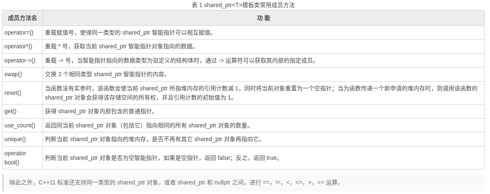

## 类如何释放资源？

让我们先来看看类是如何释放资源的：

在C++中，类的资源管理主要依赖于构造函数和析构函数。如果在类的析构函数中正确释放资源，那么当类的实例不在需要时，资源可以自动释放。

下面是一个简单的例子，展示了一个类如何在析构函数中释放资源：

```cpp
#include <iostream>

class ResourceHolder {
public:
    ResourceHolder() {
        // 构造函数，可以进行资源的初始化
        resource = new int[10];
        std::cout << "Resource allocated." << std::endl;
    }

    ~ResourceHolder() {
        // 析构函数，用于释放资源
        delete[] resource;
        std::cout << "Resource deallocated." << std::endl;
    }

    // 其他成员函数...

private:
    int* resource;
};

int main() {
    // 在作用域内创建对象，当对象离开作用域时，其析构函数会自动被调用
    ResourceHolder holder;
    // 执行其他操作...
    // holder 离开作用域时，其析构函数会自动释放资源
    return 0;
}

```

在这个例子中，ResourceHolder 类在构造函数中分配了一块动态数组的内存，在析构函数中释放了这块内存。当 holder 对象离开其作用域时，即 main 函数结束时，ResourceHolder 对象的析构函数会被自动调用，从而释放资源。

注意：当没有提供自定义的析构函数时，C++会生成一个默认的析构函数。它不会主动释放动态分配的资源。

如果类中没有动态分配的资源，通常情况下不会导致内存泄漏。内存泄漏通常是由于未释放动态分配的内存而造成的，而如果类中没有这样的资源，那么对象销毁时并不会有未释放的内存。

以下是一个没有动态分配资源的类的例子：

```cpp
#include <iostream>

class NoResourceClass {
public:
    NoResourceClass() {
        std::cout << "NoResourceClass constructed." << std::endl;
    }

    // 没有动态分配资源，不需要自定义析构函数

    // 其他成员函数...

    ~NoResourceClass() {
        std::cout << "NoResourceClass destructed." << std::endl;
    }
};

int main() {
    // 在作用域内创建对象
    NoResourceClass noResourceObj;
    // 执行其他操作...
    // noResourceObj 离开作用域时，析构函数会被调用
    // 但不会导致内存泄漏，因为没有动态分配的资源
    return 0;
}

```

在这个例子中，NoResourceClass 没有动态分配的资源，因此即使没有提供自定义的析构函数，也不会导致内存泄漏。类对象在离开作用域时，其析构函数会被调用，但由于没有需要特殊处理的资源，系统会正确地进行清理工作。

### 什么是动态分配的资源？

动态分配的资源是在程序运行时通过特定的操作符（如new、malloc等）从堆中分配的内存或其他资源。这些资源的生命周期在程序员明确释放它们之前，一直持续到程序运行结束。动态分配的资源通常包括：

1、内存分配：使用new和malloc等操作符在堆上动态分配的内存。例如：

```cpp
int* dynamicInt = new int;
char* dynamicArray = new char[100];
```

这里，dynamicInt是一个动态分配的整数，dynamicArray是一个动态分配的字符数组。

2、对象创建：使用new操作符在堆上动态创建的对象。例如：

```cpp
MyClass* dynamicObject = new MyClass;
```

3、文件或资源句柄：动态分配的资源也可能包括文件句柄、网络连接、数据库连接等。在这种情况下，通常需要使用相应的释放机制来释放这些资源。

动态分配的资源需要我们手动管理其生命周期，确保在不再需要这些资源时进行释放。如果不正确地释放或者没有释放这些资源，可能会导致内存泄漏、资源泄漏或其他一系列问题。为了简化资源管理，C++11引入了智能指针，例如std::unique_ptr和std::shared_ptr，它们可以自动管理动态分配的内存。

通过合理使用智能指针，可以简化内存管理、避免资源泄漏、并提高代码的可维护性。

## C++11 shared_ptr智能指针

Q:为什么要用智能指针？

A:智能指针就是帮助程序员管理动态分配内存的，它会帮助我们自动释放new出来的内存，从而避免内存泄漏！

shared_ptr是C++11里的新特性，其包装了new操作符在堆上分配动态对象。如：

```cpp
#include<memory>
shared_ptr<int> sp1(new int(100));
//相当于
int *sp1 = new int(100);
auto sp1 = make_shared<int>(100);

//---------------------------------

std::shared_ptr<JsonTool> json_tool = std::make_shared<JsonTool>(req.id,req.config); 
//相当于
JsonTool* json_tool = new JsonTool(req.id,req.config);
```

shared_ptr是一种共享所有权的智能指针，它采用引用计数的机制跟踪指向对象的引用情况，并在没有引用时自动释放内存。

## 智能指针在系统工程中最常见的几种应用形式

在C++系统工程中，std::shared_ptr可以广泛用于管理动态分配的资源（使用new关键字定义的就是动态分配资源），特别是在面向对象设计和大型项目中。以下是几种std::shared_Ptr最常见的应用形式：

1、动态内存管理： std::shared_ptr 用于管理动态分配的内存，特别是在避免内存泄漏的情况下。它可以通过智能指针的引用计数机制确保在不再需要资源时自动释放。

```cpp
#include <memory>

int main() {
    std::shared_ptr<int> sharedInt = std::make_shared<int>(42);
    // sharedInt 离开作用域时会自动释放内存
    return 0;
}

```

2、对象所有权共享： 在面向对象设计中，一个对象可能会被多个其他对象共享。std::shared_ptr 可以用于确保对象在最后一个持有者释放它时才被销毁。

```cpp
#include <memory>

class MyClass {
    // ...
};

int main() {
    std::shared_ptr<MyClass> sharedObject = std::make_shared<MyClass>();
    // 多个 shared_ptr 共享同一个对象
    std::shared_ptr<MyClass> anotherSharedObject = sharedObject;
    return 0;
}

```

3、循环引用的解决： 在某些情况下，对象之间可能存在循环引用，导致传统的指针可能无法正确释放内存。std::shared_ptr 使用引用计数，可以解决循环引用的问题。

```cpp
#include <memory>

class A;
class B;

class A {
public:
    std::shared_ptr<B> b_ptr;
};

class B {
public:
    std::shared_ptr<A> a_ptr;
};

int main() {
    std::shared_ptr<A> a = std::make_shared<A>();
    std::shared_ptr<B> b = std::make_shared<B>();
    a->b_ptr = b;
    b->a_ptr = a;
    // 正确释放循环引用的内存
    return 0;
}

```

4、资源管理：在系统编程中，std::shared_ptr 可以用于管理任何资源，例如文件句柄、网络连接等。通过自定义删除器，可以在资源不再需要时进行清理。

```cpp
#include <memory>
#include <iostream>

class FileResource {
public:
    FileResource(const char* filename) {
        file = fopen(filename, "r");
        if (!file) {
            std::cerr << "Failed to open file." << std::endl;
        }
    }

    ~FileResource() {
        if (file) {
            fclose(file);
        }
    }

    // ...

private:
    FILE* file;
};

int main() {
    std::shared_ptr<FileResource> fileResource = std::make_shared<FileResource>("example.txt");
    // 文件资源在 shared_ptr 离开作用域时会自动关闭
    return 0;
}

```

### std::shared_ptr的实现思想

1、引用计数：shared_ptr内部维护了一个引用计数的计数器，用于记录有多少个指针共享一个对象。

2、对象指针：shared_ptr包含一个指向动态分配的对象指针，以及一个指向引用计数的计数器指针。

3、构造和析构：当创建一个shared_ptr时，它会通过构造函数获取对象的指针，并创建一个引用计数对象，初始计数为 1 。当shared_ptr被销毁时，析构函数会递减引用计数，并在计数变为0时释放对象的内存。

4、拷贝和赋值：shared_ptr支持复制和赋值操作。无论何时我们拷贝一个`shared_ptr`，计数器都会递增。例如，当用一个`shared_ptr`初始化另一个`shared_ptr`，或将它作为参数传递给一个函数以及作为函数的返回值时，它所关联的计数器就会递增。   当我们给`shared_ptr`赋予一个新值或是`shared_ptr`被销毁（例如一个局部的`shared_ptr`离开其作用域）时，计数器就会递减。

5、析构时释放内存：当引用计数减少到0时，表示没有指针指向对象，此时会自动释放对象的内存。

下面是`std::shared_ptr`的核心代码示例，用于说明其实现的一种简化形式：

```cpp
template <typename T>
class shared_ptr {
public:
    shared_ptr(T* ptr) {
        // 构造函数获取对象指针，创建引用计数对象
        data_ = ptr;
        ref_count_ = new int(1);
    }

    ~shared_ptr() {
        // 析构函数递减引用计数，释放对象内存
        if (--(*ref_count_) == 0) {
            delete data_;
            delete ref_count_;
        }
    }

    // 拷贝构造函数
    shared_ptr(const shared_ptr<T>& other) {
        data_ = other.data_;
        ref_count_ = other.ref_count_;
        (*ref_count_)++;
    }

    // 赋值操作符重载
    shared_ptr<T>& operator=(const shared_ptr<T>& other) {
        if (this != &other) {
            if (--(*ref_count_) == 0) {
                delete data_;
                delete ref_count_;
            }

            data_ = other.data_;
            ref_count_ = other.ref_count_;
            (*ref_count_)++;
        }
        return *this;
    }

private:
    T* data_;     // 对象指针
    int* ref_count_;   // 引用计数指针
};
```

这只是一个简化的示例，实际的`std::shared_ptr`还包含了更多的功能和优化，例如支持自定义删除器（deleter）、异常安全等。

需要注意的是，C++11引入了标准库中的`std::shared_ptr`，它的实现可能与上述示例代码有所不同，且更加复杂和高效。上述代码只是为了展示`std::shared_ptr`的基本实现原理。

## `shared_ptr<T>`模板类提供的成员方法



- `operator=()`: 重载赋值号，使得同一类型的`shared_ptr`智能指针可以相互赋值。

  ```cpp
      std::shared_ptr<int> ptr1 = std::make_shared<int>(42);
      std::shared_ptr<int> ptr2;
      // ptr2 = ptr1;  //将ptr1赋值给ptr2，共享一个对象
      std::cout<<ptr2.use_count()<<std::endl;
  ```

- `operator*()`: 重载 `*` 号，获取当前`shared_ptr`智能指针对象指向的数据。

  ```cpp
      std::shared_ptr<int> ptr = std::make_shared<int>(42);
      int value = *ptr;   //获取指针指向的数据
  ```

- `operator->()`: 重载 `->` 号，当智能指针指向的数据类型为自定义的结构体或类时，通过 `->` 运算符可以获取其内部的指定成员。

  ```cpp
  #include<iostream>
  #include<memory>
  class TestPoint
  {
  public:
      TestPoint(/* args */);
      ~TestPoint();
      int get_number(const int a);
  };
  int TestPoint::get_number(const int a){
      return a;
  }
  int main(){
      std::shared_ptr<TestPoint> ptr = std::make_shared<TestPoint>();
      ptr->TestPoint();
      ptr->get_number(3);   //通过指针访问内部成员函数
      std::cout<<ptr->get_number(3)<<std::endl;
      ptr->~TestPoint();
      return 0;
  }
  ```

  上面这版的代码写法是错的，因为：

  1、智能指针已经在`std::make_shared<TestPoint>()`中调用了构造函数。

  2、智能指针会在其作用域结束时自动调用析构函数释放资源，不需要显示调用析构函数。

  下面是修改后的代码：

  ```cpp
  #include<iostream>
  #include<memory>
  
  class TestPoint
  {
  public:
      TestPoint();
      ~TestPoint();
      int get_number(const int a);
  };
  
  TestPoint::TestPoint()
  {
      std::cout << "TestPoint constructor" << std::endl;
  }
  
  TestPoint::~TestPoint()
  {
      std::cout << "TestPoint destructor" << std::endl;
  }
  
  int TestPoint::get_number(const int a)
  {
      return a;
  }
  
  int main()
  {
      std::shared_ptr<TestPoint> ptr = std::make_shared<TestPoint>();
      ptr->get_number(3);   //通过指针访问内部成员函数
      std::cout << ptr->get_number(3) << std::endl;
      return 0;
  }
  
  ```

  修正的地方如下：

  1、删除了不必要的`TestPoint`构造函数调用：`ptr->TestPoint();`，因为智能指针已经在 `std::make_shared<TestPoint>()` 中调用了构造函数。

  2、删除了显示调用析构函数的语句：`ptr->~TestPoint();`。智能指针会在其作用域结束时自动调用析构函数释放资源，不需要显式调用析构函数。

  3、将`TestPoint`类的构造函数和析构函数定义移到类外部实现。

​Q: 如果将上述代码：`std::shared_ptr<TestPoint> ptr = std::make_shared<TestPoint>();`   改成      `std::shared_ptr<TestPoint> ptr;`   会有什么样的结果？

​A: 会导致指针ptr没有有效地指向一个对象。这将产生以下结果：当尝试通过`ptr->get_number(3);`调用指针的成员函数时，会出现未定义行为，因为`ptr`为空指针，没有有效对象可调用成员函数。

### `make_shared()`函数

最安全的分配和使用动态内存的方法是调用一个名为`make_shared`的标准库函数。

此函数在动态内存（堆）中分配一个对象并初始化它，返回指向此对象的`shared_ptr`。

与智能指针一样，`make_shared`也定义在头文件`memory`中。

代码示例：

```cpp
// 指向一个值为42的int的shared_ptr
shared_ptr<int> p3 = make_shared<int>(42);
```

- `swap()`: 交换两个相同类型`shared_ptr`智能指针的内容。

  ```cpp
  #include<iostream>
  #include<memory>
  int main()
  {
      std::shared_ptr<int> ptr1 = std::make_shared<int>(42);
      std::shared_ptr<int> ptr2 = std::make_shared<int>(24);
      ptr1.swap(ptr2); // 交换ptr1和ptr2的内容
      std::cout << *ptr1 <<"   "<<*ptr2 << std::endl;
      return 0;
  }
  ```

- `reset()`:当函数没有实参时，该函数会使当前`shared_ptr`所指堆内存的引用计数减1，同时将当前对象重置为一个空指针；当为函数传递一个新申请的堆内存时，则调用该函数的`shared_ptr`对象会获得该存储空间的所有权，并且引用计数的初始值为1。

  ```cpp
  #include<iostream>
  #include<memory>
  int main()
  {
      std::shared_ptr<int> ptr1 = std::make_shared<int>(42);
      ptr1.reset();   //释放所指堆内存，ptr1变为nullptr，此时如果使用cout打印ptr1的值会出现 段错误 (核心已转储) 的错误
      std::shared_ptr<int> ptr2;
      ptr2.reset(new int(24));    //重置ptr2为新的堆内存
      std::cout <<*ptr2 << std::endl;
      return 0;
  }
  ```

- `use_count()`:返回与当前`shared_ptr`对象（包括它自己）指向相同的所有`shared_ptr`对象的数量。它返回一个整数值，表示共享指针的引用计数。

  ```cpp
  #include<iostream>
  #include<memory>
  int main()
  {
      std::shared_ptr<int> ptr1 = std::make_shared<int>(42);
      int count = ptr1.use_count(); //返回共享指针的数量，此处为1
      std::cout<<count<<std::endl;    
  
      ptr1.reset();   //释放所指堆内存，ptr1变为nullptr
      count = ptr1.use_count(); //返回共享指针的数量，此处为0
      std::cout<<count<<std::endl;    
  
      std::shared_ptr<int> ptr2;
      ptr2.reset(new int(24));    //重置ptr2为新的堆内存
      count = ptr2.use_count(); //返回共享指针的数量，此处为1
      std::cout<<count<<std::endl;  
  
      std::shared_ptr<int> ptr3;
      ptr3 = ptr2;
      count = ptr3.use_count();   //返回共享指针的数量，此处为2
      std::cout<<count<<std::endl;
  
      auto p(ptr3);
      count = p.use_count();  //返回共享指针的数量，此处为3
      std::cout<<count<<std::endl;
  
      return 0;
  }
  ```

- `operator bool()`:判断当前`shared_ptr`对象是否为空智能指针，如果是空指针，返回false；反之，返回true。

  ```cpp
  #include<iostream>
  #include<memory>
  int main()
  {
      std::shared_ptr<int> ptr1 = std::make_shared<int>(42);  //有值，不为空指针
      if(ptr1){
          std::cout<<"指针不为空..."<<std::endl;
      }
      else{
          std::cout<<"指针为空..."<<std::endl;
      } 
  
      ptr1.reset();   //将ptr1置为空指针
      if(ptr1){
          std::cout<<"指针不为空..."<<std::endl;
      }
      else{
          std::cout<<"指针为空..."<<std::endl;
      } 
  
      return 0;
  }
  ```

- `unique()`:判断当前`shared_ptr`对象指向的堆内存是否不再有其他`shared_ptr`对象再指向它。如果返回值为`true`，表示当前对象是唯一指向该堆内存的智能指针；如果返回值为`false`，表示还有其他智能指针指向同一块堆内存。

  ```cpp
  #include<iostream>
  #include<memory>
  int main()
  {
      std::shared_ptr<int> ptr1 = std::make_shared<int>(42);  //有值，不为空指针
      bool isUnique1 = ptr1.unique(); // 返回true，无其他指针指向堆内存
  
      if(isUnique1){
          std::cout<<"没有其他对象再指向ptr1..."<<std::endl;
      }
      else{
          std::cout<<"有..."<<std::endl;
      } 
  
      std::shared_ptr<int> ptr2;
      ptr2 = ptr1;        
      bool isUnique2 = ptr2.unique(); // 返回false，有其他指针指向堆内存
  
      if(isUnique2){
          std::cout<<"没有其他对象再指向ptr2..."<<std::endl;
      }
      else{
          std::cout<<"有..."<<std::endl;
      } 
  
      return 0;
  }
  ```

- `get()`:获取`shared_ptr`对象内部包含的普通指针。

  ```cpp
  std::shared_ptr<int> ptr = std::make_shared<int>(42);
  int* rawPtr = ptr.get(); // 获取内部的普通指针
  ```

## C++11 weak_ptr智能指针

虽然C++11标准将`weak_ptr`定位为智能指针的一种，但该类型指针不单独使用，只能和`shared_ptr`类型指针搭配使用。

我们还可以将 weak_ptr 类型指针视为 shared_ptr 指针的一种辅助工具，借助 weak_ptr 类型指针， 我们可以获取 shared_ptr 指针的一些状态信息，比如有多少指向相同的 shared_ptr 指针、shared_ptr 指针指向的堆内存是否已经被释放等等。

需要注意的是，当`weak_ptr`类型指针指向和某一`shared_ptr`指针相同时，`weak_ptr`指针并不会使所指堆内存的引用计数加1；同样，当`weak_ptr`指针被释放时，之前所指堆内存的引用计数也不会因此而减1。也就是说，`weak_ptr`类型指针并不会影响所指堆内存空间的引用计数。这样做的好处如下：

1. 防止循环引用：`std::weak_ptr`可以用于解决循环引用的问题（下文会讲）。循环引用指的是两个或多个对象相互持有对方的`std::shared_ptr`，导致它们之间的引用计数永远不会降为零，从而无法释放内存。通过使用`std::weak_ptr`来解决循环引用，可以打破循环依赖关系，允许对象在被其他智能指针引用时正确地释放。
2. 安全地访问对象：由于`std::weak_ptr`不会增加所指堆内存的引用计数，即使原始的`std::shared_ptr`已经释放了内存，使用`std::weak_ptr`仍然可以安全地检查对象是否存在，而不会访问已释放的内存。这可以避免悬空指针的问题。
3. 提高性能：由于`std::weak_ptr`不会增加引用计数，因此在访问对象时不需要进行引用计数的增减操作，从而提高了性能。

**`weak_ptr<T>`模板类中没有重载*和->运算符，这也就意味着，weak_ptr类型指针只能访问某一`shared_ptr`指针所指的堆内存空间，无法对其进行修改。**

### shared_ptr使用陷阱--循环引用问题

`shared_ptr`作为被管控的对象的成员时，小心因循环引用造成无法释放资源！

如下代码很好解释了什么是循环引用：

1、Boy类中有Girl的智能指针；

2、Girl类中有Boy类的智能指针；

3、当他们交叉互相持有对方的管理对象时...

```cpp
#include <iostream>
#include <string>
#include <memory>

using namespace std;
class Girl;
class Boy {
public:
 Boy() {
  cout << "Boy 构造函数" << endl;
 }
 ~Boy() {
  cout << "~Boy 析构函数" << endl;
 }
 void setGirlFriend(shared_ptr<Girl> _girlFriend) {
  this->girlFriend = _girlFriend;
 }
private:
 shared_ptr<Girl> girlFriend;
};
class Girl {
public:
 Girl() {
  cout << "Girl 构造函数" << endl;
 }
 ~Girl() {
  cout << "~Girl 析构函数" << endl;
 }
 void setBoyFriend(shared_ptr<Boy> _boyFriend) {
  this->boyFriend = _boyFriend;
 }
private:
 shared_ptr<Boy> boyFriend;
};
void useTrap() {
 shared_ptr<Boy> spBoy(new Boy());
 shared_ptr<Girl> spGirl(new Girl());

 // 陷阱用法
 spBoy->setGirlFriend(spGirl);
 spGirl->setBoyFriend(spBoy);
 // 此时boy和girl的引用计数都是2
}
int main(void) {
 useTrap();
 system("pause");
 return 0;
}
```

运行结果为：

```bash
Boy 构造函数
Girl 构造函数
```

可看出，程序结束了，但是并没有释放内存。

### weak_ptr模板类提供的成员方法

| operator=() | 重载 = 赋值运算符，是的 weak_ptr 指针可以直接被 weak_ptr 或者 shared_ptr 类型指针赋值。 |
| :---------: | ------------------------------------------------------------ |
|   swap(x)   | 其中 x 表示一个同类型的 weak_ptr 类型指针，该函数可以互换 2 个同类型 weak_ptr 指针的内容。 |
|   reset()   | 将当前 weak_ptr 指针置为空指针。                             |
| use_count() | 查看指向和当前 weak_ptr 指针相同的 shared_ptr 指针的数量。   |
|  expired()  | 判断当前 weak_ptr 指针为否过期（指针为空，或者指向的堆内存已经被释放）。 |
|   lock()    | 如果当前 weak_ptr 已经过期，则该函数会返回一个空的 shared_ptr 指针；反之，该函数返回一个和当前 weak_ptr 指向相同的 shared_ptr 指针。 |

operator=()、swap()、reset()、use_count()成员方法和`shared_ptr<T>`方法一样，我主要来讲讲expired()以及lock()这两个成员方法。

1、`expired()`: `expired()`函数用于判断当前`weak_ptr`指针是否过期，即指针为空或者指向的堆内存已经被释放。如果返回值为`true`，表示指针已过期；如果返回值为`false`，表示指针仍然有效。

```cpp
std::weak_ptr<int> weakPtr;
if (weakPtr.expired()) {
    // 执行此处代码，指针已过期
} else {
    // 执行此处代码，指针仍然有效
}
```

2、`lock()`: `lock()`函数用于获取一个与当前`weak_ptr`指向相同对象的`std::shared_ptr`指针。如果当前`weak_ptr`已经过期（即指向的对象已经被释放），`lock()`函数会返回一个空的`std::shared_ptr`；反之，如果`weak_ptr`仍然有效，`lock()`函数会返回一个指向相同对象的非空的`std::shared_ptr`。

```cpp
std::weak_ptr<int> weakPtr;
std::shared_ptr<int> sharedPtr = weakPtr.lock();
if (sharedPtr) {
    // 执行此处代码，sharedPtr非空，指针仍然有效
} else {
    // 执行此处代码，sharedPtr为空，指针已过期
}
```

3、在使用`weak_ptr`的lock()成员函数时，最好使用`expired()`函数判断是否为空指针？

## shared_ptr 和 weak_ptr配合使用

```cpp
std::shared_ptr<roborts_costmap::CostmapInterface> local_cost;
std::weak_ptr<roborts_costmap::CostmapInterface> local_cost_;  
local_cost_ = local_cost;
local_cost_.lock()->GetRobotPose(robot_pose);
```

上面代码使用了C++智能指针`std::shared_ptr`和`std::weak_ptr`。

​ 首先，`std::shared_ptr<roborts_costmap::CostmapInterface> local_cost;`创建了一个`std::shared_ptr`类型的指针`local_cost`，指向类型为`roborts_costmap::CostmapInterface`的对象。`std::shared_ptr`是一种共享所有权的智能指针，它可以自动跟踪指向的对象被引用的次数，并在没有引用时自动释放内存。

​ 接下来，`std::weak_ptr<roborts_costmap::CostmapInterface> local_cost_;`创建了一个`std::weak_ptr`类型的指针`local_cost_`，指向相同的对象类型。`std::weak_ptr`是一种弱引用的智能指针，它可以共享对对象的访问，但不会增加引用计数。当对象的引用计数降为零时，`std::weak_ptr`也无法访问对象。

​ 最后，`local_cost_ = local_cost;`将`local_cost`的值赋给了`local_cost_`。这里的赋值操作并不会增加对象的引用计数，因为`local_cost_`是一个弱引用。通过将`std::shared_ptr`赋值给`std::weak_ptr`，可以实现对相同对象的共享访问，而不会增加引用计数。

​ 总结，上面的代码创建了一个`std::shared_ptr`和一个`std::weak_ptr`，它们指向相同的对象，通过这样的方式，可以共享访问对象，并确保不再需要对象时适当地释放内存，以防内存泄漏。

再举一个栗子：

```cpp
void ChargeInfo::Run(){
    ros::Rate loop_rate(1);
    while(ros::ok()){
        pub_info();
        loop_rate.sleep();
        ros::spinOnce();
    }
}

int main(int argc,char **argv)
{
    ros::init(argc,argv,"charge_node");

    std::shared_ptr<ChargeInfo> charge_ptr = std::make_shared<ChargeInfo>();
    std::weak_ptr<ChargeInfo> weak_ptr = charge_ptr;
    std::cout<<"引用数量为：  "<<weak_ptr.use_count()<<std::endl;   //不会增加引用次数，引用次数为 1
    weak_ptr.lock()->Run();
    
    return 0;
}
```

## C++11 unique_ptr智能指针

std::unique_ptr 是一个独占型的智能指针，它不允许其他的智能指针共享其内部的指针，可以通过它的构造函数初始化一个独占智能指针对象，但是不允许通过赋值将一个 unique_ptr 赋值给另一个 unique_ptr。

这也就意味着，每个`unique_ptr`指针指向的堆内存空间的引用计数，都只能为1，一旦`unique_ptr`指针放弃对所指堆内存空间的所有权，则该空间会被立即释放回收。

```cpp
// 通过构造函数初始化对象
unique_ptr<int> ptr1(new int(10));
// error, 不允许将一个unique_ptr赋值给另一个unique_ptr
unique_ptr<int> ptr2 = ptr1;
```

std::unique_ptr 不允许复制，但是可以通过函数返回给其他的 std::unique_ptr，还可以通过 std::move 来转译给其他的 std::unique_ptr，这样原始指针的所有权就被转移了，这个原始指针还是被独占的。

```cpp
#include <iostream>
#include <memory>
using namespace std;

unique_ptr<int> func()
{
    return unique_ptr<int>(new int(520));
}

int main()
{
    // 通过构造函数初始化
    unique_ptr<int> ptr1(new int(10));
    // 通过转移所有权的方式初始化
    unique_ptr<int> ptr2 = move(ptr1);
    unique_ptr<int> ptr3 = func();

    return 0;
}
```

## boost::shared_ptr与std::shared_ptr的区别

`boost::shared_ptr`和`std::shared_ptr`是两个不同的智能指针类，它们有一些区别和相似之处。

1. 来源：`boost::shared_ptr`是来自Boost库的智能指针类，而`std::shared_ptr`是C++11标准引入的智能指针类。
2. 命名空间：`boost::shared_ptr`位于`boost`命名空间下，而`std::shared_ptr`位于`std`命名空间下。
3. 兼容性：`std::shared_ptr`是C++11标准的一部分，因此只能在支持C++11的编译器中使用。而`boost::shared_ptr`可以在不支持C++11的编译器中使用，因为它来自Boost库。
4. 功能和接口：`boost::shared_ptr`和`std::shared_ptr`提供类似的功能和接口，包括共享所有权、引用计数、自动资源管理等。它们都支持`operator*`和`operator->`来访问所管理对象的成员。然而，`std::shared_ptr`提供了一些额外的功能，如自定义删除器、支持空指针和`std::make_shared`函数等。
5. 性能：在性能方面，`std::shared_ptr`通常比`boost::shared_ptr`更高效，因为`std::shared_ptr`利用了C++11的移动语义和更高级的内部实现。

总的来说，如果您使用的是C++11及以上的编译器，建议使用`std::shared_ptr`，因为它是C++标准的一部分，并提供了更多的功能。如果您在不支持C++11的环境中工作，可以选择使用`boost::shared_ptr`，它提供了类似的功能，并且与Boost库的其他组件更加兼容。
