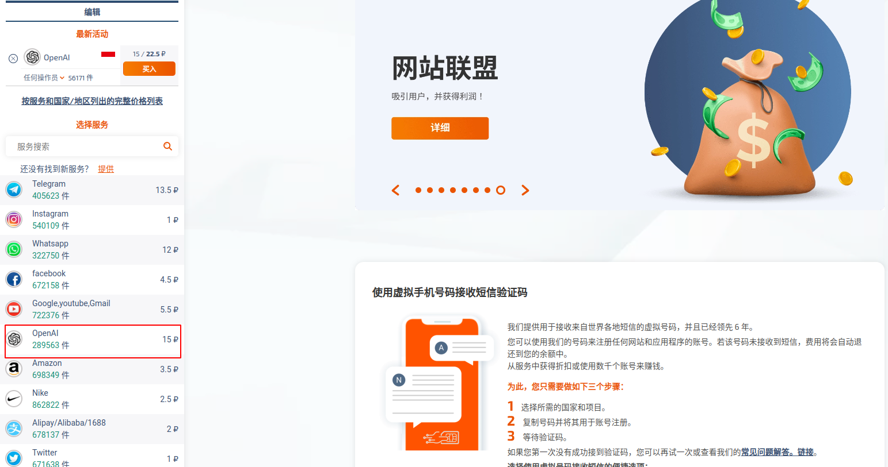

## 注册ChatGPT账号步骤

### 第一步 进入OpenAI注册页面

1. [OpenAI登录注册页面链接](https://chat.openai.com/auth/login)
2. 点击Sign UP进行注册

3. 选择Google账号 or 微软账号注册

4. 如果验证地区服务可用，系统自动跳转用户信息填写页面
5. 填写好用户信息后，点击"Continue"，进入手机号码验证页面

### 第二步 准备海外手机号码接收短信验证码

1. 先注册一个[sms-activate.org](https://sms-activate.org/)账号

2. 登录之后在选择服务区选中"OpenAI"

3. 然后选择国家加入购物车,购物车里会显示虚拟手机号码。这里可以便宜的国家服务。虚拟手机号码有效时间为20分钟，在时间范围内可以多次发送短信。如果有效时间过期了，没有发送短信，系统不会扣费用。

4. 如果你没有充值，他可能说你余额不足。点击右上角的余额下面的按钮，再点击"充值"，可以选择支付宝充值，最低充值为2美元，加上手续费0.1美元，折算成人民币大概15RMB。

5. 加入购物车之后，就可以直接复制手机号码，到OpenAI手机号码验证页面上填写。要注意国家区号。

6. 手机号码填写好了之后，点击"Send Code via SMS"。有时候遇到手机号码不可用的情况，继续到Sms-Activate里找可以的手机号码。
7. 找到可用的手机号码，可以在Sms-Activate的购物车里等待短信。

8. 填写验证码
9. 进入到[ChatGPT 聊天页面](https://chat.openai.com/chat)

## 参考致谢

- [ChatGPT账号注册手把手教程（最新版）](https://juejin.cn/post/7214512376669175845)
