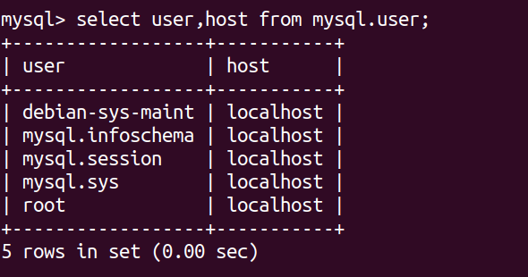

## 查看名为ppn_data数据库的内存大小

```bash
USE ppn_data;

SELECT table_schema "Database Name", SUM(data_length + index_length) / 1024 / 1024 "Database Size (MB)"
FROM information_schema.tables
WHERE table_schema = 'ppn_data';
```

这个查询将返回名为ppn_data的数据库的内存大小（以MB为单位）。

## 查看指定表的数据量

```sql
SELECT COUNT(*) FROM _data.charging_info;
```

## 查看数据库中各个用户的访问权限

```sql
select user,host from mysql.user;
```



## 将所需要开放的用户的访问权限改为任意

```sql
CREATE USER 'myuser'@'%' IDENTIFIED BY 'your_password';
GRANT ALL PRIVILEGES ON *.* TO 'myuser'@'%' WITH GRANT OPTION;
```

首先，创建用户并设置密码，然后再授予该用户所需的权限。上述示例中的`'myuser'`是您要创建的用户名，`'%'`表示从任何主机都可以访问，`'your_password'`是用户的密码，`ALL PRIVILEGES`表示授予用户所有权限，`*.*`表示对所有数据库和表，`WITH GRANT OPTION`允许用户进一步授权。

如果您已经创建了用户，只需执行第二个GRANT语句来授予用户所需的权限。

## 更新密码

```sql
ALTER USER 'root'@'localhost' IDENTIFIED WITH mysql_native_password by '1';
```

## 本地连接云数据库

```bash
mysql -h 127.0.0.1  -u root -P 3306 -p
```

解释：-h 后带的是地址 ；-u 后面带的是用户名； -P  后面带的是端口号；-p  后面带的是密码，需要回车才能输入密码。

## 筛选指定时间段数据

```sql
SELECT * FROM system_info  WHERE insertTime > '2023-11-14 10:16:56' AND insertTime < '2023-11-14 10:17:08';
```
