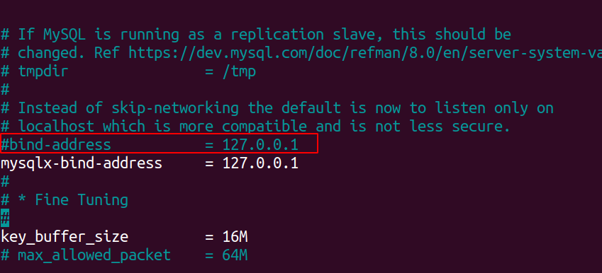

## 通过apt方式安装MySQL服务（会安装最新版本）

1. 更新源

    ```bash
    sudo apt update
    ```

2. 通过apt-get安装mysql服务

    ```bash
    sudo apt-get install mysql-server
    ```

3. 初始化配置

    ```bash
    sudo mysql_secure_installation
    ```

  配置项较多，如下所示：

\#1

```bash
 Securing the MySQL server deployment.

 Connecting to MySQL using a blank password.

 VALIDATE PASSWORD COMPONENT can be used to test passwords
 and improve security. It checks the strength of password
 and allows the users to set only those passwords which are
 secure enough. Would you like to setup VALIDATE PASSWORD component?

 Press y|Y for Yes, any other key for No: N (选择N ,不会进行密码的强校验)
```

\#2

```python
Please set the password for root here...
New password: (输入密码)
Re-enter new password: (重复输入)
```

到这步我会显示错误：

```bash
 ... Failed! Error: SET PASSWORD has no significance for user 'root'@'localhost' as the authentication method used doesn't store authentication data in the MySQL server. Please consider using ALTER USER instead if you want to change authentication parameters.
```

解决方案：

- 用这个命令进入mysql

  ```bash
  sudo mysql
  ```

- 在sql命令行输入以下命令回车，你就可以把密码改成 1

  ```bash
  ALTER USER 'root'@'localhost' IDENTIFIED WITH mysql_native_password by '1';
  ```

- 然后重复第二步输入密码即可。

\#3

```python
By default, a MySQL installation has an anonymous user,
allowing anyone to log into MySQL without having to have
a user account created for them. This is intended only for
testing, and to make the installation go a bit smoother.
You should remove them before moving into a production
environment.

Remove anonymous users? (Press y|Y for Yes, any other key for No) : N (选择N，不删除匿名用户)
```

翻译过来就是：

默认情况下，MySQL安装有一个匿名用户，允许任何人登录MySQL而不必为他们创建用户账户。这只是为了测试，并使安装进行得更顺利。在进入生产环境之前，您应该删除它们。

\#4

```python
Normally, root should only be allowed to connect from
'localhost'. This ensures that someone cannot guess at
the root password from the network.

Disallow root login remotely? (Press y|Y for Yes, any other key for No) : N (选择N，允许root远程连接)
```

翻译过来就是：

正常情况下，应该只允许从"localhost"连接。这确保了别人无法从网络上猜出根密码。

\#5

```python
y default, MySQL comes with a database named 'test' that
anyone can access. This is also intended only for testing,
and should be removed before moving into a production
environment.

Remove test database and access to it? (Press y|Y for Yes, any other key for No) :  N (选择N，不删除test数据库)
```

翻译过来就是：

默认情况下，MySQL自带一个名为"test"的数据库，任何人都可以访问。这也只是用于测试，在进入生产环境之前应该删除。

\#6

```python
Reloading the privilege tables will ensure that all changes
made so far will take effect immediately.
Reload privilege tables now? (Press y|Y for Yes, any other key for No) : Y (选择Y，修改权限立即生效)
```

翻译过来就是：

重新加载特权表将确保到目前为止所做的所有更改将立即生效。

\#7检查mysql服务状态

```bash
systemctl status mysql.service
```

## 安装配置MySQL workbench

1. 安装MySQL workbench
  安装包下载地址如下：<https://dev.mysql.com/downloads/workbench/>

2. 要安装 Workbench 的社区版本，请运行以下命令。

  ```
  sudo apt install mysql-workbench-community
  ```

如果您想从命令行打开它，只需键入：

```
mysql-workbench
```

3. 使用dpkg安装workbench，中间可能会有依赖报错，使用以下命令安装其依赖项：

```bash
sudo apt -f install
```

## 本地数据库如何连接服务器的数据库

1. 首先进入服务器里面安装mysql并初始化配置
2. 使用如下命令查看数据库中各个用户的访问权限：

    ```bash
    select user,host from mysql.user;
    ```

3. 使用如下命令查看数据库中各个用户的访问权限：

    ```bash
    select user,host from mysql.user;
    ```

    

4. 将所需要开放的用户的访问权限改为任意

    ```bash
    CREATE USER 'myuser'@'%' IDENTIFIED BY 'your_password';
    GRANT ALL PRIVILEGES ON *.* TO 'myuser'@'%' WITH GRANT OPTION;
    ```

    首先，创建用户并设置密码，然后再授予该用户所需的权限。上述示例中的`'myuser'`是您要创建的用户名，`'%'`表示从任何主机都可以访问，`'your_password'`是用户的密码，`ALL PRIVILEGES`表示授予用户所有权限，`*.*`表示对所有数据库和表，`WITH GRANT OPTION`允许用户进一步授权。

    如果您已经创建了用户，只需执行第二个GRANT语句来授予用户所需的权限。

5. 再查看一下用户的访问权限变为%说明赋权成功
    

6. 去服务器的控制台将3306端口开放出来，选择协议为TCP，IP地址为0.0.0.0/0

7. 修改服务器中的配置文件
    进入到服务器，运行：

    ```bash
    cd /etc/mysql/mysql.conf.d

    nano mysqld.cnf
    ```

    将bind-address=127.0.0.1这行注释掉，该行的作用是只允许本地访问。
    如下图所示：
    
    修改完毕后按Ctrl+O保存，Ctrl+X退出。

8. 重启服务器的mysql

   ```bash
   systemctl restart mysql.service
   ```

9. 本地连接服务器的数据库

   ```bash
   mysql -h 127.0.0.1  -u root -P 3306 -p
   ```

   解释：-h 后带的是地址 ；-u 后面带的是用户名； -P  后面带的是端口号；-p  后面带的是密码，需要回车才能输入密码。

10. 代码连接数据库

    ```python
    #!/usr/bin/env python
    # -*- coding: utf-8 -*-
    import pymysql

    def connect():
        try:
            connection = pymysql.connect(
                host='111.111.11.1',  # 连接名称，默认127.0.0.1
                user='ppn',  # 用户名
                passwd='1',  # 密码
                port=3306,  # 端口，默认为3306
                db='ppn_data',  # 数据库名称
                charset='utf8'  # 字符编码
            )
            connection.close()

        except:
            print("error")
        
    connect()
    ```

## 参考致谢

- [Ubuntu20.04安装Mysql（亲测有效，一定要按步骤来）](https://blog.csdn.net/YM_1111/article/details/107555383)
- [Ubuntu20.04安装Mysql](https://blog.csdn.net/weixin_38924500/article/details/106261971)

- [Ubuntu20.04安装MySQL及配置MySQL workbench](https://blog.csdn.net/weixin_46584887/article/details/121432061)
