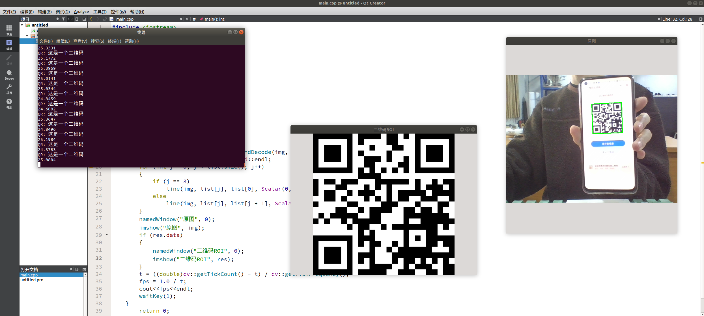

**OpenCV4中负责二维码检测与解析的类是`QRCodeDetector`**

**1.负责从图像中找到二维码区域，返回的是二维码四个顶点的坐标。**

```cpp
detect (InputArray img, OutputArray points) const
```

:::tip
`img`参数是输入图像，支持灰度或者彩色

`points`是vector返回的四个点坐标数组
:::

**2.负责解析二维码，返回utf-8字符串作为解析结果，无法解析返回空**

```shell
decode (InputArray img, InputArray points, OutputArray straight_qrcode=noArray())
```

:::tip
`img`表示输入图像

`point`表示检测到四个点坐标

`straight_qrcode`表示解析的二维码 ROI
:::

**3.一步搞定二维码检测与解析。**

```go
detectAndDecode(
InputArray img, //输入图像
OutputArray points=noArray(), // 顶点坐标
OutputArray straight_qrcode=noArray() // ROI
)
```


**在这贴出自己写的一份利用detectAndDecode函数来检测并解析二维码的代码**

```cpp
#include <iostream>
#include <opencv2/opencv.hpp>
using namespace cv;
using namespace std;
int main()
{
    Mat img;
    VideoCapture cap(0);
    double t = 0;
    double fps;
    while(1)
    {
        t = (double)cv::getTickCount();
        cap.read(img);
        cv::QRCodeDetector QRdetecter;
        std::vector<cv::Point> list;
        cv::Mat  res;
        string str = QRdetecter.detectAndDecode(img, list, res);
        std::cout << "QR: "<< str << std::endl;
        for (int j = 0; j < list.size(); j++)
        {
            if (j == 3)
                line(img, list[j], list[0], Scalar(0, 255, 0), 2);
            else
                line(img, list[j], list[j + 1], Scalar(0, 255, 0), 2);
        }
        namedWindow("原图", 0);
        imshow("原图", img);
        if (res.data)
        {
            namedWindow("二维码ROI", 0);
            imshow("二维码ROI", res);
        }
        t = ((double)cv::getTickCount() - t) / cv::getTickFrequency();
        fps = 1.0 / t;
        cout<<fps<<endl;
        waitKey(1);
    }
        return 0;
}
```


效果图
