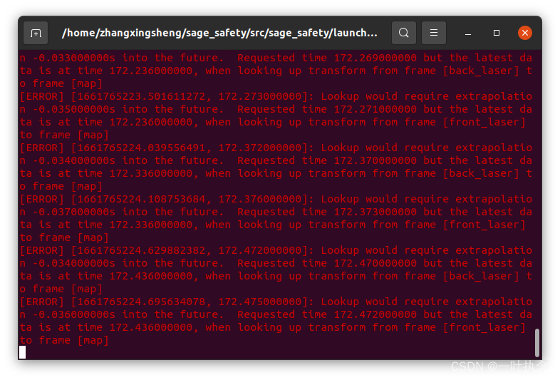

## 前言
用ROS编写机器人的时候，不免会用到坐标变换，而TF是ROS中建立坐标系，并且使用各个坐标间转换关系的一个很好的工具。

TF库的目的是实现系统中任一一个点在所有坐标之间的坐标变换，也就是说，只要给定一个坐标系下的一个点的坐标，就能获得这个点在其他坐标系下的坐标。

使用TF功能包主要有以下两种方式：
- 监听TF变换。接收并缓存系统中发布的所有参考系变换，并从中查询所需要的参考系变换。
- 广播TF变换。向系统中广播参考系之间的坐标变换关系。系统中更可能会存在多个不同部分的TF变换广播，每个广播都可以直接将参考系变换关系直接插入TF树中，不需要进行同步。

基本的数据类型有：Quaternion，vector，point，pose，transform

其中，quaternion表示四元数，vector3是一个3*1的向量，point表示一个点的坐标，Pose是位姿（包括坐标和方向），transform是一个转换的模板。

通过监听TF，我们可以避免繁琐的旋转矩阵的计算，而直接获取我们需要的相关信息。

在监听中最常用的以下几个函数：
- lookupTransform();   
- transformPoint();
- transformLaserScanPointCloud();


## lookupTransform()   查找TF变换
函数功能：可以获得两个坐标系之间的转换关系，包括旋转与平移

代码教程：http://wiki.ros.org/tf/Tutorials/Writing%20a%20tf%20listener%20%28C++%29

### 函数原型

```cpp
void Transformer:: lookuptransform (const std::string & target_frame,const std::string & source_frame, const ros::Time & Time, StampedTransform & transform)
```

- target_frame：目标坐标系，数据应该转到的坐标系
- source_frame：源坐标系，数据来源坐标系
- Time：时间，使用ros::Time(0)。使用ros::time::now()会出现问题
- transform：存在转换关系

### 主要步骤
1. 添加相关头文件
    ```cpp
    #include <tf/transform_listener.h>
    ```
2. 定义监听器
    ```cpp
    tf::TransformListener tf_listener;
    ```
3. 定义存放变换关系的变量
    ```cpp
    tf::StampedTransform tf_transform;
    ```
4. 监听两个坐标系之间的变换
    ```cpp
    try{
        tf_listener.lookupTransform("/map","/base_link",ros::Time(0),tf_transform);
    }
    catch(tf::TransformException &ex){
        ROS_ERROR("%s",ex.what());
        ros::Duration(1.0).sleep();
        continue;
    }
    ```
    这里监听了base_link到map的坐标变换，并将参数存放到tf_transform中。

    另外，注意到ros::Time(0)的使用是获取了某一个tf变换中最后一次的数据，注意是最后一次，不是当前时间的。所以对于某些tf时间性要求比较高的场合，比如物体识别。当我从某个位置识别到物体后，发布一个相对于物体的TF。然后我再次运动，识别物体，此时假设由于光线等因素影响算法没有识别出来物体，但是使用ros::Time(0)仍然是可以获取到相对变换的，这个变换就是最后一次识别到物体时的相对TF，显然这样子的结果可能是错误的。

    **那如果我们需要得到当前时间戳下的TF而不是很早之前的TF应该怎么做？**

    答案是：增加一个waitFortransform()函数即可。waitFortransform()的作用是阻塞程序进程直到两个frame连通。

    将上面的
    ```cpp
    tf_listener.lookupTransform("/map","/base_link",ros::Time(0),tf_transform);
    ```
    改成
    ```cpp
    ros::Time now = ros::Time::now();
    listener.waitForTransform("/map", "/base_link",now, ros::Duration(3.0));
    listener.lookupTransform("/map", "/base_link",now, transform);
    ```
    waitFortransform()与ros::Time::now()连用可以获取当前最新时间戳下的TF变换，ros::Duration(3.0)代表能接受的最大时间戳差异，3.0就是当前时间戳3秒内的数据。因为时间戳完全对其基本是不可能的，所以一般这里会设置一个范围。如果获取到的TF不是当前时间戳容许范围内的，数据就会被丢弃。这样，下面一行的lookupTransform就不会执行。
5. 使用
    ```cpp
    transform.getOrigin().getX();
    transform.getOrigin().getY();
    ```
    注意：由于tf会把监听到的内容存放到一个缓存中，然后再读取相关的内容，而这个过程可能会有几毫秒的延迟，也就是tf的监听器并不能实时监听变换，所以如果不使用try,catch函数会导致报错：
```bash
“world” passed to lookupTransform argument target_frame does not exist. ”
```
并且会导致程序挂掉，使用try,catch之后就OK了。

完整代码例程：
```cpp title = "/agilex_pure_pursuit/src/record_path.cpp"
#include <ros/ros.h>
#include <tf/transform_listener.h>
#include <tf/tf.h>
#include <nav_msgs/Path.h>
#include <iostream>
#include <fstream>

int main(int argc, char** argv) {
    ros::init(argc, argv, "record_path");   //初始化节点
    ros::console::set_logger_level(ROSCONSOLE_DEFAULT_NAME, ros::console::levels::Info);

    ros::NodeHandle nh; //定义一个nh节点句柄
    ros::NodeHandle private_nh("~");    //定义参数服务器
    ros::Publisher path_pub = nh.advertise<nav_msgs::Path>("target_path", 1, true); //发布target_path话题信息

    std::string path_file;  //定义path_file字符串
    private_nh.param("path_file", path_file, std::string("/home/agilex/target_path.txt"));  //参数服务器定义了path_file的保存路径

    tf::TransformListener tf_listener;  //定义一个tf 监听器
    tf::StampedTransform tf_pose;       //定义存放两坐标系之间的转化关系变量

    nav_msgs::Path path_msg;

    ros::Rate r(20);
    while (ros::ok()) { //进入while循环
        //监听两个坐标系之间的变换
        try {
            //阻塞程序进程直到两个frame连通。如果数据不是在0.5秒以内获取到的，数据就会被丢弃掉，下面的lookupTransform将不会执行。
            tf_listener.waitForTransform("map", "base_link", ros::Time(0), ros::Duration(0.5)); 
            tf_listener.lookupTransform("map", "base_link", ros::Time(0), tf_pose);
        }
        catch (tf::TransformException e) {
            ROS_ERROR("%s", e.what());
        }
        //获取当前点信息，可以得到base_link坐标系的点在map坐标系下的位置。
        static double x = tf_pose.getOrigin().getX();
        static double y = tf_pose.getOrigin().getY();
        //获取下一个点与上一个点的距离的信息
        double dx = tf_pose.getOrigin().getX() - x;
        double dy = tf_pose.getOrigin().getY() - y;
        //如果两点之间的距离大于0.05，则将改该点存放至geometry_msgs::PoseStamped消息类型的容器中
        //并以nav_msgs::Path消息类型发布出去
        if (sqrt(dx * dx + dy * dy) > 0.05) {
            x = tf_pose.getOrigin().getX();
            y = tf_pose.getOrigin().getY();

            geometry_msgs::PoseStamped pose_msg;
            pose_msg.header.stamp = ros::Time::now();
            pose_msg.header.frame_id = "map";

            pose_msg.pose.position.x = x;
            pose_msg.pose.position.y = y;
            pose_msg.pose.position.z = 0.0;

            path_msg.header = pose_msg.header;
            path_msg.poses.push_back(pose_msg);
            path_pub.publish(path_msg);
        }
        r.sleep();
    }
    //使用std::ofstream将点的信息写入path_file
    std::ofstream stream(path_file);
    for (int i = 0; i < path_msg.poses.size(); ++i) {
        stream << path_msg.poses[i].pose.position.x << " " << path_msg.poses[i].pose.position.y << std::endl;
    }
    stream.close();
    return 0;
}
```
## transformPoint() 点云变换
函数功能：用来将一个传感器的数据从一个坐标系转换到另外一个坐标系下。

这个函数在传感器数据的坐标变换中使用的比较多。

代码示例：
```cpp
listener_.transformPoint("map",laser_pose,map_pose);
```
- "map"是指，我要将laser_pose转换到map坐标系下，map_pose是转换的结果。
- 其中laser_pose,map_pose的数据类型都是geometry::PointStamped，需要定义laser_pose.header.frame.id 即改点所属的坐标系（比如激光雷达坐标系）。

使用例程：
```cpp
geometry_msgs::PointStamped turtle1;
turtle1.header.stamp=ros::Time();
turtle1.header.frame_id="turtle1";
turtle1.point.x=1;
turtle1.point.y=2;
turtle1.point.z=3;
geometry_msgs::PointStamped turtle1_world;
        try{
listener_.transformPoint("PTAM_world",turtle1,turtle1_world);
         }
             catch (tf::TransformException &ex) {
          ROS_ERROR("%s",ex.what());
          ros::Duration(1.0).sleep();
    }
```
这里将turtle1从turtle1坐标系转换到PTAM_world坐标系下，数据存储在turtle1_world下。

## transformLaserScanToPointCloud()  
函数功能：这个TF一般用于激光SLAM中对于激光点云转换到其他坐标系下，例如将来自激光的数据转换到map下，使用transformPoint也可以转但是会比较麻烦，使用transformLaserScanToPointCloud可以一次性转换。

代码示例：
```cpp
tf::TransformListener tf_listener; 
laser_geometry::LaserProjection projector_;
sensor_msgs::PointCloud mapcloud; 
void XXX::ScanCallback(const sensor_msgs::LaserScan::ConstPtr& scan_in)
{
    if(!tf_listener.waitForTransform(
            scan_in->header.frame_id,
            "/map",
            scan_in->header.stamp + ros::Duration().fromSec(scan_in->ranges.size()*scan_in->time_increment),
           ros::Duration(1))){
        ROS_INFO("timestamp error");
        return;
    }   
    try
    {
        projector_.transformLaserScanToPointCloud("/map",*scan_in,mapcloud,tf_listener);
    }
    catch(const std::exception& e)
    {
        ROS_ERROR("%s", e.what());
    }	
	//点云处理：	    
}
```
最前面定义的三个参数一般定义在class成员变量中，定义在public下。

注意回调函数中的tf_listener.waitForTransform是有必要加的，要不然会报如下错误：

上图使用的是CSDN用户一叶执念的配图
## tf::StampedTransform 与 geometry::TransformStamped
tf::StampedTransform 和 geometry_msgs/TransformStamped.msg不同，tf::StampedTransform只能用在C++里，是C++的一个类，一种数据格式，不是一个消息。geometry_msgs/TransformStamped.msg是一个message，依赖于ROS，与语言无关（即是无论和种语言C++、Python、Java等，都可以发送该消息）。
### tf::transformStampedTFToMsg
`tf::transformStampedTFToMsg()`函数是ROS中的一个工具函数，用于将tf库中的变换信息（Transform）转换为ROS消息（TransformStamped）。

变换信息（Transform）用于描述一个坐标系在另一个坐标系下的位置和姿态关系，通常表示为四元数（Quaternion）和平移向量（Vector3）。`TransformStamped`消息则包含变换信息，以及发布该消息的时间戳和父子坐标系的名称。

`tf::transformStampedTFToMsg()`函数的定义如下：
```cpp
void tf::transformStampedTFToMsg(const tf::StampedTransform& transform, geometry_msgs::TransformStamped& msg);
```
其中，`transform`是要转换的变换信息，`msg`是要填充的ROS消息对象。


### 如何使用tf::transformStampedTFToMsg
在ROS中，消息用于在分布式系统中的不同节点之间传输数据。`tf::StampedTransform`是一个数据结构，用来存储3D空间中2帧之间的坐标变换，而`geometry::TransformStamped`是一个ROS消息类型，用来传递坐标变换信息。

为了在ROS节点之间传递坐标变换信息，需要使用`tf::transformStampedTFtoMsg`将`tf::StampedTransform`转换为`geometry::TransformStamped`消息类型。这种转换确保坐标变换信息可以在不同节点之间正确传输，即使它们是用不同的编程语言写的。示例代码如下：
```cpp
#include <tf/transform_listener.h>
#include <tf/transform_broadcaster.h>
#include <geometry_msgs/TransformStamped.h>

// 在回调函数中获取变换信息并转换为消息
void callback(const tf::StampedTransform& transform) {
    // 创建ROS消息对象
    geometry_msgs::TransformStamped transform_msg;
    // 将tf库中的变换信息转换为ROS消息
    tf::transformStampedTFToMsg(transform, transform_msg);
    // 使用ROS话题发布消息
    pub.publish(transform_msg);
}

int main(int argc, char** argv) {
    // 初始化ROS节点
    ros::init(argc, argv, "tf_to_msg_node");
    ros::NodeHandle nh;

    // 创建订阅tf变换信息的监听器
    tf::TransformListener listener(nh);

    // 创建话题发布器，发布TransformStamped消息
    ros::Publisher pub = nh.advertise<geometry_msgs::TransformStamped>("/transform", 10);

    // 循环监听tf变换信息
    while (ros::ok()) {
        tf::StampedTransform transform;
        try {
            listener.lookupTransform("child_frame", "parent_frame", ros::Time(0), transform);
            callback(transform);
        } catch (tf::TransformException ex) {
            ROS_ERROR("%s",ex.what());
        }
        ros::spinOnce();
    }
    return 0;
}
```
在回调函数中，我们创建了一个geometry_msgs::TransformStamped类型的ROS消息对象transform_msg，并使用tf::transformStampedTFToMsg()函数将tf库中的变换信息transform转换为ROS消息。最后，我们使用ROS话题发布器pub发布该消息。

在主函数中，我们创建了一个tf::TransformListener对象listener，用于监听tf变换信息。在循环中，我们使用lookupTransform()函数获取child_frame坐标系相对于parent_frame坐标系的变换信息，如果获取失败则记录错误信息。如果获取成功，则调用回调函数callback()将变换信息转换为ROS消息并发布。最后，我们使用ros::spinOnce()函数来处理ROS回调函数。

对象`tf::StampedTransform`在其成员变量中包含转换信息，例如平移和旋转，而消息`geometry::TransformStamped`包含标准化格式的相同信息，可以在ROS节点之间轻松传输。

## static_transform_publisher 与ROS广播器有什么不同
`static_transform_publisher` 和 ROS 广播器`tf2_ros::TransformBroadcaster`都用于将两个坐标系之间的静态转换关系广播出去，但是它们有一些不同：

`static_transform_publisher`是一个ROS的命令行工具，用于在启动节点时将静态转换关系广播到 tf 系统中，它不能动态改变广播的转换关系。
`tf2_ros::TransformBroadcaster`是ROS中的一个C++库，可以在运行时动态地发布转换关系到 tf 系统中，所以它适用于动态变化的转换关系。
因此，如果转换关系在运行过程中是静态不变的，可以使用 static_transform_publisher 将其发布到 tf 系统中，这可以减少一些开发时间和代码复杂度。如果转换关系是动态变化的，应该使用 tf2_ros::TransformBroadcaster 来动态地发布转换关系。

## 参考致谢
- [Writing a tf listener (C++)](http://wiki.ros.org/tf/Tutorials/Writing%20a%20tf%20listener%20%28C++%29)
- [C++ tf::TransformListener](https://blog.csdn.net/YiYeZhiNian/article/details/124355687#t2)

- [ROS学习--轻松使用tf](https://blog.csdn.net/Start_From_Scratch/article/details/50762293?spm=1001.2101.3001.6661.1&utm_medium=distribute.pc_relevant_t0.none-task-blog-2%7Edefault%7ECTRLIST%7ERate-1-50762293-blog-126333900.235%5Ev27%5Epc_relevant_3mothn_strategy_recovery&depth_1-utm_source=distribute.pc_relevant_t0.none-task-blog-2%7Edefault%7ECTRLIST%7ERate-1-50762293-blog-126333900.235%5Ev27%5Epc_relevant_3mothn_strategy_recovery&utm_relevant_index=1)