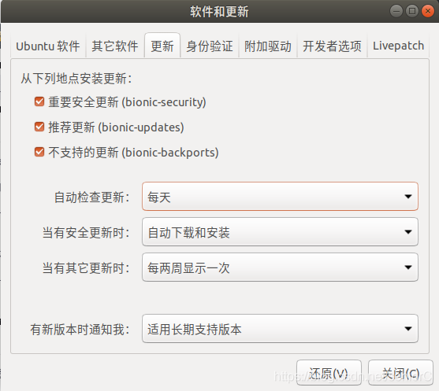
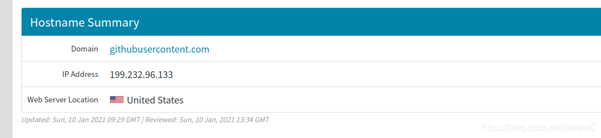
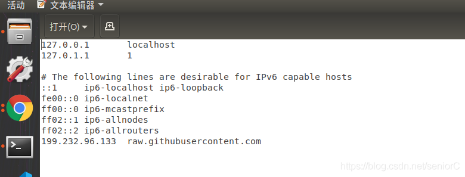
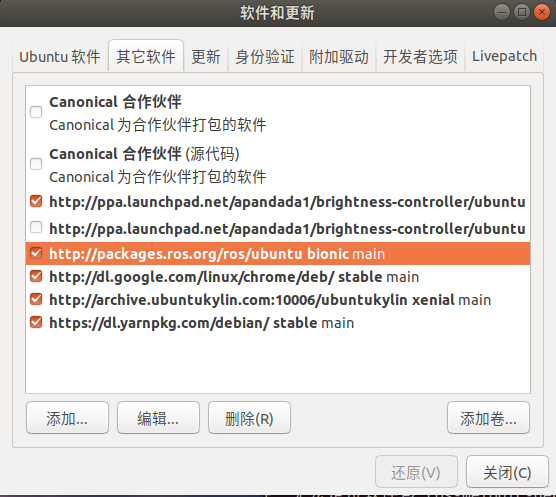

## ROS依赖不会被安装报错问题

当我将ROS卸载重装后终端报错如下：

```shell
zdg@1:~$ sudo apt install ros-melodic-desktop-full
正在读取软件包列表... 完成
正在分析软件包的依赖关系树       
正在读取状态信息... 完成       
有一些软件包无法被安装。如果您用的是 unstable 发行版，这也许是
因为系统无法达到您要求的状态造成的。该版本中可能会有一些您需要的软件
包尚未被创建或是它们已被从新到(Incoming)目录移出。
下列信息可能会对解决问题有所帮助：

下列软件包有未满足的依赖关系：
 ros-melodic-desktop-full : 依赖: ros-melodic-desktop 但是它将不会被安装
                            依赖: ros-melodic-perception 但是它将不会被安装
                            依赖: ros-melodic-simulators 但是它将不会被安装
                            依赖: ros-melodic-urdf-sim-tutorial 但是它将不会被安装
E: 无法修正错误，因为您要求某些软件包保持现状，就是它们破坏了软件包间的依赖关系。
```

:::tip 解决办法
  问题出现的原因是未开启更新，可以在Ubuntu 软件仓库(repositories) 的update中开启。
:::



## ROS下用usb_cam功能包打开外接摄像头失败

1. 首先下载ROS驱动外接摄像头功能包usb_cam

```shell
cd catkin_ws/src  
 git clone https://github.com/bosch-ros-pkg/usb_cam.git  
 cd ..  
catkin_make  
```

2. 打开usb_cam包下的usb_cam-test.launch文件，可以看到它里面的内容如下：

```cpp
<launch>
  <node name="usb_cam" pkg="usb_cam" type="usb_cam_node" output="screen" >
    <param name="video_device" value="/dev/video0" />
    <param name="image_width" value="640" />
    <param name="image_height" value="480" />
    <param name="pixel_format" value="yuyv" />
    <param name="camera_frame_id" value="usb_cam" />
    <param name="io_method" value="mmap"/>
  </node>
  <node name="image_view" pkg="image_view" type="image_view" respawn="false" output="screen">
    <remap from="image" to="/usb_cam/image_raw"/>
    <param name="autosize" value="true" />
  </node>
</launch>
```

3. 修改建议
1. 修改摄像头设备接口号为：`/dev/video2`

2. 修改分辨率为外接摄像头的分辨率

3. 修改pixel_format(像素编码)格式为：`mjpeg`

## ROS如何单独编译一个包？

在遇到用ros开发的一个大工程时，对其中一个包修改后用`catkin_make`的方法编译太过浪费时间，可使用

```shell
catkin_make -DCATKIN_WHITELIST_PACKAGES="package1;package2"
```

这条指令对更改过的功能包进行单独编译，节省许多时间

需要注意的是，使用完上面的指令后，如果想回到原来那种catkin_make编译所有功能包的状态，可执行

```shell
catkin_make -DCATKIN_WHITELIST_PACKAGES=""
```

## ROS多机通信公共网络问题

1. 提出问题
假设我们计划使用一台机器人执行任务，而此时刚好有另外一台机器人和这台机器人处于相同的网络中，它们之间有着部分相同的话题，而这将导致通信冲突。

会出现的情况是：两个机器人可能会尝试执行相同的命令并执行相同的操作，而不是单独执行任务。

上述情况是使用ROS网络的主要问题之一。机器人无法理解哪一个是自己的控制动作，因为它们在网络中具有相同的话题名称。

2. 解决问题
使用群组/命名空间来给每一台机器人赋予专属话题名称。

如：`scan---->/robot1/scan  或   <group ns="robot1">`

## ROS如何清除log文件？

今天打开`roscore`时出现一个警告，警告如下：

```shell
Checking log directory for disk usage. This may take a while.
Press Ctrl-C to interrupt
WARNING: disk usage in log directory [/home/zdg/.ros/log] is over 1GB.
It's recommended that you use the 'rosclean' command.

```

上面提示的是`.ros/log`的log文件已经超过 1GB，打开一看堆积到了 2GB 。

解决：

1. 打开终端check一下log文件的大小

```shell
zdg@1:~$ rosclean check 
2.0G ROS node logs
```

2. 删除

```shell
zdg@1:~$ rosclean purge 
Purging ROS node logs.
PLEASE BE CAREFUL TO VERIFY THE COMMAND BELOW!
Okay to perform:

rm -rf /home/zdg/.ros/log
(y/n)?
```

输入yes，然后再次打开`roscore`，问题解决。

## ROS由于Python版本问题导致roscore运行发生错误问题

**问题分析：由于ROS1支持的是Python2.7版本，而我将Ubuntu自带的Python升级到了Python3.7版本，所以运行roscore时发生了相关错误**

1. 解决方案一
降低Python版本到2.7，方法如下：

1.进入usr.bin目录

```shell
cd /usr/bin/
```

2.删除原默认编译器文件

```shell
rm -r python
```

3.复制python2编译器设置为原编译器文件

```shell
cp python2 python
```

2. 解决方案二

**[更改ubuntu中默认python版本](https://blog.csdn.net/weixin_45378779/article/details/102905841)**

## roscore时出现报错

出现的报错如下：

```shell
zdg@1:~$ roscore
... logging to /home/zdg/.ros/log/5574b26e-2e7c-11eb-8470-4074e0a66b16/roslaunch-1-18514.log
Checking log directory for disk usage. This may take a while.
Press Ctrl-C to interrupt
Done checking log file disk usage. Usage is <1GB.

RLException: Unable to contact my own server at [http://1:41259/].
This usually means that the network is not configured properly.

A common cause is that the machine cannot connect to itself.  Please check
for errors by running:

 ping 1

For more tips, please see

 http://wiki.ros.org/ROS/NetworkSetup

The traceback for the exception was written to the log file
```

1. 问题原因：在刚刚装好ROS环境的时候，还没有加入本地的ROS IP

2. 解决方法： 在.bashrc中加入这俩行

```cpp
export ROS_HOSTNAME=localhost

export ROS_MASTER_URI=http://localhost:11311
```

## raw.githubusercontent.com 连接失败

本文转载自:<https://blog.csdn.net/m0_64362956/article/details/121596760>

- 问题描述
服务器安装软件的时候出现

```shell
正在连接 raw.githubusercontent.com (raw.githubusercontent.com)|0.0.0.0|:443… 失败：拒绝连接。
```

这是因为改网址是被墙的，但是还是需要安装软件怎么办？

- 解决办法

1. 打开[多个地点Ping服务器,网站测速 - 站长工具网站](https://ping.chinaz.com/)，输入raw.githubusercontent.com，可在**监测结果**看到最新解析出来的IP。

2. 在Centos系统终端输入：

```shell
sudo gedit /etc/hosts
```

3. 选择上面一个IP添加内容即可：
比如：

185.199.110.133 raw.githubusercontent.com

4. 然后保存，退出再次执行安装命令,问题解决。

**参考链接**

- [解决正在连接 raw.githubusercontent.com 失败：拒绝连接](https://blog.csdn.net/weixin_40973138/article/details/106081946)

- [解决出现“raw.githubusercontent.com (raw.githubusercontent.com)|::|:443... 失败：拒绝连接。“问题](https://blog.csdn.net/m0_64362956/article/details/121596760)

## 安装ROS时sudo rosdep init的时候出现错误问题

**终端报错如下：**

```cpp
 sudo: rosdep：找不到命令
```

1、先安装这个依赖

```shell
sudo apt install python-rosdep2

sudo apt install ros-melodic-ros-base
```

安装完之后出现这个错误：

```cpp
ERROR: cannot download default sources list from:
https://raw.githubusercontent.com/ros/rosdistro/master/rosdep/sources.list.d/20-default.list
Website may be down.
```

1. 方法一（推荐）
   安装小鱼的工具

  ```bash
   sudo pip install rosdepc
  ```

  使用：

  ```bash  
  sudo rosdepc init

  rosdepc update
  ```

1. 方法二

打开hosts文件

```shell
sudo gedit /etc/hosts
```

在文件末尾添加

```txt
151.101.84.133  raw.githubusercontent.com
```

保存后退出再尝试

3. 方法三

这个错误我每次重装ROS的时候都会遇到，我也尝试过很多种方法，方法一一开始是可以用的，可到最近却不行了，后来参考了`https://www.ioiox.com/archives/62.html`这篇博客，发现可能是被墙了，raw.githubusercontent.com这个地址根本连接不上的缘故，所以我尝试了这位博主的方法：
1.查询真实IP
通过IPAddress.com首页,输入`raw.githubusercontent.com`查询到真实IP地址

IPAddress.com网址：<https://www.ipaddress.com/>


真实IP地址如上图

2.打开Ubuntu终端，输入：

```cpp
sudo gedit /etc/hosts
```

3.在之中添加：

```txt
199.232.96.133 raw.githubusercontent.com
```



保存之后再继续执行sudo rosdep init就行了。

**参考致谢**

- [rosdep init ROS安装问题解决方案](https://www.guyuehome.com/12640)

## rospack profile 刷新所有package的位置记录

当我们在ROS上编译好文件后，明明编译成功了，但是却怎么rosrun、roslaunch功能包就是不自动不全，这时就要用到rospack工具中的profile了。

**rospack profile是什么意思？**
当我们在终端运行`rospack profile`时，会出现下面的信息：

```shell
zdg@1:~$ rospack profile
Full tree crawl took 0.017888 seconds.
Directories marked with (*) contain no manifest.  You may
want to delete these directories.
To get just of list of directories without manifests,
re-run the profile with --zombie-only
-------------------------------------------------------------
0.016315   /opt/ros/melodic/share
0.000888   /home/zdg/catkin_ws/src
0.000801   /home/zdg/catkin_ws/src/Wolf_ICRA
0.000038 * /opt/ros/melodic/share/doc
0.000007 * /opt/ros/melodic/share/doc/liborocos-kdl
```

rospack的主要功能是爬取ROS_ROOT和ROS_PACKAGE_PATH中的包，读取并解析每个包的`package.xml`，为所有包组装一个完整的依赖树。

## ROS编译出现缺少依赖问题

解决方法如下：

方法一:针对新加入工作空间的单个功能包使用

1、先进入功能包的位置

```shell
roscd package_name
```

2、rosdep即可安装缺少依赖项

```shell
rosdep package_name
```

方法二：针对大批新加入工作空间的功能包使用

有一种直接安装功能包全部缺少的依赖的方法，如下：

```shell
cd ~/catkin_ws
//三选一

rosdep install --from-paths src --ignore-src --rosdistro melodic

rosdep install --from-paths src --ignore-src --rosdistro=melodic -y

rosdep install --from-paths src --ignore-src --rosdistro melodic -r -y

```

**这个命令是用于安装工作空间中 src 路径下所有package的依赖项(由pacakge.xml文件指定)。**

方法三：使用`sudo apt-get install ros-melodic-XXX`的方式逐个安装缺少的依赖。

## 解决ROS出现无法定位软件包问题

### 起因

今天想安装一个`ROS`的包

```shell
sudo apt-get install ros-melodic-depthimage-to-laserscan
```

结果终端报了以下错误

```shell
E: 无法定位软件包 ros-melodic-depthimage-to-laserscan
```

想起之前我每次安装`ros`包的时候它总是跳出这个`err`，今天我忍不了了，我决定要干掉它

### 发展

我想起了我`软件更新`里面的`packages.ros.org`没有勾选上，直接导致了每次安装ros包是它总是无法定位软件包

就是这个



将它勾选，然后在终端上进行`update`

```shell
sudo apt update 
```

结果它又报了个`err`

```shell
zdg@1:~$ sudo apt update 
命中:1 http://mirrors.ustc.edu.cn/ubuntu bionic InRelease
命中:2 http://mirrors.ustc.edu.cn/ubuntu bionic-updates InRelease              
命中:3 http://dl.google.com/linux/chrome/deb stable InRelease                  
命中:5 http://security.ubuntu.com/ubuntu bionic-security InRelease             
命中:6 http://ppa.launchpad.net/apandada1/brightness-controller/ubuntu bionic InRelease
获取:4 http://packages.ros.org/ros/ubuntu bionic InRelease [4,680 B]           
错误:4 http://packages.ros.org/ros/ubuntu bionic InRelease                     
  下列签名无效： EXPKEYSIG F42ED6FBAB17C654 Open Robotics <info@osrfoundation.org>
命中:7 https://deb.nodesource.com/node_14.x bionic InRelease                   
命中:8 http://archive.ubuntukylin.com:10006/ubuntukylin xenial InRelease       
命中:9 https://dl.yarnpkg.com/debian stable InRelease                       
正在读取软件包列表... 完成                       
W: GPG 错误：http://packages.ros.org/ros/ubuntu bionic InRelease: 下列签名无效： EXPKEYSIG F42ED6FBAB17C654 Open Robotics <info@osrfoundation.org>
E: 仓库 “http://packages.ros.org/ros/ubuntu bionic InRelease” 没有数字签名。
N: 无法安全地用该源进行更新，所以默认禁用该源。
N: 参见 apt-secure(8) 手册以了解仓库创建和用户配置方面的细节。
```

- 原因

   `ROS GPG`密匙过期了

- 解决方法
   更新ROS仓库使用的公共密钥

ROS1：

```shell
curl -s https://raw.githubusercontent.com/ros/rosdistro/master/ros.asc | sudo apt-key add -
```

ROS2：

```shell
sudo curl -sSL https://raw.githubusercontent.com/ros/rosdistro/master/ros.key -o /usr/share/keyrings/ros-archive-keyring.gpg
```

## 使用ROS_INFO在终端打印中文时显示问号问题

解决办法：

在代码加入一行

```cpp
    setlocale(LC_ALL,"");
```

再次运行，就OK了。

## apt安装MoveIt时的报错

```cpp
dpkg: 处理归档 /tmp/apt-dpkg-install-gdnwZT/59-ros-noetic-moveit-task-constructo
r-core_0.1.1-1focal.20230216.033022_amd64.deb (--unpack)时出错：
 正试图覆盖 /opt/ros/noetic/lib/python3/dist-packages/moveit/__init__.py，它同时
被包含于软件包 ros-noetic-moveit-core 1.1.11-1focal.20230216.012252
dpkg-deb: 错误: 粘贴 子进程被信号(断开的管道) 终止了
```

```cpp
下列软件包有未满足的依赖关系：
 ros-noetic-moveit-task-constructor-core-dbgsym : 依赖: ros-noetic-moveit-task-constructor-core (= 0.1.1-1focal.20230216.033022) 但是它将不会被安装
E: 有未能满足的依赖关系。请尝试不指明软件包的名字来运行“apt --fix-broken install”(也可以指定一个解决办法)。
```

将`moveit-task-constructor-core-dbgsym`卸载即可。

```bash
sudo apt-get remove ros-noetic-moveit-task-constructor-core-dbgsym 
```
