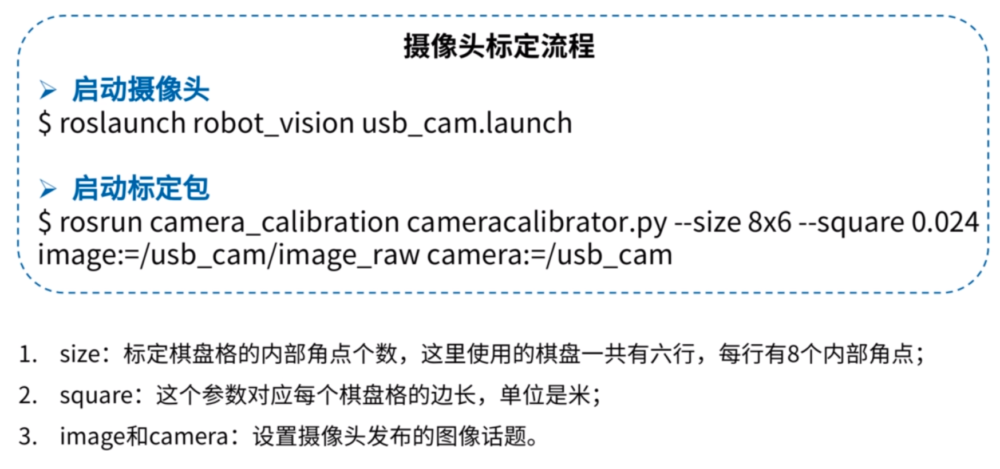
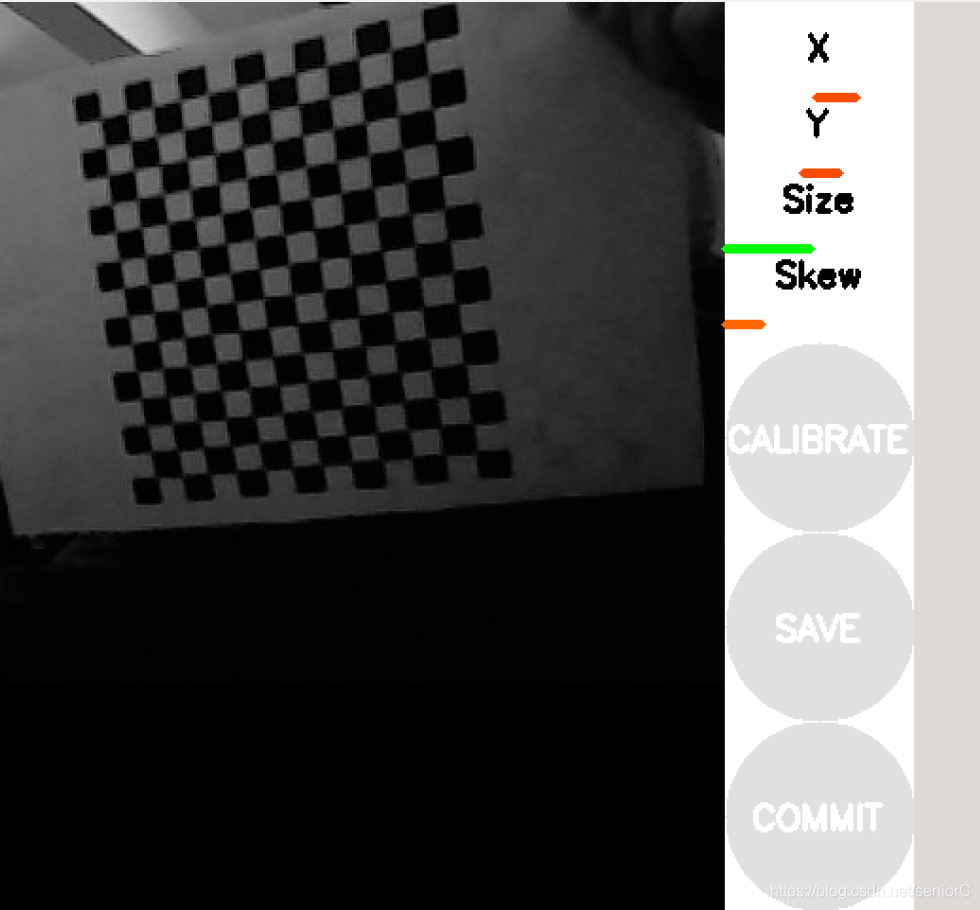

## 摄像头为什么要进行内参标定？

摄像头内参标定是指确定摄像头的内部参数，以便在图像中准确地测量物体的三维位置或进行图像处理。这是因为摄像头在生产过程中存在一些不可避免的误差和畸变，内参标定可以帮助校正这些问题，提高摄像头的测量和成像精度。

主要的内部参数包括焦距、光心坐标、镜头畸变等。进行内参标定的过程通常包括拍摄一个已知几何形状的标定板，然后通过图像处理算法来计算摄像头的内部参数。这些参数对于计算机视觉、机器人学、虚拟现实等领域的应用非常重要。

通过内参标定，可以纠正图像中的畸变，使得图像中的物体位置更加精准，有助于实现准确的测量和检测。在许多计算机视觉和图像处理的应用中，摄像头内参标定是一个常见且必要的步骤。

相机通过标定板标定过程，简单的可以简单的描述为：
通过标定板，可以得到n个对应的世界坐标三维点Xi和对应的图像坐标二维点xi，这些三维点到二维点的转换都可以通过上面提到的相机内参K，相机外参R和t，以及畸变参数D，经过一系列的矩阵变换得到。

## 使用ROS对相机进行内参标定过程

安装标定功能包：

```cpp
sudo apt-get install ros-melodic-camera-calibration
```

这个功能包里面封装了对摄像头参数标定的一个通用的算法。

这个功能包使用时需要配合一个棋盘格标定靶一起使用（棋盘格标定靶如下图


标定基本流程：将摄像头看到的标定靶的图像跟真实的正方形的尺寸进行对比，对摄像头的各个硬件参数去做标定。


```cpp
注：square这个参数需根据现实你测量的标定靶的边长而定。
```

打开外接摄像头：

```cpp
roslaunch robot_vision usb_cam.launch
```

启动标定功能包

```cpp
rosrun camera_calibration cameracalibrator.py --size 12x14 --square 0.012 image:=/usb_cam/image_raw camera:=/usb_cam
```

启动标定包后会出现以下界面
以下对图中出现的X、Y、Size、Skew进行解释

```cpp
X：标定靶在摄像头视野中左右移动
Y：标定靶在摄像头视野中上下移动
Size：标定靶在摄像头视野中前后移动
Skew：标定靶在摄像头视野中的倾斜转动
```

标定过程直至绿色的CALIBRATE键亮起表明标定标定工作可以结束
然后按下SAVE键将标定的数据保存下来

标定所生成的数据保存在`/home/.ros/camera_info`文件夹中，下次打开摄像头的时候会自动读取里面的内容
