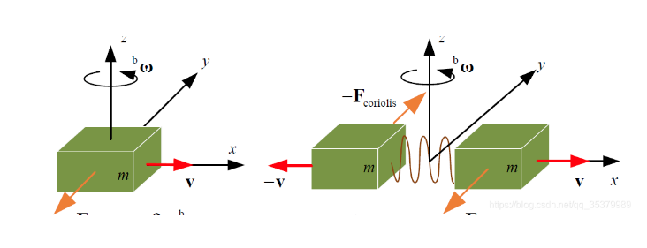

IMU：Inertial Measurement Unit，即惯性测量单元

狭义上，一个IMU 内在正交的三轴上安装陀螺仪和加速度计，一共 6 个自由度，来测量物体在三维空间中的角速度和加速度，这就是我们熟知的“6轴IMU”

广义上，IMU可在加速度计和陀螺仪的基础上加入磁力计，可形成如今已被大众知晓的“9轴IMU”，
它是由三轴加速度计、三轴陀螺仪、三轴磁力计等多种传感器组成的模块

## 三轴加速度计工作原理
三轴加速度传感器是基于加速度的基本原理去实现工作

1. 测量比力
    三轴加速度计是一种惯性传感器，能够测量物体的比力，即去掉重力后的整体加速度或者单位质量上作用的非引力。当加速度计保持静止时，加速度计能够感知重力加速度，而整体加速度为零。在自由落体运动中，整体加速度就是重力加速度，但加速度计内部处于失重状态，而此时三轴加速度计输出为零

    
    
    f弹簧的拉力，a物体在惯性坐标系下的加速度，g重力加速度（此处的g为矢量）

    可以想象一个小球装在一个感应的小盒子里。水平放置的时候，重力使得小球与下表面接触，下表面会产生一个向上的力，与重力相抵消，则产生一个向上的加速度，大小为G

    假设IMU的测量范围是正负16G，则测得向上加速度为16个G的时候，真实物体向上的加速度只有15个G。反之，向下测得有16个G的时候，真实加速度有17个Ｇ

2. 测量角度 
   三轴加速度计的原理能够用来测量角度。直观地，如图所示，弹簧压缩量由加速度计与地面的角度决定。比力能够通过弹簧压缩长度来测量。因此，在没有外力作用的情况下，加速度计能够精确地测量俯仰角和滚转角，且没有累积误差

   

   介于其测量角度的工作原理，三轴加速度计无法测量偏航角(yaw轴)；可测量俯仰角(pitch轴)和翻滚角(roll轴)

## 三轴陀螺仪工作原理
三轴陀螺仪是惯性导航系统的核心敏感器件，其测量精度直接影响惯导系统的姿态解算的准确性

作用：用于测量单元中的角速度及对角速度积分后角度的计算

### 科里奥利力（Coriolis force）
简称科氏力，是对旋转体系中进行直线运动的质点由于惯性相对于旋转体系产生直线运动偏移的一种描述。科氏力来自于物体运动所具有的惯性

当一个质点相对于惯性体系做直线运动时，因为质点自身惯性，它相对于旋转体系，其轨迹是一条曲线。立足于旋转体系，认为有一个力驱使质点运动轨迹形成曲线。科氏力就是对这种偏移的一种描述，表示为：

即本来直线的运动放在一个旋转体系中直线轨迹会发生偏移，而实际上直线运动的问题并未受到力的作用，设立这样一个虚拟的力称为科里奥利力

由此我们在陀螺仪中，选用两块物体，它们处于不断的运动中，并令它们运动的相位相差-180度，即两个质量块运动速度方向相反，而大小相同。它们产生的科氏力相反，从而压迫两块对应的电容板移动，产生电容差分变化。电容的变化正比于旋转角速度。由电容即可得到旋转角度变化

## 三轴磁力计
磁力计能提供物体在XYZ各轴所承受磁场的数据，接着相关数据会汇入微型控制器的运算法，以提供磁北极相关的航向角，利用这些信息可侦测地理方位

磁力仪采用三个互相垂直的磁阻传感器，每个轴向上的传感器检测在该方向上的地磁场强度

三轴磁力计还可以采用洛伦兹力原理，电流流过磁场产生力，从而驱动电容等变化

## 参考致谢
- [干货！IMU中加速度计、陀螺仪、磁力计的工作原理](https://www.eet-china.com/mp/a96946.html)

