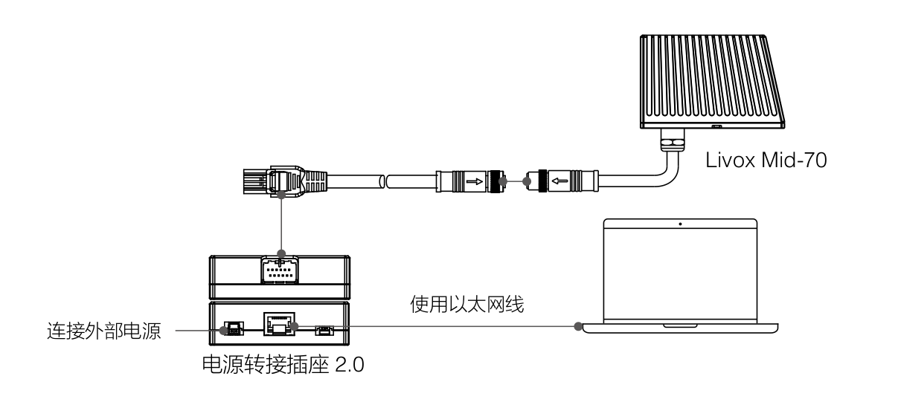
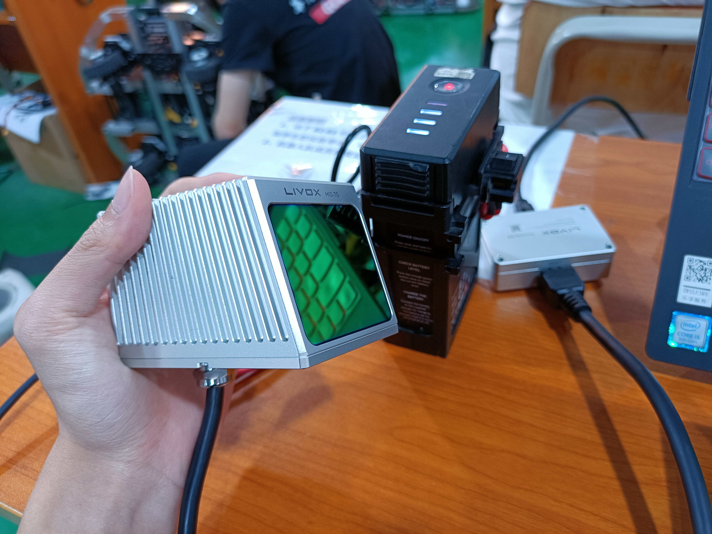

## Livox的一些概述
- Livox Mid-70最小探测距离为0.05m，最大探测距离可达260m；
- 它的圆形视场（FOV）达到70.4°；
- 它遵循右手定则；


## Livox Mid-70 静态配置
1. 按下图连接好各个硬件设备。


2. 使用ifconfig查看自己的网口名称。
   
    比如我这里是`enp7s0`

3. 然后使用
   ```shell
   sudo ifconfig enp7s0 192.168.1.50
   ```
   配置静态IP，将enp7s0改成你自己的网口名称，`192.168.1.50`这个IP固定，不要改，后面使用多台Livox雷达时可更改，范围是11~80，我这里是50。

配置完后就可以打开激光雷达看数据了。

## 在Ubuntu下利用Livox_Viewer实时显示三维点云
Livox Viewer是一款可实时显示、录制、回放、解析三维点云的操作软件,并支持产品设置、外参调节等高级功能。


- [Livox_Viewer下载地址](https://www.livoxtech.com/cn/mid-70/downloads)

进入到Livox_Viewer_For_Linux_Ubuntu16.04_x64_0.10.0文件目录下，运行
```shell
./livox_viewer.sh 
```


下图是Livox_Viewer实时显示的三维点云


## 使用livox_ros_driver在rviz实时显示三维点云数据
打开终端，运行：
```shell
roslaunch livox_ros_driver livox_lidar_rviz.launch bd_list:="3GGDJAR00100531"
```

上面的`3GGDJAR00100531`是购买激光雷达上面的广播码，最后数字1是根据雷达的型号去设置的。

下图是官方对最后一个数字的说明，我使用的是MID-70，对应的是数字1。


下图是在rviz上实时显示三维点云数据


## 使用livox_mapping来进行三维建图
1. 雷达SDK下载和安装，GitHub下载最新源码。
    ```shell
    git clone https://github.com/Livox-SDK/Livox-SDK.git

    cd Livox-SDK

    cd build && cmake ..

    make

    sudo make install
    ```
2. 安装ros驱动
    ```shell
    git clone https://github.com/Livox-SDK/livox_ros_driver.git 
    ```

3. 下载并安装编译livox_mapping，注意一定要先单独编译雷达的驱动
    ```shell
    git clone https://github.com/Livox-SDK/livox_mapping.git

    cd ..

    catkin_make
    ```
4. 运行gmapping
   
    开启雷达
   ```shell
   roslaunch livox_ros_driver livox_lidar.launch
   ```
   开启gmapping
   ```shell
   roslaunch livox_mapping mapping_mid.launch
   ```

下图放一张随便建的图

帅啊

最后放一张实物图


质感很好，就是有点烫


## 三维激光雷达外参标定
### 外参标定概述
在多传感器智能体导航中，通常会安装多个传感器用以数据的融合与计算。在移动建图和环境感知中，通常需要布置多个Lidar以确保较大的FOV， 为更稳健的姿态估计算法和丰富环境细节提供稳定的数据源。然而无论是哪种传感器：相机、激光雷达、毫米波雷达都有自己的坐标系，也就是 所有的传感器产生的数据都是基于传感器自身的坐标系的。为了方便算法研究和测试，需要将各自传感器获得的数据转换到同一个坐标系下，这既是传感器的外参标定。

(由于没有没有2台三维激光雷达给我测试，后面的实操先放放)
### Lidar-Camera外参标定
Livox提供了一个手动校准Livox雷达和相机之间外参的方法，并在Mid-40，Horizon和Tele-15上进行了验证。其中包含了计算相机内参，获得标定数据，优化计算外参和雷达相机融合应用相关的代码。本方案中使用了标定板角点作为标定目标物，由于Livox雷达非重复性扫描的特点，点云的密度较大，比较易于找到雷达点云中角点的准确位置。相机雷达的标定和融合也可以得到不错的结果。

详情可参考：[Camera-LiDAR-Calibration Manual](https://github.com/Livox-SDK/livox_camera_lidar_calibration/blob/master/README.md)

需要安装的依赖：
- PCL 安装
- Eigen 安装
- Ceres-solver 安装
  
这里我没有Ceres-solver这个库，所以下面我来讲一下怎么安装Ceres-solver库。

1. 到[ceres-solver](https://github.com/ceres-solver/ceres-solver)下载安装包,或者复制链接http://ceres-solver.org/ceres-solver-2.1.0.tar.gz
到浏览器打开

1. 安装所有依赖
   ```shell
   # CMake
    sudo apt-get install cmake
    # google-glog + gflags
    sudo apt-get install libgoogle-glog-dev libgflags-dev
    # Use ATLAS for BLAS & LAPACK
    sudo apt-get install libatlas-base-dev
    # Eigen3
    sudo apt-get install libeigen3-dev
    # SuiteSparse and CXSparse (optional)
    sudo apt-get install libsuitesparse-dev
    ```
2. 准备好构建、测试和安装 Ceres
    ```shell
    tar zxf ceres-solver-2.1.0.tar.gz
    mkdir ceres-bin
    cd ceres-bin
    cmake ..
    make -j3
    make test
    # Optionally install Ceres, it can also be exported using CMake which
    # allows Ceres to be used without requiring installation, see the documentation
    # for the EXPORT_BUILD_DIR option for more information.
    sudo make install
    ```
至此 Ceres Solver 已安装完毕。

下载标定源码，编译准备
```shell
git clone https://github.com/Livox-SDK/livox_camera_lidar_calibration.git
cd camera_lidar_calibration
catkin_make
source devel/setup.bash
```

(实操待续。。。)


## 其他文档
- [Livox外参标定与点云显示](https://github.com/Livox-SDK/Livox-SDK/wiki/Calibrate-extrinsic-and-display-under-ros-cn)
- [在ROS驱动程序下使用lvx文件的方法](https://github.com/Livox-SDK/Livox-SDK/wiki/How-to-use-lvx-file-under-ros)
- [Livox 0.1 文档](https://livox-wiki-cn.readthedocs.io/zh_CN/latest/introduction/production.html)
- [相机雷达标定文档](https://github.com/Livox-SDK/livox_camera_lidar_calibration/blob/master/doc_resources/README_cn.md)
