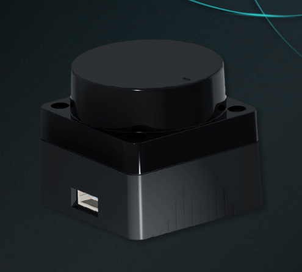

## ROS如何获取激光雷达扫描的每个点云（x，y，z）位置信息?

在ROS中，可以使用ROS中的激光雷达驱动程序，如hokuyo_node、sick_tim等，来获取激光雷达的扫描数据。

获取激光雷达扫描的每个点云（x，y，z）位置信息的一般步骤如下：

1、安装并启动激光雷达驱动程序

在ROS中，可以使用命令行工具或者在launch文件中配置激光雷达驱动程序来启动激光雷达。

2、查看激光雷达消息类型

在ROS中，激光雷达数据通常以sensor_msgs/LaserScan类型的消息进行传递。可以通过命令行工具或者在launch文件中查看激光雷达驱动程序发布的消息类型。

3、订阅激光雷达数据

在ROS中，可以通过创建一个ROS节点，并使用ros::Subscriber对象订阅激光雷达驱动程序发布的消息。

4、处理激光雷达数据

在回调函数中，可以使用sensor_msgs/LaserScan类型的消息中的ranges字段获取激光雷达扫描到的每个点的距离信息。同时，可以使用sensor_msgs/LaserScan类型的消息中的angle_min、angle_max和angle_increment字段计算出每个点的角度信息。根据激光雷达的扫描模式（如水平扫描、垂直扫描等），可以将距离信息和角度信息转换为每个点的（x，y，z）位置信息。

5、可视化激光雷达数据

在ROS中，可以使用rviz等可视化工具来可视化激光雷达数据。

以上是获取激光雷达扫描的每个点云（x，y，z）位置信息的一般步骤。具体实现方式可能因激光雷达驱动程序和应用需求而有所差异。


## 实验过程
本次使用的激光雷达型号为：ORADAR MS200


激光雷达发布的数据类型为sensor_msgs::LaserScan 
```bash
float32 angle_min        # 开始扫描的角度(角度)
float32 angle_max        # 结束扫描的角度(角度)
float32 angle_increment  # 每一次扫描增加的角度(角度)
 
float32 time_increment   # 测量的时间间隔(s)
float32 scan_time        # 扫描的时间间隔(s)
 
float32 range_min        # 距离最小值(m)
float32 range_max        # 距离最大值(m)
 
float32[] ranges         # 距离数组(长度360)(注意: 值 < range_min 或 > range_max 应当被丢弃)
float32[] intensities    # 与设备有关,强度数组(长度360)
```
打开雷达驱动包，echo一下查看`scan`话题查看激光雷达发布的数据，如下所示：
```bash
header: 
  seq: 744
  stamp: 
    secs: 1679554264
    nsecs: 439160604
  frame_id: "laser_frame"
angle_min: 0.0
angle_max: 6.2831854820251465
angle_increment: 0.013931674882769585
time_increment: 0.0002243229391751811
scan_time: 0.1011696457862854
range_min: 0.05000000074505806
range_max: 20.0
ranges:[]
intensities:[]
-------------
header: 
  seq: 745
  stamp: 
    secs: 1679554264
    nsecs: 540396316
  frame_id: "laser_frame"
angle_min: 0.0
angle_max: 6.2831854820251465
angle_increment: 0.013993731699883938
time_increment: 0.00021970857051201165
scan_time: 0.09864915162324905
range_min: 0.05000000074505806
range_max: 20.0
ranges:[]
intensities:[]
```
这里的ranges[]、 intensities[]数组由于数据量太大没放出来。

回调函数中，可以使用sensor_msgs/LaserScan类型的消息中的ranges字段获取激光雷达扫描到的每个点的距离信息。同时，可以使用sensor_msgs/LaserScan类型的消息中的angle_min、angle_max和angle_increment字段计算出每个点的角度信息。根据激光雷达的扫描模式（如水平扫描、垂直扫描等），可以将距离信息和角度信息转换为每个点的（x，y，z）位置信息。

可以从上面看到angle_min为0（弧度制）；angle_max为6.2831854820251465（弧度制）；angle_increment在0.01399左右，这里把它取值为0.0134（弧度制）。

则我们就可以得到雷达扫描一帧的点云数量，计算过程为：

（angle_max - angle_min） / angle_increment = 1HZ 点云数量

----->6.2831854820251465 / 0.0134 ~= 449

这样我们就得到了激光雷达一帧扫描出来的点云数量约为449个点云。

代码实现如下:
```C++
#include <ros/ros.h>
#include <sensor_msgs/LaserScan.h>

void laserScanCallback(const sensor_msgs::LaserScan::ConstPtr& msg)
{
  float angle_min = msg->angle_min;  //雷达开始扫描角度
  float angle_increment = msg->angle_increment;     //雷达每一次扫描增加的角度
  std::vector<float> ranges = msg->ranges;      //雷达扫描距离数组
  
  for(int i=0; i<ranges.size(); i++)
  {
    float angle = angle_min + i*angle_increment;
    float x = ranges[i] * std::cos(angle);
    float y = ranges[i] * std::sin(angle);
    float z = 0.0; // 单线激光雷达使用水平扫描方式，Z值为0
    
    ROS_INFO("Point cloud #%d: x=%f, y=%f, z=%f", i, x, y, z);
  }
}

int main(int argc, char** argv)
{
  //节点初始化
  ros::init(argc, argv, "laser_scan_listener");
  //创建节点句柄
  ros::NodeHandle nh;
  //订阅激光雷达话题
  ros::Subscriber sub = nh.subscribe<sensor_msgs::LaserScan>("/MS200/scan", 1, laserScanCallback);   
  //spin()处理订阅回调函数
  ros::spin();
  
  return 0;
}
```

首先，在回调函数laserScanCallback()中，我们从传入的sensor_msgs::LaserScan消息中获取激光雷达扫描到的每个点的距离信息ranges，以及角度信息angle_min和angle_increment。接下来，我们使用这些信息计算每个点的（x，y，z）位置信息。这里我们假设激光雷达是在水平平面上扫描的，所以z坐标为0。

然后，我们使用ROS_INFO()函数将每个点云的位置信息打印出来。最后，在main()函数中，我们创建了一个ROS节点，并订阅了话题“scan”，并将接收到的消息传递给回调函数laserScanCallback()处理。最后，我们调用ros::spin()来保持ROS节点在运行状态，以等待接收消息。


