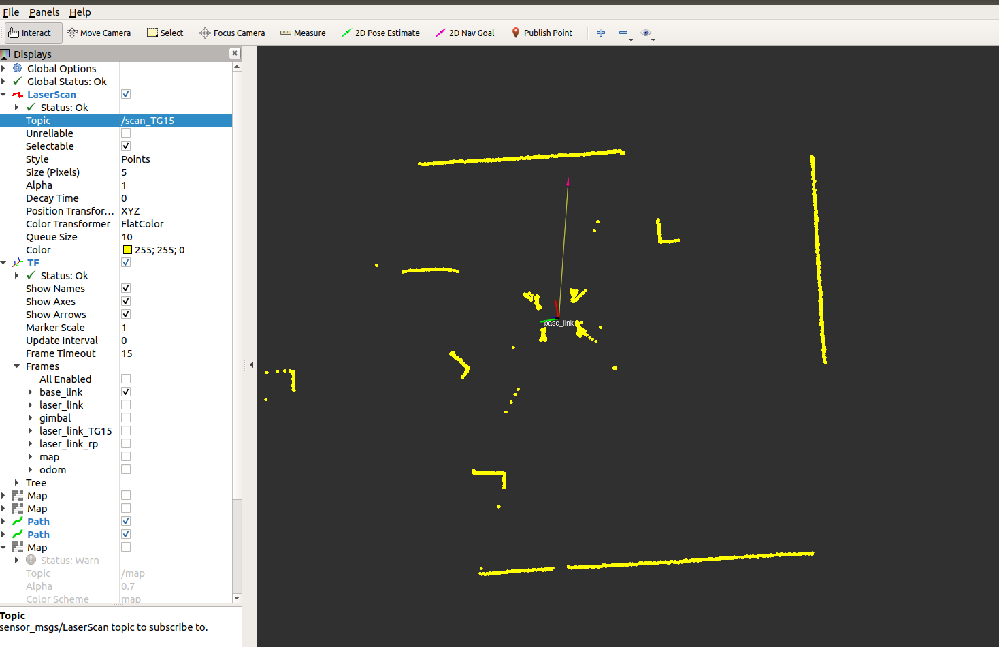
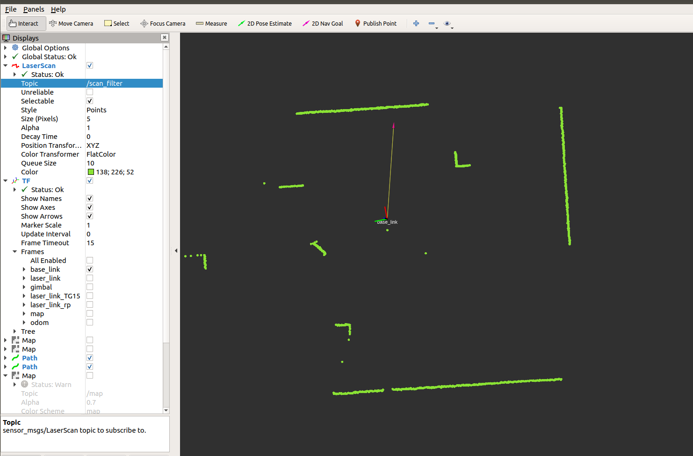

当2d激光雷达放在车的底盘时，由于四周轮子的遮挡，会出现机器人把自己轮子当成障碍物产生错误的运动的情况，所以我们要将激光雷达扫描到四周的轮子的信息屏蔽掉，我们决定使用laser_filters来滤除轮子的点云信息。
## 2D激光雷达数据过滤器主要有以下几种
### LaserArrayFilter
此过滤器内部使用浮点数组过滤器的过滤器实现（使用数学过滤器对距离和强度进行过滤）。它提取范围和强度值，并将每个值视为通过内部过滤器链传递的独立浮点数组。

参数设置示例：
```cpp
scan_filter_chain:
- type: laser_filters/LaserArrayFilter
  name: laser_median_filter
  params:
    range_filter_chain:
      - name: median_5
        type: MultiChannelMedianFilterFloat
        params:
          number_of_observations: 5
          unused: 10
    intensity_filter_chain:
      - name: median_5
        type: MultiChannelMedianFilterFloat
        params:
          number_of_observations: 5
          unused: 10
```
### ScanShadowsFilter
此过滤器可移除最有可能在扫描对象边缘时由遮蔽效应引起的激光读数。对于任何两个点P1和P2，我们通过计算垂直角来实现。 也就是说，假设激光的原点是O，则形成OP1P2的角度。 如果垂直角度小于特定最小值或大于特定最大值，我们将该点的所有附近点移除。

**过滤掉可能因为遮挡效应而产生的数据**

参数设置示例：
```cpp
scan_filter_chain:
- name: shadows
  type: laser_filters/ScanShadowsFilter
  params:
    min_angle: 10
    max_angle: 170
    neighbors: 20
    window: 1
```

### InterpolationFilter
对于扫描中的任何无效测量值，会产生一个测量值，该测量值是周围良好值之间的插值。

**向可信点间插入数据**

参数设置示例：
```cpp
scan_filter_chain:
- name: interpolation
  type: laser_filters/InterpolationFilter
```

###  LaserScanIntensityFilter
此过滤器会从sensor_msgs / LaserScan中删除强度大于upper_threshold或小于lower_threshold的所有测量值。 通过将相应的范围值设置为range_max + 1来“移除”这些点，这被假定为错误情况。

**过滤掉给定密度上下界范围之外的数据**

参数设置示例：
```cpp
scan_filter_chain:
- name: intensity
  type: laser_filters/LaserScanIntensityFilter
  params:
    lower_threshold: 8000
    upper_threshold: 100000
    disp_histogram: 0
```

###  LaserScanRangeFilter
此过滤器会从sensor_msgs / LaserScan中删除大于upper_threshold或小于lower_threshold的所有测量值。 通过将相应的范围值设置为NaN来“移除”这些点，NaN被假定为错误情况或lower_replacement_value / upper_replacement_value。 如果use_message_range_limits为true，则使用laserscan消息中的范围。

**过滤掉指定扫描距离范围之外的雷达数据**

参数设置示例：
```cpp
scan_filter_chain:
- name: range
  type: laser_filters/LaserScanRangeFilter
  params:
    use_message_range_limits: false    是否使用scan消息中的阈值信息，默认为false
    lower_threshold: 0.3    最小阈值
    upper_threshold: .inf   最大阈值
    lower_replacement_value: -.inf   将小于最小阈值的数据改为该值，默认NaN
    upper_replacement_value: .inf    将大于最大阈值的数据改为该值，默认NaN
```

###  LaserScanAngularBoundsFilter
此过滤器通过更改最小和最大角度来移除sensor_msgs / LaserScan中某些角度范围之外的点。

**过滤掉指定扫描角度范围之外的雷达数据**

参数设置示例：
```cpp
scan_filter_chain:
- name: angle
  type: laser_filters/LaserScanAngularBoundsFilter
  params:
    lower_angle: -1.57
    upper_angle: 1.57
```

### LaserScanAngularBoundsFilterInPlace
此过滤器会删除某些角度范围内的sensor_msgs / LaserScan中的点（不会删除目标角度扇区外的数据）。 通过将相应的范围值设置为range_max + 1来“移除”这些点，这被假定为错误情况。

**过滤掉指定扫描角度范围之内的雷达数据**

参数设置示例：
```cpp
scan_filter_chain:
- name: angle
  type: laser_filters/LaserScanAngularBoundsFilterInPlace
  params:
    lower_angle: 0.685398163
    upper_angle: 0.885398163
```

### LaserScanBoxFilter
此过滤器会删除一个区块内的数据（常用于无视机器人本体对激光雷达数据的干扰）。 通过将相应的范围值设置为NaN来“移除”这些点，这被假定为错误情况。

**过滤掉指定的box范围内额数据**

参数设置示例：
```cpp
scan_filter_chain:
- name: box
  type: laser_filters/LaserScanBoxFilter
  params:
    box_frame: scan_link
    min_x: -1.0
    max_x: 1.0
    min_y: -1.0
    max_y: 1.0
    min_z: -1.0
    max_z: 1.0
```

### 雷达滤波器下载
```shell
git clone https://github.com/ros-perception/laser_filters
```

**使用雷达滤波器**
我使用的是ydlidar TG15型号雷达，将雷达放在底盘下方，由于底盘四周有轮子遮挡，需要过滤掉四个轮子所在区域的数据，启动文件为：
```html
<!-- 打开TG雷达 -->
  <include file="$(find ydlidar_ros_driver)/launch/TG.launch" />
  <!-- 开启雷达滤波器 -->
  <node pkg="laser_filters" type="scan_to_scan_filter_chain" output="screen" name="laser_filter">
  <rosparam command="load" file="$(find laser_filters)/examples/my_robot_laser_filters.yaml" />
  </node>
```

其中， my_robot_laser_filters.yaml文件为：
```cpp
scan_filter_chain:
# 左上轮
- name: angle1
  type: laser_filters/LaserScanAngularBoundsFilterInPlace
  params:
    lower_angle: 0.55
    upper_angle: 1
# 左下轮
- name: angle2
  type: laser_filters/LaserScanAngularBoundsFilterInPlace
  params:
    lower_angle: 1.9
    upper_angle: 2.5
# 右上轮
- name: angle3
  type: laser_filters/LaserScanAngularBoundsFilterInPlace
  params:
    lower_angle: -0.98
    upper_angle: -0.53
# 右下轮
- name: angle4
  type: laser_filters/LaserScanAngularBoundsFilterInPlace
  params:
    lower_angle: -2.49
    upper_angle: -1.93
```

:::caution 注意
- 多次使用同一过滤器时，需要不同的name；
- `lower_angle`、`upper_angle`分别对应扇区角度值小的和角度值大的；
:::

### 滤波器使用前后对比图
**使用滤波器前**


**使用滤波器后**



可以看到车四周被轮子遮挡部分已经被滤波器滤除掉了。


## 参考致谢
- [laser_filters](http://wiki.ros.org/laser_filters)
- [ROS中laser_filters软件包学习](https://blog.csdn.net/weixin_38437252/article/details/90020543)
- [ROS激光雷达数据过滤](https://blog.csdn.net/seeseeatre/article/details/79191737)
