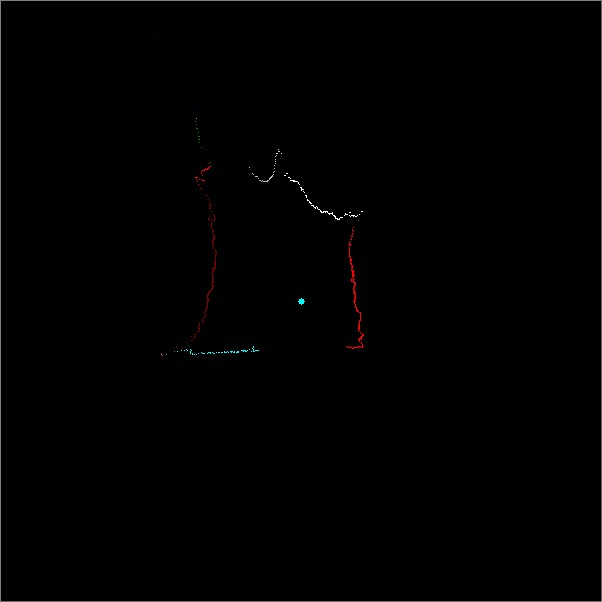

## 激光雷达特征提取
主要分两个步骤：
 1. 区域分割：这个阶段主要完成特征模式的分类及识别确认，即确定特征属于哪种类型，如直线、圆弧等，并确定属于该特征模式的区域及区域内的激光数据点集。
 2. 特征提取：主要完成各类特征模式参数的确定以及特征点的提取。


## 区域分割
对于每一帧距离数据，首先把激光扫描点分割成不同的区块。如果连续两个扫描点的距离小于一个阈值，这两个扫描点属于同一个区块。如果连续两个扫描点的距离大于一个阈值，数据帧就从这个地方分割开。最后把一帧距离数据分割成几个区块。分割的区块表示为 Ri(i=1,…,Q，其中 Q 是分割的区块数)，每一个区块包含 Ni个点。由于扫描点的分布并不是均匀的，通常情况下，离传感器近的扫描点密度大一些，而远离传感器的扫描点密度小一些。所以进行距离数据分割时，应用自适应变阈值分割方法。例如当某个扫描点离传感器中心的距离为 D 时，分割阈值选择为 d，当扫描点离传感器中心的距离为3D 时，阈值选择为 3d。除此之外，也可以选用其它的线性或非线性函数来定义自适应分割阈值。总之，在不同的扫描点选用不同的分割阈值，以求距离数据的分割区块能够更好地与实际环境特征模型一致。如果激光的有效测距距离为 10 米，并且角度分辨率为 0.25度，则相邻扫描点之间的距离最小为：2×10m×sin(0.125°)=0.0436m。根据该值可以设定合适的分隔阈值。


 1. 计算相邻两个点之间的距离Dj。

 2. 判断Dj和阈值delta的关系。

如果Dj,大于闽值delta,则认为点(x,y)是两个区域的分割点，阈值的选择一般按照动态阈值的方式。

 3. （可选）判断每个区域内的数据点的个数,如果某个区域包含数据点的个数小于等于三个,那么该区域被视为噪声区域,舍弃这些噪声点。


激光雷达区域分割效果图




不同的区域用不同的颜色分割（同一种颜色并不代表在同一区域，只是颜色有限，几种颜色在循环使用）。


## 特征提取
激光雷达扫描的数据中，几个重要的特征：撕裂点（breakPoint）、角点（Corner）、直线、圆弧等。

区域分割实际上就已经找到了数据中的撕裂点。折线也可以当成是一个特征，是直线加角点构成的特征。


直线作为一个很关键的特征在很多的论文中都是提取的关键，鉴于折线的是普遍存在的，那么角点的检测同样是一个难以回避的问题。那么我们就先提取角点，将所有的折线都打断成直线和角点。


###  角点检测

假设有一条折线，只有单个角点，那么我们可以采用多变形拟合方式确定角点的位置。首先将区域内的点拟合成一条直线，然后找出离直线最远的点，这个距离如果大于某个阈值，则可以认为是折线，而该点就是折线的分割点，否者就是一条直线。

当某区域含有多个角点时，就需要采用迭代或者递归的方式，不断的寻找角点-->拆分成两段，循环进行，直到每个区域都不存在角点。


代码作用：多边形拟合的方式确定是否存在角点，以及角点的位置
```cpp
// 进行多边形拟合： Points : 轮廓上的点      n -- 轮廓点数目  Eps -- 拟合精度
// 返回值： 若该轮廓段需要分段，则返回分段点在该轮廓点列中的索引，否则，返回 0 表示不需要分段
// 这里是整个算法计算复杂性最大的一个地方
// 为了提高程序运行效率，对点到直线的距离计算进行改进：
// 多边形拟合中的直线是由点列中的点决定的
// 为了计算点到直线的距离，
// 采用坐标系旋转，将直线旋转到x轴方向，这样点到直线的距离即为各个点
// 在坐标旋转后的y值的绝对值
// 同时，坐标旋转矩阵在该次运算中为定值，只需一次计算，不需要多次的开方或三角计算
int OpenRadar::PolyContourFit( int* X, int* Y, int n , float Eps ) // 根据轮廓点，用多边形拟合该轮廓点    
{
    double dis = sqrt((double)(((X[0] - X[n - 1])*(X[0] - X[n - 1])) +  
                     ((Y[0] - Y[n - 1])* (Y[0] - Y[n - 1]))));
    double cosTheta = (X[n- 1] - X[0]) / dis;
    double sinTheta = - ( Y[n- 1] - Y[0] )/dis;
    double MaxDis = 0;
    int i ;
    int MaxDisInd = -1;
    double dbDis;
    for(i = 1 ; i < n - 1 ; i++)
    {
        // 进行坐标旋转，求旋转后的点到x轴的距离
        dbDis = abs( (Y[i] - Y[0]) * cosTheta + (X[i] - X[0])* sinTheta);
        if( dbDis > MaxDis)
        {
            MaxDis = dbDis;
            MaxDisInd = i;
        }
    }
    if(MaxDis > Eps)
    {
        return MaxDisInd;
        //        cout << "Line 1 : " << endl;
        //        cout << "Start :" << Points[0].x << "  " << Points[0].y  << " --- " << Points[MaxDisInd].x << "  " << Points[MaxDisInd].y << endl;
        //        cout << "角度： "<<180 * atan2(Points[0].y - Points[MaxDisInd].y , Points[0].x - Points[MaxDisInd].x ) / 3.1415926;
        //        cout << "Line 2 :" << endl;
        //        cout << "Start :" << Points[MaxDisInd].x << "  " << Points[MaxDisInd].y  << " --- " << Points[n - 1].x << "  " << Points[n - 1].y << endl;
        //        cout << "角度： "<< 180 * atan2(Points[n - 1].y - Points[MaxDisInd].y , Points[n - 1].x - Points[MaxDisInd].x ) / 3.1415926;
    }
    //    else{
    //        cout << "Line 1 : " << endl;
    //        cout << "Start :" << Points[0].x << "  " << Points[0].y  << " --- " << Points[n - 1].x << "  " << Points[n - 1].y << endl;
    //        cout << "角度： "<<180 * atan2(Points[n - 1].y - Points[0].y , Points[n - 1].x - Points[0].x ) / 3.1415926;
 
    //    }
    return 0;
}
```
以上只能检测具有单个角点的折线，任意个角点的折线采用了递归的方式，想提速的可以自己转化为迭代的方式实现。

```cpp
//将折线拆多段
int OpenRadar::BreakPolyLine(vector<int>& BreakedRadarRho,
                             vector<double>& BreakedRadarTheta,
                             vector<int>& SepRadarRho ,   
                             vector<double>&SepRadarTheta)
{
    int rho = 0;
    double theta = 0.0;
    int X[1200] = {0};
    int Y[1200] = {0};
    int rhoCopy[1200] = {0};
    double thetaCopy[1200] = {0};
    int pointCnt = 0;
    int lineCnt = 0;
    int N = 0;
    SepRadarRho.clear();
    SepRadarTheta.clear();
    Corners.clear();
 
    //进行多次迭代，将所有的折线都拆分成直线段
   
   vector<int>CornerIndex;
   int CornerCnt = 0;
   int tempIndex = 0;
    for (int i = 0; i < static_cast<int>(BreakedRadarRho.size());i++)
    {
        rho   = BreakedRadarRho.at(i);
        theta = BreakedRadarTheta.at(i);
 
        if (rho < 0)
        {
            if (pointCnt > 200)//数目比较少的点直接抛弃
            {
                CornerIndex.clear();
                CornerCnt = FindCorners(CornerIndex,X,Y,0,pointCnt,200);
 
                if (CornerIndex.size() == 0)
                {
                    for (int k = 0 ; k < pointCnt;k++)
                    {
                        SepRadarRho.push_back(rhoCopy[k]);
                        SepRadarTheta.push_back(thetaCopy[k]);
                    }
                    SepRadarRho.push_back(-1);
                    SepRadarTheta.push_back(1000.0);
                    lineCnt++;
                }else
                {
                    tempIndex = 0;
                    for (int k = 0 ; k < pointCnt;k++)
                    {
                        SepRadarRho.push_back(rhoCopy[k]);
                        SepRadarTheta.push_back(thetaCopy[k]);
                        if (k == CornerIndex.at(tempIndex))
                        {
                            SepRadarRho.push_back(-1);
                            SepRadarTheta.push_back(1000.0);
                            lineCnt++;
                            if (tempIndex < static_cast<int>(CornerIndex.size()) -1)
                            {
                                tempIndex++;
                            }  
                        }
                    }
                    SepRadarRho.push_back(-1);
                    SepRadarTheta.push_back(1000.0);
                    lineCnt++;
                }
            }
            pointCnt = 0;
            continue;
        }
        X[pointCnt] = static_cast<int>(rho*cos(theta));
        Y[pointCnt] = static_cast<int>(rho*sin(theta));
        rhoCopy[pointCnt]   = rho;
        thetaCopy[pointCnt] = theta;
        pointCnt++;
    }
    
    //cout<<"lineCnt: "<<lineCnt<<endl;
    return lineCnt;
}
```

### 直线拟合
   如果某区域不存在角点，并且点数据比较大，那么一般都是直线。

直线拟合的原理比较简单，实际就是一个最小二乘法，或者为了提高拟合的精度可以采用加权的最下二乘法，这里采用的是加权最小二乘。

原始数据图 蓝点是雷达的位置。


拟合直线和角点图 粗点是角点，粗实线是拟合出的直线。


由于只对点数比价多的直线进行了拟合，上部分的直线并为画出，实际上点数比较少的直线误差也会大，并不是关键的特征。

## 参考致谢
-[激光雷达学习笔记（三）特征提取](https://blog.csdn.net/renshengrumenglibing/article/details/8604245)
