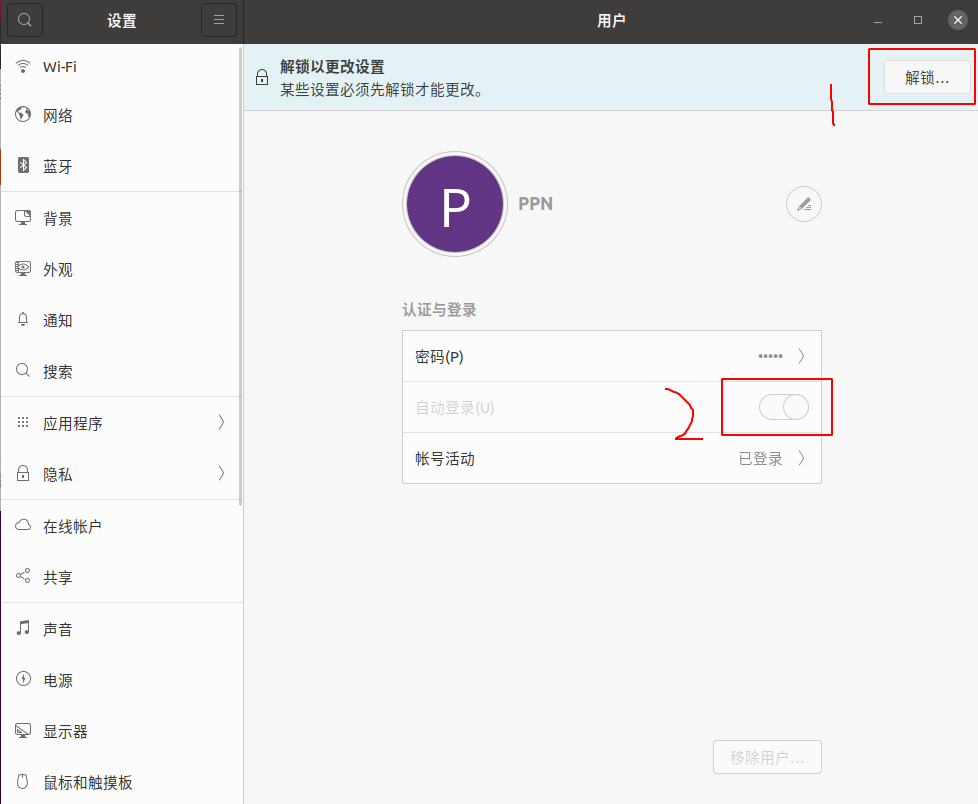
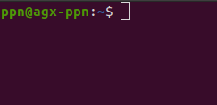
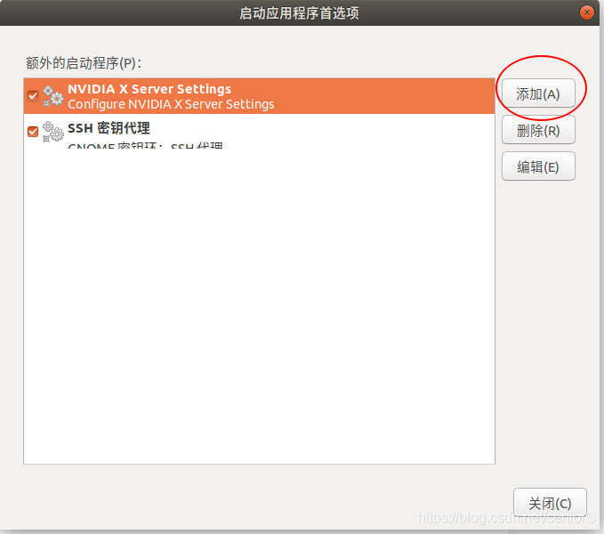

## 设置免密码登录

1.打开   `设置`

2.点击`system settings(详细信息）`

3.点击`user accounts（用户）`

4.点击右上角的`Unlock（解锁）`，只有解锁了才能将更改自动登录设置

5.`输入密码`>将`Automatic login（自动登录）`设置为`on`打开



**这样，免密码登录就设置完成了**

## 给当前帐号设置默认管理员权限

终端运行

```shell
sudo visudo
```

在文件最后加上这一句

```shell
【用户名】 ALL=(ALL) NOPASSWD: ALL
```

用户名打开终端 @之前的就是你的用户名，例如



这里我的用户名为ppn，而不是agx-ppn

:::tip
 用户名为root时: `root ALL=(ALL:ALL) ALL`

 用户名为wolf时: `wolf ALL=(ALL)NOPASSWD:ALL`
:::

## 建立一个自启动的文件

新建一个`run.sh`文件，内容格式如下：

```cpp
cd /home/ppn    //进入可执行文件的目录，例如我这里的final.py是放在主目录下的
python3 final.py
```

## 添加自启动程序

1. 点击显示应用程序搜索框然后搜索 **启动应用程序**

    

2. 点击添加启动程序

    

3. 编辑启动程序

    

第三步需要注意：名称和注释随便填写，命令那块点击浏览你的.sh文件并打开（这里我的run.sh文件是放在主目录下，所以它的路径是`/home/ppn`），然后在最前面加个sh,如上图所示。

为了验证.sh文件是否可以自启动可以在终端中运行:

```shell
bash +【你的.sh文件绝对路径和文件名】
```

或者

```shell
sh   + 【你的.sh文件绝对路径和文件名】
```

例如：我这里的run.sh文件是放在/home目录下的
所以就应该为：

```shell
sh /home/ppn/run.sh
```

## 在nano上是怎么做的？

编辑启动程序时加入下面这句，这句指令的意思就是打开一个新的终端。

```bash
gnome-terminal
```

好了，现在能开机打开一个新的终端了，那如何让新开的终端运行代码呢？

答案就是：修改`./bashrc`文件

在./bashrc文件中添加

```bash
cd /home/agilex
python final.py
```

意思是打开一个终端,先进入到py文件的目录下也就是`/home/agilex`目录，然后运行该文件

## 使用systemd配置开机自启动服务

1. 创建一个服务文件： 创建一个以.service为后缀的服务文件，并将其保存在/etc/systemd/system/目录下。例如，使用nano编辑器创建一个文件：

   ```bash
   sudo nano /etc/systemd/system/your_service_name.service
   ```

   在文件中，添加类似以下的内容，替换相应的路径和命令：

   ```bash
    [Unit]
    Description="my device start"
    #Requires=ppn.service
    #After=network.target

    [Service]
    Type=simple
    ExecStart=/home/maverick/service.sh
    Restart=always
    #User=mav

    [Install]
    WantedBy=multi-user.target

   ```

   - `Description`: 服务的描述。
   - `After`: 指定在哪些目标（target）后启动服务，这里是network.target。
   - `Requires`: 指定服务单元依赖的其他单元。在这个例子中，ppn.service 是此服务所需的另一个服务。如果 ppn.service 没有启动，那么此服务也不会启动。
   - `Type`: 指定服务的类型。simple 表示 systemd 不会认为服务启动完成直到
   - `ExecStart`: 启动服务的命令或脚本的路径。
   - `Restart`: 指定服务失败时是否自动重启,Restart=always表示失败时会一直重启。
   - `User`: 指定服务以哪个用户的身份运行。
   - `WantedBy`: 指定服务的启动目标。在这个例子中，服务会在 multi-user.target 启动。

2. 重新加载systemd管理器配置

   ```bash
   sudo systemctl daemon-reload
   ```

3. 启用服务：使用以下命令启用服务：

   ```bash
   sudo systemctl enable your_service_name.service
   ```

   这会在系统启动时自动启动该服务。

4. 启动服务：手动启动服务以测试：

   ```bash
   sudo systemctl start your_service_name.service
   ```

   可使用以下命令检查服务状态：

   ```bash
   sudo systemctl status your_service_name.service
   ```

5. 重启服务

   ```bash
   sudo systemctl restart your_service_name.service
   ```

## 停止并删除service自启动配置

要删除已经配置的服务，您可以执行以下步骤：

1. **停止服务：** 在删除服务之前，首先停止正在运行的服务。使用以下命令：

   ```shell
   sudo systemctl stop your_service_name.service
   ```

2. **禁用服务：** 禁用服务，以确保它不会在系统启动时自动启动。执行以下命令：

   ```shell
   sudo systemctl disable your_service_name.service
   ```

3. **卸载服务：** 删除服务配置文件。使用以下命令：

   ```shell
   sudo rm /etc/systemd/system/your_service_name.service
   ```

4. **重新加载systemd管理器配置：** 为了使更改生效，重新加载systemd管理器的配置：

   ```shell
   sudo systemctl daemon-reload
   ```

5. **删除服务相关的文件：** 如果服务有其他配置文件或数据文件，您可能需要手动删除它们。请根据实际情况执行适当的清理操作。

6. **检查状态（可选）：** 可以使用以下命令检查服务状态，确保服务已停止并且已禁用：

   ```shell
   sudo systemctl status your_service_name.service
   ```

以上步骤将删除已配置的服务，并确保它在系统启动时不再自动启动。请谨慎操作，确保删除服务之前了解其对系统的影响。
