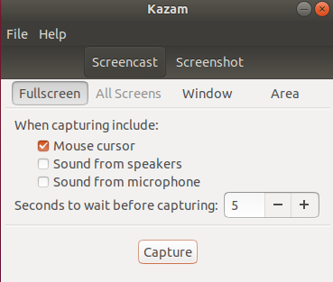

## 需自行去官网下载对应的deb包，使用dpkg进行安装

注意不要去ubuntu Software里面下载，里面下载的都是最小安装版本，很多功能没法用

- Xmind[可用来做思维导图]
- typora[可用来显示md文件]
- VSCode[写代码的IDE]
- WPS
- Google浏览器
- 百度网盘
- 微信
- 钉钉
- 腾讯会议
- Discord
- 搜狗输入法

## 截图工具---Flameshot

Ubuntu自带的截图工具没有对截图进行操作的功能，这我忍不了。
Flameshot功能概述：

- 注释 (高亮、标示、添加文本、框选)
- 图片模糊
- 图片裁剪
- 上传到 Imgur
- 用另一个应用打开截图
我主要使用的是它的截屏后对图片进行标出高亮or在图片上画框的功能。

在终端上进行安装：

```shell
sudo apt install flameshot
```

## 录屏工具---Kazam

Ubuntu自带的录屏工具出来的格式是webm，后续对其进行剪辑时还要转换成mp4文件，太麻烦，换一个！
如果你对命令行不太舒服，而你只想要一个简单的屏幕录像机，可以截屏你的屏幕自由区域，选择Kazam。UI 非常简单而直观。与 GNOME 不同，您只需点击一个复选框来切换音频录制。它支持录音从麦克风以及扬声器。

Kazam 还允许您使用帧速率和视频编解码器进行一些自定义。它支持 RAW、无损 JPEG、WEBM、H.264 视频编解码器。Kazam 是专为极简用户和只需要一点点功能的人而构建的。

在终端进行安装：

```shell
sudo apt install kazam
```



## vlc视频播放器

对于视频文件，你可以在 Ubuntu 上安装 VLC。VLC 是 Linux 上的最佳视频播放器之一，它几乎可以播放任何视频文件格式。

```bash
sudo apt-get  install  vlc
```

## 音视频解码器

但你仍然会遇到无法播放音频和 flash 的麻烦。

好消息是 Ubuntu 提供了一个软件包来安装所有基本的媒体编解码器：ubuntu-restricted-extras。

ubuntu-restricted-extras 是一个包含各种基本软件，如 Flash 插件、unrar、gstreamer、mp4、Ubuntu 中的 Chromium 浏览器的编解码器等的软件包。

可以使用以下命令安装：

```bash
sudo apt-get install ubuntu-restricted-extras 
```

## QT

终端输入该行代码，自动下载最新版本：

```bash
sudo apt-get update
sudo apt-get install qt5-default qtcreator
```

## 串口调试工具---cutecom

cutecom是一个拥有可视化界面的串口调试助手。
1、安装cutecom

```bash
sudo apt-get install cutecom
```

2、运行cutecom

```bash
sudo cutecom
```
