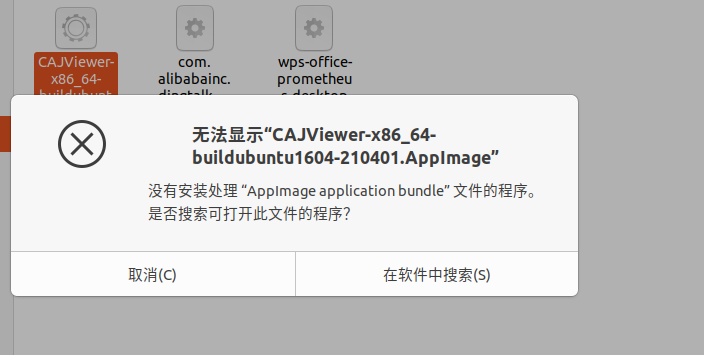
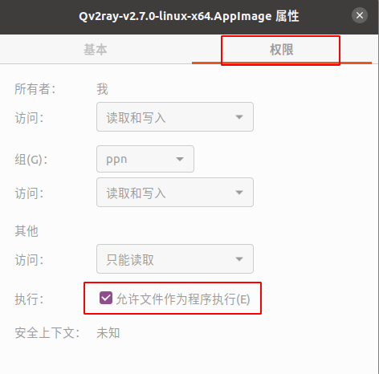

## 拯救者y7000连不上WIFI怎么办？

打开终端上输入：

```shell
sudo modprobe -r ideapad_laptop
```

## 拯救者7000双系统在引导界面进入Ubuntu系统后出现黑屏怎么办？

1. 进入Window系统，先按shift，再点击`重启`，之后会有一个选择页面跳出来，选择`recovery model`，再选择进入`Ubuntu`设备，进入`ubuntu`系统之后，打开终端，输入：

```shell
sudo gedit /etc/default/grub
```

2. 将`GRUB_CMDLINE_LINUX_DEFAULT="quiet splash"`修改为`GRUB_CMDLINE_LINUX_DEFAULT="quiet splash nomodeset"`
3. 在终端中输入：

```shell
  sudo update-grub
```

## 华硕重启选择Ubuntu后进入不了系统怎么办？

重启后不能直接选择ubuntu进入，点击e,进行编辑。

找到quiet splash,在后面输入$vt_handoff acpi_osi=linux nomodeset，然后按f10进入系统。

## 蓝牙连接不上怎么办？

ubuntu 18.04连接蓝牙鼠标或键盘，系统重启后不自动连接，甚至出现无法再次连接的情况，即使删除重新适配连接也连接不上，于是上网找解决方案。

1. 打开终端，输入bluetoothctl，进入蓝牙实用工具

```shell
bluetoothctl
```

2. 输入list检索主控设备，例如我这里显示的

```shell
list
```

> Controller 40:74:E0:A6:6B:1A ppn [default]

3. 选择主控设备select [mac addr]

```shell
select 40:74:E0:A6:6B:1A//将这个改成自己的设备号即可
```

4. 如果蓝牙处于关闭状态，请先开启power on

```shell
power on   //关闭为power off
```

蓝牙设备上电后在终端提示提示`Failed to set power on: org.bluez.Error.Blocked`
这是由于蓝牙设备没有上电造成的，可通过如下命令解决此问题：

```shell
rfkill unblock bluetooth

hciconfig hci0 up
```

之后，就可以在Ubuntu上使用蓝牙了。

## 由于intelRST的问题导致无法安装ubuntu怎么办？

**原因**：英特尔快速存储技术（RST）和ubuntu是不兼容的

**解决方法**需要在w10系统中移除掉RST技术

**解决步骤**

1. 重启进入w10系统中，卸载intelRST驱动
2. 按win+R，在运行窗口中输入msconfig。选择引导->引导选项->安全引导，打上勾并保存设置
3. 重启电脑，在出现电脑品牌画面，快速按F2进入BIOS设置（不同电脑进入BIOS的快捷键可能不一样，我的是DELL）。之后再调整BIOS的SATA硬盘控制器的模式由RAID改为AHCI。（RST使用的是RAID模式，因为卸载了RST驱动，所以需要改变硬盘控制器模式），保存设置
重启电脑，会自动进入安全模式（因为改变了设置，无法正常进入w10，所以之前的安全引导可以让电脑自动进入安全模式并且修复硬盘控制器模式改变而出现的问题，就不用使用二维码里面那么麻烦的方法了）
4. 再次按win+R，输入msconfig进入系统配置，这次把安全引导选项去掉。再重启电脑，进入ubuntu安装，就会发现可以正常安装了同时w10也可以正常进入。

**致谢：**[解决由于intelRST问题导致无法安装ubuntu](https://zhuanlan.zhihu.com/p/148855857)

## ubuntu安装不了AppImage类型文件怎么办？

问题描述：双击AppImage文件试图运行该软件时报如下错误


解决方法：右键 .AppImage 后缀的安装包 > 属性 > 权限 > 勾选“允许作为程序执行文件”



## ubuntu系统源文件被配置了多次

问题描述：我在ubuntu20.04上进行sudo apt update 后出现如下报错

```bash
W: 目标 Packages (main/binary-amd64/Packages) 在 /etc/apt/sources.list.d/ros-fish.list:1 和 /etc/apt/sources.list.d/ros-latest.list:1 中被配置了多次
W: 目标 Packages (main/binary-all/Packages) 在 /etc/apt/sources.list.d/ros-fish.list:1 和 /etc/apt/sources.list.d/ros-latest.list:1 中被配置了多次
W: 目标 Translations (main/i18n/Translation-zh_CN) 在 /etc/apt/sources.list.d/ros-fish.list:1 和 /etc/apt/sources.list.d/ros-latest.list:1 中被配置了多次
W: 目标 Translations (main/i18n/Translation-zh) 在 /etc/apt/sources.list.d/ros-fish.list:1 和 /etc/apt/sources.list.d/ros-latest.list:1 中被配置了多次
W: 目标 Translations (main/i18n/Translation-en_US) 在 /etc/apt/sources.list.d/ros-fish.list:1 和 /etc/apt/sources.list.d/ros-latest.list:1 中被配置了多次
W: 目标 Translations (main/i18n/Translation-en) 在 /etc/apt/sources.list.d/ros-fish.list:1 和 /etc/apt/sources.list.d/ros-latest.list:1 中被配置了多次
W: 目标 DEP-11 (main/dep11/Components-amd64.yml) 在 /etc/apt/sources.list.d/ros-fish.list:1 和 /etc/apt/sources.list.d/ros-latest.list:1 中被配置了多次
W: 目标 DEP-11 (main/dep11/Components-all.yml) 在 /etc/apt/sources.list.d/ros-fish.list:1 和 /etc/apt/sources.list.d/ros-latest.list:1 中被配置了多次
W: 目标 DEP-11-icons-small (main/dep11/icons-48x48.tar) 在 /etc/apt/sources.list.d/ros-fish.list:1 和 /etc/apt/sources.list.d/ros-latest.list:1 中被配置了多次
W: 目标 DEP-11-icons (main/dep11/icons-64x64.tar) 在 /etc/apt/sources.list.d/ros-fish.list:1 和 /etc/apt/sources.list.d/ros-latest.list:1 中被配置了多次
W: 目标 DEP-11-icons-hidpi (main/dep11/icons-64x64@2.tar) 在 /etc/apt/sources.list.d/ros-fish.list:1 和 /etc/apt/sources.list.d/ros-latest.list:1 中被配置了多次
W: 目标 CNF (main/cnf/Commands-amd64) 在 /etc/apt/sources.list.d/ros-fish.list:1 和 /etc/apt/sources.list.d/ros-latest.list:1 中被配置了多次
```

问题分析及解决方案：

根据错误信息，系统中有两个源文件 ros-fish.list 和 ros-latest.list 分别配置了相同的目标 Packages 和目标 Translations。这导致了重复配置的问题，因此 sudo apt update 报错。

要解决这个问题，你可以按照以下步骤进行操作：

1、打开终端。

2、输入以下命令以编辑 ros-fish.list 文件：

```bash
sudo nano /etc/apt/sources.list.d/ros-fish.list
```

3、在编辑器中，删除重复的行或注释掉重复的行（在行首添加 # 符号）。
4、按下 Ctrl + O 保存文件，然后按下 Ctrl + X 退出编辑器。
5、输入以下命令以编辑 ros-latest.list 文件：

```bash
sudo nano /etc/apt/sources.list.d/ros-latest.list
```

6、在编辑器中，删除重复的行或注释掉重复的行。
7、按下 Ctrl + O 保存文件，然后按下 Ctrl + X 退出编辑器。
8、最后，再次运行 sudo apt update 命令，应该不再报错。

通过删除或注释掉重复的配置行，你消除了重复配置的问题，并允许系统正确更新软件包信息。

## jetson Nano +ubuntu18.04 开机自启动问题

问题描述：我在jetson nano上的ubuntu18.04系统上写好了开机自动打开终端，并且提前已经给设备端口赋予了最高权限，并在终端上运行一个python代码，但每次开机终端都会报如下错误：

```bash
SerialException：[Errno 16] could not open port /dev/ttyACM0:[Errno 16] Device or resource busy: '/dev/ttyACM0'
```

问题分析：这个错误表明在尝试打开串口设备`/dev/ttyACM0`时，发生了设备忙的错误。这可能是由于设备已经被其他程序或进程占用而导致的。

为了解决这个问题，你可以尝试以下几个步骤：

1. 确保你的Python程序在终端中运行时，没有其他程序同时占用了串口设备`/dev/ttyACM0`。可能有其他的程序在后台自动启动并占用了该设备，导致你的程序无法打开。你可以使用命令`lsof /dev/ttyACM0`来检查是否有其他程序正在使用该设备。如果有，你可以尝试终止那些程序或者重新配置它们以释放串口设备。

2. 在Jetson Nano上，可能会有一些系统服务或其他自动启动的进程在启动时就尝试访问串口设备。这些进程可能会与你的程序冲突。你可以尝试在你的Python程序运行之前延迟一段时间，以确保系统完全启动并释放了串口设备。你可以在程序开头使用`time.sleep()`函数来增加一个延迟。

3. 检查串口设备的权限。虽然你已经给设备赋予了最高权限，但仍然可以确认一下。使用`ls -l /dev/ttyACM0`命令来检查设备的权限设置。确保你的用户具有读写设备的权限。

4. 确保你的Python程序中没有其他地方同时打开了串口设备。如果在程序的其他部分或其他线程中也打开了同一个串口设备，可能会导致冲突。确保在程序中只有一个地方打开串口设备，并且其他部分不会再次尝试打开它。

通过执行上述步骤，你应该能够解决串口设备忙的问题，并成功打开`/dev/ttyACM0`设备。
