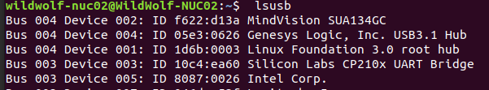

### 根据硬件接口（串口，USB或者ACM）来配置/etc/udev/rules.d中的udev文件，实现ydlidar-G4激光雷达的设备绑定

1. 首先连接ydlidar-G4设备的虚拟串口，lsusb可以查看Vendor和Product的ID，然后创建并配置/etc/udev/rules.d/roborts.rules文件。



从上图可看到雷达的ID为**10c4:ea60**。

创建并配置`/etc/udev/rules.d/ydlidar.rules`文件。

```cpp
KERNEL=="ttyUSB*", ATTRS{idVendor}=="10c4", ATTRS{idProduct}=="ea60", MODE:="0666", GROUP:="dialout",  SYMLINK+="ydlidar"
```

**STM32F4设备虚拟串口配置**

```shell
KERNEL=="ttyACM*", ATTRS{idVendor}=="0483", ATTRS{idProduct}=="5740", MODE:="0777", SYMLINK+="serial_sdk"
```

1. 重新加载并启动udev服务，可能需要重新插拔设备后生效。

```cpp
sudo service udev reload
sudo service udev restart
```

### 同类型厂家设备也有效，固定的是工控机本体的端口号，需要固定设备插入位置

1. 查看USB端口信息，找到唯一KERNELS。

   ```shell
   zdg@1:~$ udevadm info --attribute-walk --name=/dev/ttyUSB0 |grep KERNELS
    KERNELS=="ttyUSB0"
    KERNELS=="1-3:1.0"
    KERNELS=="1-3"
    KERNELS=="usb1"
    KERNELS=="0000:00:14.0"
    KERNELS=="pci0000:00"
    ```

    "1-3"这个与硬件本身的端口有关，与插入设备无关，可以做标识
2. 在/etc/udev/rules.d 路径下添加映射文件rplidar.rules（可取其他名字）
    根据KERNELS 在/etc/udev/rules.d/usb.rules 文件中添加端口映射。

    添加如下代码：

    ```shell
    KERNEL=="ttyUSB*",KERNELS=="1-3", MODE:="0666", SYMLINK+="rplidar_421"
    ```

3. 重新加载并启动udev服务，可能需要重新插拔设备后生效。

    ```cpp
    sudo service udev reload
    sudo service udev restart
    ```

### 配置多个相同型号的相机

配置多个相同型号的相机的会麻烦一些，由于Vendor和Product的ID是一样的，因此要查看每个相机具体的特性。

```shell
udevadm info --attribute-walk --name=/dev/video0
```

一般可以用串口号不同（serial）作为属性来区分每个相机，例如：

```shell
SUBSYSTEM=="usb", ATTR{serial}=="68974689267119892", ATTR{idVendor}=="1871", ATTR{idProduct}=="0101", SYMLINK+="camera0"
SUBSYSTEM=="usb", ATTR{serial}=="12345698798725654", ATTR{idVendor}=="1871", ATTR{idProduct}=="0101", SYMLINK+="camera1"
```

如果是廉价相机，可能串口号也相同，可以由连接HUB的物理端口不同（KERNEL或KERNELS绑定）来配置，例如：

```cpp
SUBSYSTEM=="usb", KERNEL=="2-3", ATTR{idVendor}=="1871", ATTR{idProduct}=="0101", SYMLINK+="camera0"
SUBSYSTEM=="usb", KERNEL=="2-4", ATTR{idVendor}=="1871", ATTR{idProduct}=="0101", SYMLINK+="camera1"
```

### 使用脚本一键配置

创建一个driver.sh的脚本文件，往文件里面写入以下内容：

```sh
#!/bin/bash
echo  'KERNEL=="ttyUSB*", ATTRS{idVendor}=="10c4", ATTRS{idProduct}=="ea60", MODE:="0666", GROUP:="dialout",  SYMLINK+="ydlidar"' >/etc/udev/rules.d/ydlidar.rules

echo  'KERNEL=="ttyACM*", ATTRS{idVendor}=="1a86", ATTRS{idProduct}=="55d4", MODE:="0666", GROUP:="dialout",  SYMLINK+="elephant"' >/etc/udev/rules.d/elephant-280.rules

service udev reload
sleep 2
service udev restart
```

然后给driver.sh赋予执行权限并使用sudo sh运行它。

```bash
chmod 0777 driver.sh

sudo sh driver.sh
```
