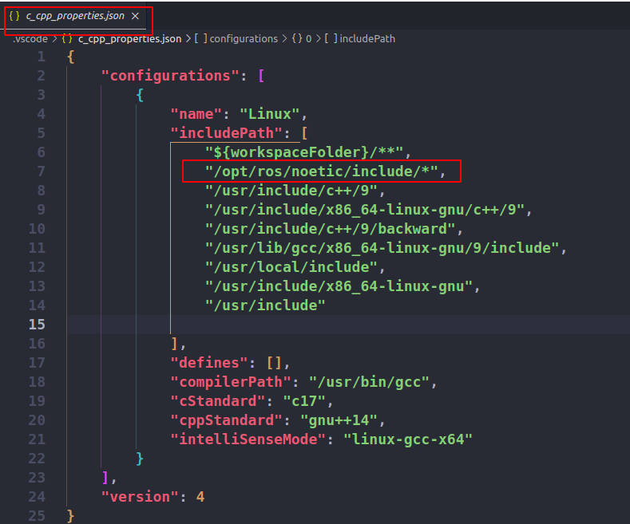

问题描述：无法打开源文件"ros/ros.h"/"image_transport/image_transport.h"

问题分析及解决方案：VSCode搜索库文件是根据`c_cpp_properties.json`文件里面的`includePath`定义的，而`includePath`默认的是在当前的工作文件夹下对库文件进行搜索的，而我们的库文件不在当前的工作空间下，而是在`/opt/ros/noetic/include/`目录下，因此只在`includePath`添加上即可。

如图所示：

问题解决：

