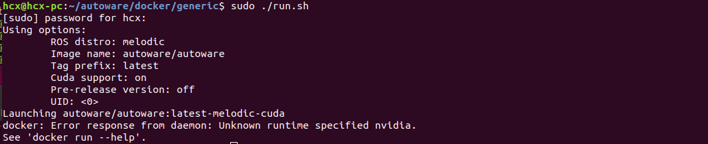
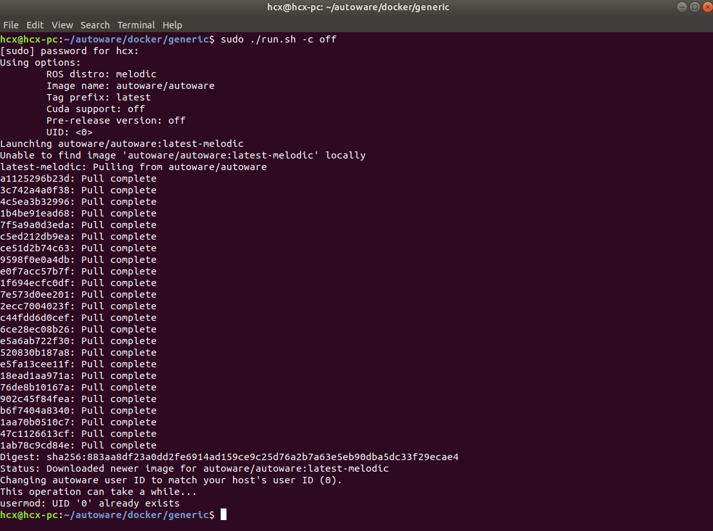
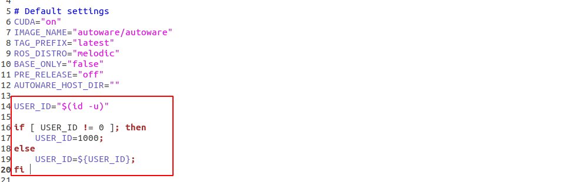
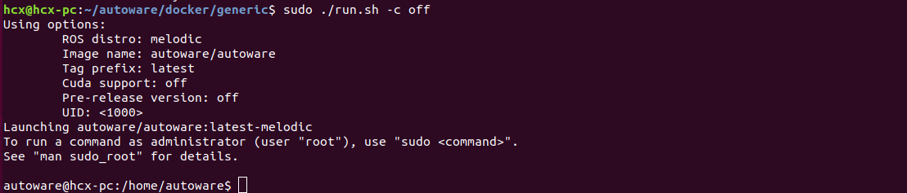
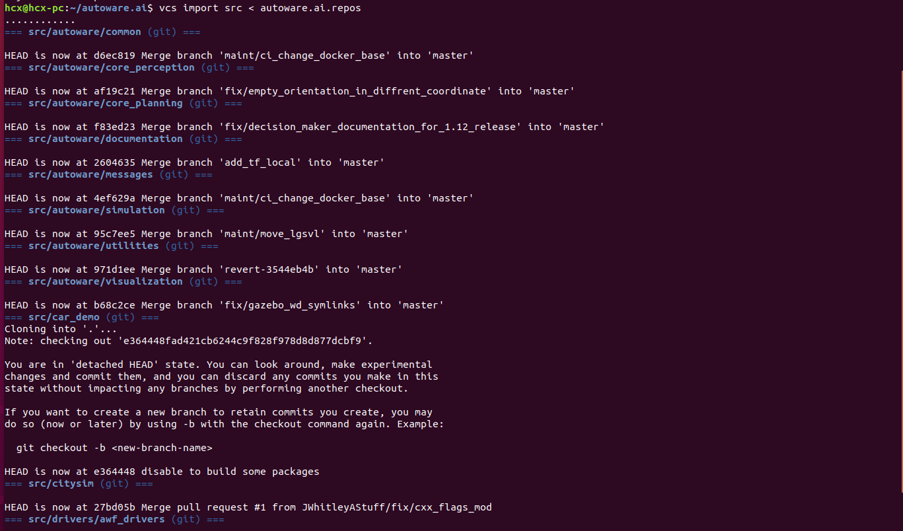

## autoware主体简介

autoware主要包括sensing、computing（perception、decision、planning）、actuation等几个部分，如下图所示


1. 其中sensing模块对应的是各类传感器对真实世界中各类数据的采样，例如camera采样图像、LiDAR采样激光点云等，采样数据属于未处理的原始数据，需要输入到computing模块进行计算处理。
2. computing模块主要是为了对传感器采样的原始数据进行加工处理，最后以为实现安全高效的导航为目的，将规划结果输出给actuation模块。其中computing模块主要分为三个小模块:
   - perception（感知模块），这部分要处理localization（通过车辆当前采集传感器数据和已有地图进行自身定位，ps若无地图需要通过SLAM构建地图），然后detection模块负责检测周围与车辆有场景交互的非自身个体（车辆、行人等），prediction模块会对检测出的物体进行未来运动预测，以提前规划防止碰撞。
   - decision（决策模块），根据之前感知的结果，Autoware决策一个由有限状态机表示的驾驶行为，以便可以选择适当的计划功能。当前的决策方法是基于规则的系统。
   - planning（规划模块），主要是根据决策和起始点和目标点，采用mission和motion模块可以计算出一条kinodynamic的路径。
3. actuation模块，表示驱动器模块，如YMC驱动器等，接收planning模块出来的规划结果，经历驱动器实现驱动控制。

## Docker安装

1. 先删除旧版的docker

   ```shell
   sudo apt-get remove docker docker-engine docker.io
   ```

2. 安装依赖

   ```shell
   sudo apt-get update

   sudo apt-get install apt-transport-https ca-certificates curl software-properties-common
   ```

3. 设置密钥

   ```shell
   curl -fsSL https://download.docker.com/linux/ubuntu/gpg | sudo apt-key add -

   sudo apt-key fingerprint 0EBFCD88
   ```

4. 设置软件源

   ```shell
   sudo add-apt-repository "deb [arch=amd64] https://download.docker.com/linux/ubuntu $(lsb_release -cs) stable"
   ```

5. 安装Docker

   ```shell
   sudo apt-get update

   sudo apt-get install docker-ce
   ```

6. 安装Docker镜像

   ```shell
   git clone https://gitlab.com/autowarefoundation/autoware.ai/docker.git

   cd docker/generic

   sudo ./run.sh
   ```

   
   使用指令关闭cuda支持即可：

   ```shell
   sudo ./run.sh -c off
   ```

   
   耐心等待下载，需要下载一段时间了，下载完成之后会继续报一个错误：usermod: UID '0' already exists
需要手动修改一下刚才运行的run.sh脚本，加入这一段内容：

   ```shell
   USER_ID="$(id -u)"
   if [ USER_ID != 0 ]; then
   USER_ID=1000;
   else
   USER_ID=${USER_ID};
   fi
   ```

   
   修改完成之后，重新运行脚本，即可进入autoware的镜像啦。
至此Autoware.ai的Docker镜像就配置完毕，进入镜像后的操作步骤与源码编译后是一致的。
   

## 源码安装autoware-1.14.0

****
　　先说一下我为什么选1.14.0版本吧，我刚开始接触的是1.12.0版本，我用1.12.0版本有个毛病，就是打开autoware后那个QT界面会花屏，尝试过网上的解决办法，不行！后来换成1.14.0版本后就再也没有出现过花屏问题，所以1.14.0版本也是我使用至今的一个版本。
****
正文开始

### 安装autoware-1.14.0(以v1.14.0为例，对于其他版本也适用)

1. 安装依赖

   ```shell
   sudo apt update

   sudo apt install -y python-catkin-pkg python-rosdep ros-$ROS_DISTRO-catkin

   sudo apt install -y python3-pip python3-colcon-common-extensions python3-setuptools python3-vcstool

   pip3 install -U setuptools
   ```

2. 创建工作空间

   ```shell
   mkdir -p autoware.ai/src

   cd autoware.ai
   ```

3. 下载autoware.ai的工作空间配置

   ```shell
   wget -O autoware.ai.repos "https://raw.githubusercontent.com/Autoware-AI/autoware.ai/1.14.0/autoware.ai.repos"
   ```

   下载其他版本只需将1.14.0替换成你想安装的版本即可。
4. 下载autoware.ai到工作区

   ```shell
   vcs import src < autoware.ai.repos
   ```

   
   这一步要很久，耐心等待。
5. 使用rosdep安装依赖项

   ```shell
   sudo pip3 install rosdepc

   sudo rosdepc init

   rosdepc update

   rosdepc install -y --from-paths src --ignore-src --rosdistro $ROS_DISTRO
   ```

6. 编译

- 若有CUDA，使用CUDA编译

    ```shell
    AUTOWARE_COMPILE_WITH_CUDA=1 colcon build --cmake-args -DCMAKE_BUILD_TYPE=Release
    ```

- 若没有CUDA，只使用CPU

    ```shell
    colcon build --cmake-args -DCMAKE_BUILD_TYPE=Release
    ```

    编译时长依据电脑性能来定，我编译了15分钟。

    至此autoware.ai已经安装完毕，接下来是使用官方给出的demo测试软件。

## 官方demo演示

网上资源很多，我就不再描述了，这里贴出古月居的教程供参考：[Autoware.ai的安装、配置与测试（Docker & 源码编译）](https://guyuehome.com/37565)

## 控制底盘

本人不是通过can通讯控制底盘运动的，是输出线速度角速度给STM32，通过STM32来控制底盘运动的。

autoware中输出线速度和角速度的相关话题为/twist_cmd话题，所以注意的是小车底盘节点中要订阅这个话题，读取相关的速度信息后发送相关信息给STM32，stm32通过串口通讯来读取线速度角速度后经过一定的处理后，控制电机运动。

## 参考致谢

- [Autoware入门学习（二）——Ubuntu18.04下的源码安装和配置](https://blog.csdn.net/zhao5269/article/details/106827618?spm=1001.2014.3001.5502)
- [Autoware.ai的安装、配置与测试（Docker & 源码编译）](https://guyuehome.com/37565)
- [autoware实车实战之一：如何快速适配环境、让自己的小车跑起来](https://blog.csdn.net/qq_38861347/article/details/126741386?spm=1001.2014.3001.5502)
