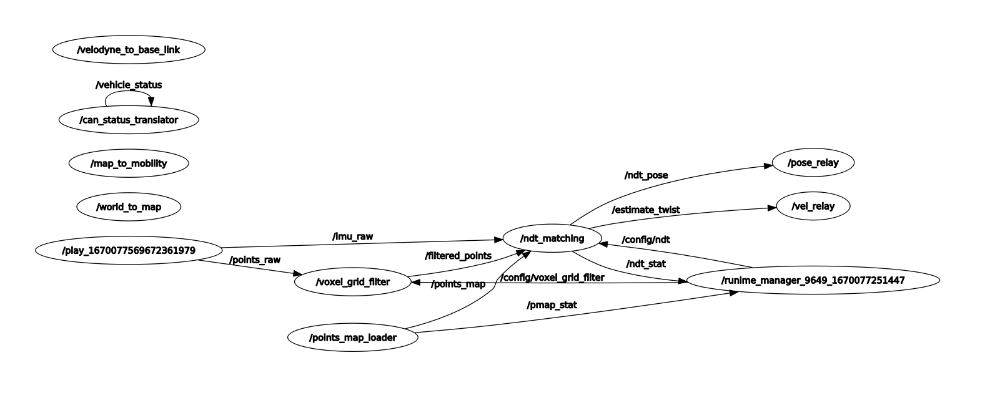
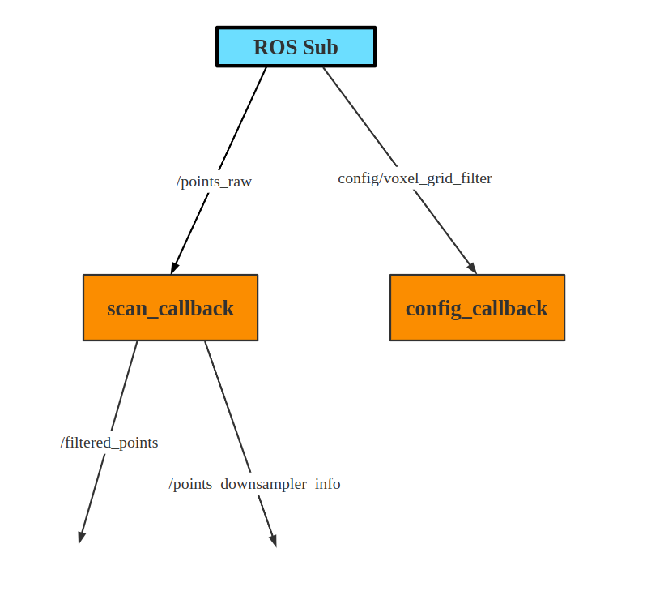

## Localization模块

Autoware中的Localization模块包括了：

- lidar_localizer:使用来自激光雷达的扫描数据和加载的３Ｄ地图信息计算车辆在地图坐标的( x, y, z, roll, pitch, yaw )位姿。对于使用激光雷达与３Ｄ点云地图匹配，autoware使用的主要是正态分布变换（NDT）算法以及ICP算法。
- gnss_localizer:接收来自GNSS传感器的NMEA数据并将该数据转换成( x, y, z, roll, pitch, yaw )位姿。这个结果可单独作为车辆的位置，也可以用来初始化、纠正lidar_localizer的位置。
- dead_reckoner:主要使用IMU来预测车辆下一帧的位置，并对lidar_localizer和gnss_localizer的结果进行插值。

## ndt_matching定位模块

ndt_matching使用的是正态分布变换算法来对车辆进行定位，autoware提供的ndt_matching可融合GNSS、IMU、odom、LIDAR四种传感器数据对车辆进行综合定位判断。我目前使用的传感器为LIDAR+IMU,在运行ndt_matching时，节点关系图如下：

### voxel_grid_filter

先从**voxel_grid_filter**这个节点说起,它主要有以下两个topic的回调控制。

- scan_callback:该函数主要做的就是接收velodyne激光雷达发布的`/points_raw`原始点云信息，进行体素化处理，从而得到主要的话题`/filtered_points`，而`/points_downsampler_info`是向外输出点云降采样的各项参数信息，对后面的定位作用不大。

>使用体素化网格方法实现下采样，即减少点的数量，减少点云数据，并同时保持点云的形状特征，在提高配准、曲面重建、形状识别等算法速度中非常实用。
>PCL实现的VoxelGrid类通过输入的点云数据创建一个三维体素栅格（可把体素栅格想象为微小的空间三维立方体的集合），然后在每个体素（即，三维立方体）内，用体素中所有点的重心来近似显示体素中其他点，这样该体素就内所有点就用一个重心点最终表示，对于所有体素处理后得到过滤后的点云。这种方法比用体素中心来逼近的方法更慢，但它对于采样点对应曲面的表示更为准确。
>其中可配置的voxel_leaf_size即为设置滤波器处理时采用的体素大小。

- config_callback:该函数就是接收runtime_manager发送的config/voxel_grid_filter话题设置voxel_leaf_size(滤波器处理时采用的体素大小)、measurement_range(测量范围)的值。
