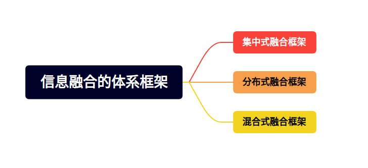
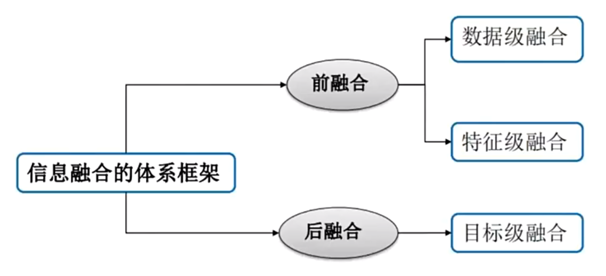

## 信息融合的体系框架

在多传感器融合中，按照对原始数据处理方法不同，多传感器融合系统的体系结构可以分为三种：集中式、分布式和混合式（混合式又分为有反馈结构和无反馈结构）。

### 集中式融合架构

集中式，就是将各传感器获得的原始数据直接送到中央处理器进行融合处理，可以实现实时融合。

从上图可以看出，各传感器没有自己的处理器，只有将数据都传到中央处理器中，然后实现实时融合。

优点：

- 集中式融合结构结构简单，数据处理精度高，算法相对灵活，融合速度快。

缺点：

- 各传感器之间相互独立，数据直接流向融合中心，缺乏必要的联系；
- 融合中心的计算和通信负载过重，系统容错性差，可靠性较低。

### 分布式融合架构

分布式融合结构就是先对各个独立传感器获得的原始数据进行局部处理，然后将结果送入到中央处理器中进行融合，最终获得目标结果。

优点：

- 每个传感器都具有估计全局信息的能力，任何一种传感器失效都不会导致系统崩溃，系统可靠性和容错性高；
- 对通信带宽要求低，计算速度快，可靠性和延续性好；
  
缺点：

- 传感器模块需要具备应用处理器，这样的话自身的体积将更大，功耗也就更高；
- 中央处理器只能获取各个传感器经过处理后的对象数据，而无法访问原始数据，因此，想要“放大”感兴趣区域将很难实现。

### 混合式融合架构

混合式架构，是集中式和分布式的混合应用，即部分传感器采用集中式融合架构，其余传感器采用分布式融合架构。

混合式融合架构有其自有的特点：

- 兼顾了集中式融合和分布式的优点，稳定性强，且具有较强的使用能力；
- 对通信带宽和计算能力要求较高。

## 信息融合的级别分类

依据传感器信息在整个融合流程中的位置划分（也可理解为传感器信息在处理过程中的抽象程度），即前融合、后融合。

判断一个融合系统是前融合还是后融合，主要看该系统中有几个感知算法。前融合只有一个感知算法（不管是数据层面的融合还是特征层面的融合，都只有一个感知算法），而后融合系统中，有几个传感器，就有几个感知算法。
