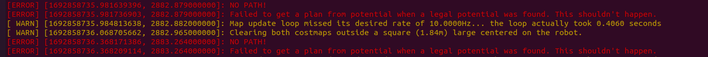

## move_base框架

`move_base`是ROS中用于导航移动机器人的重要框架。它采用了Action通信机制，结合全局规划器、局部规划器和底盘控制器，实现了机器人在未知环境中的自主导航。下面详细讲解`move_base`框架的各个组成部分：

1. **全局规划器（Global Planner）**： 全局规划器负责生成机器人从当前位置到目标位置的全局路径。它基于地图信息和目标位置，采用规划算法（如Dijkstra、A*、RRT等），在静态地图中搜索可行的路径。全局规划器考虑机器人的运动能力和避障要求，生成一个高层的全局路径。
2. **局部规划器（Local Planner）**： 局部规划器负责在机器人实际移动时避开动态障碍物，并确保机器人沿着全局路径安全地到达目标。它会实时获取机器人周围的传感器数据，并根据地图和传感器信息计算出局部路径和速度指令，使机器人在避开障碍物的同时尽可能接近全局路径。
3. **Costmap**： `move_base`使用Costmap来表示环境的静态和动态障碍物信息。Costmap是一个二维网格地图，其中每个格子表示环境的一部分，包含了关于该区域的代价信息。全局规划器和局部规划器都会利用Costmap信息来规划和执行机器人的移动。
4. **Trajectory Rollout Controller**： Trajectory Rollout Controller是`move_base`中的一个控制器，它将局部规划器生成的轨迹信息转换为底盘控制器可以理解的速度指令。这个控制器还可以处理不同类型的底盘控制器（例如差速驱动、全向轮等）。
5. **Action服务器**： `move_base`节点提供了一个Action服务器，它通过`actionlib::SimpleActionServer<move_base_msgs::MoveBaseAction>`来接收导航目标的请求。当收到目标请求时，`move_base`节点会调用全局规划器和局部规划器，并通过底盘控制器控制机器人移动。
6. **Recovery行为**： 为了应对导航中可能出现的困难情况（如局部路径失败、全局规划失败等），`move_base`提供了一系列Recovery行为，用于恢复机器人的导航。常见的Recovery行为包括旋转、振荡、跳跃、尝试其他规划器等。
7. **参数服务器**： `move_base`通过ROS参数服务器来配置其行为和规划参数。可以通过参数服务器来设置全局规划器和局部规划器的参数，调整Costmap参数，设置Recovery行为等。
8. **状态监控和反馈**： `move_base`节点会定期发布当前的导航状态和反馈信息，通过话题发布在`move_base/status`和`move_base/feedback`上，以便用户或其他节点了解导航进展和状态。

总体来说，`move_base`框架将导航问题分解为全局规划和局部规划两个层次，通过Action通信机制和参数服务器，整合了多个组件，使得机器人能够在未知环境中规划路径，并通过局部规划器实现障碍物避开，最终实现自主导航。该框架可以方便地与不同类型的底盘和传感器集成，适用于各种移动机器人的导航控制需求。

## 局部规划器

局部规划器是导航系统中的另一个重要组件，它的主要作用是在机器人移动过程中实时避开动态障碍物，沿着全局规划器生成的高层路径进行局部导航。局部规划器负责在机器人行进过程中实时规划低层次的轨迹，以避开障碍物，并保持机器人在全局路径上的正确方向。

下面是局部规划器的详细讲解：

**作用和原理**： 局部规划器的作用是使机器人在实际移动过程中能够避开动态障碍物，并在全局路径上保持正确的导航方向。局部规划器通常在较短的时间内规划机器人的运动轨迹，以实现实时的导航控制。其主要原理如下：

1. **局部感知**： 局部规划器会通过传感器获取机器人周围的实时环境信息，包括静态障碍物、动态障碍物（如行人、车辆等）和自由空间等。这些信息将用于生成局部导航轨迹。
2. **局部路径生成**： 基于全局规划器生成的高层路径，局部规划器根据机器人当前位置和目标位置，以及周围环境信息，实时规划机器人的局部导航路径。常用的规划方法包括Bezier曲线、样条曲线等。
3. **障碍物避障**： 局部规划器会根据周围环境信息，在生成局部路径的过程中考虑动态障碍物的位置和运动状态，以避免与它们发生碰撞。当遇到动态障碍物时，局部规划器会实时调整机器人的运动轨迹，以确保安全避开障碍物。
4. **路径跟踪**： 一旦局部规划器生成了局部导航路径，机器人会根据路径跟踪控制器实时调整自己的运动，以保持在路径上，并实现精确的导航。

**实时避开动态障碍物**： 局部规划器通过实时感知机器人周围的动态障碍物，并结合规划算法，及时避开这些障碍物。具体方法可以是：

- **动态感知**： 利用传感器（如激光雷达、摄像头等）实时感知机器人周围的动态障碍物，获取其位置、速度等信息。
- **预测运动**： 基于感知到的动态障碍物信息，对其未来运动进行预测，以便更好地避开它们。
- **局部避障规划**： 在局部规划器中，考虑动态障碍物的位置和预测运动，生成能够绕过障碍物的局部导航路径。

**沿着全局路径进行局部导航**： 局部规划器的目标是沿着全局规划器生成的高层路径进行导航，以达到整体的目标。为实现沿着全局路径导航，局部规划器需要：

- **路径插值**： 将全局规划器生成的高层路径插值为较低层次的局部导航路径，以实现平滑过渡和精确的导航。
- **路径跟踪**： 利用路径跟踪控制器，控制机器人沿着局部导航路径前进，并保持在路径上。
- **路径更新**： 当机器人在导航过程中发现障碍物或者需要重新规划路径时，局部规划器可以根据新的信息实时更新局部导航路径，以保证机器人能够按照全局路径正确导航。

总结： 局部规划器在导航系统中起着关键作用，它通过实时感知机器人周围的动态环境，实时规划机器人的低层导航路径，以避开动态障碍物并沿着全局路径正确导航。通过合理的局部规划算法和路径跟踪控制器，机器人能够实现高效、安全的导航移动。

## Trajectory Rollout Controller

Trajectory Rollout Controller是move_base中的一个重要控制器，它的主要作用是将局部规划器生成的轨迹信息转换为底盘控制器可以理解的速度指令。同时，Trajectory Rollout Controller还支持处理不同类型的底盘控制器，如差速驱动和全向轮等。该控制器负责实现底盘的实际运动，确保机器人按照局部规划器生成的轨迹进行移动。

下面详细讲解Trajectory Rollout Controller的功能和实现原理：

**功能**： Trajectory Rollout Controller的主要功能是将局部规划器生成的轨迹（通常是一系列位姿点）转换为机器人底盘的速度指令。它的目标是使机器人按照局部规划器规划的路径进行导航，实现精确的局部导航控制。同时，该控制器支持适配不同类型的底盘控制器，使move_base可以在不同类型的机器人上运行。

**实现原理**： Trajectory Rollout Controller实现了一种称为"Trajectory Rollout"的控制算法。该算法基于轨迹上的导航点进行插值和控制，以获得机器人的速度指令。其实现步骤如下：

1. **轨迹插值**： 首先，Trajectory Rollout Controller对局部规划器生成的轨迹上的位姿点进行插值，以获得更平滑的轨迹。插值可以确保机器人在运动过程中不会出现突然的速度或方向变化，使得导航更加平稳。
2. **轨迹跟踪控制**： 通过跟踪轨迹上的导航点，Trajectory Rollout Controller计算机器人在每个时刻的期望位置和朝向，并根据当前机器人的位姿与期望位姿之间的差距计算出速度指令。常用的控制算法包括PID控制等。
3. **底盘控制器适配**： Trajectory Rollout Controller支持适配不同类型的底盘控制器。它可以将计算得到的速度指令转换为特定底盘类型的控制信号，以实现机器人的运动。例如，对于差速驱动的机器人，速度指令会被转换为左右轮速的控制信号。

**底盘控制器的选择**： Trajectory Rollout Controller允许用户根据实际机器人的底盘类型选择合适的底盘控制器。用户可以在配置文件中指定底盘控制器的类型和相关参数，以适配不同类型的机器人。

**总结**： Trajectory Rollout Controller是move_base中的一个重要控制器，负责将局部规划器生成的轨迹信息转换为底盘控制器可以理解的速度指令。它通过轨迹插值和轨迹跟踪控制实现机器人的平滑导航，同时支持适配不同类型的底盘控制器，使move_base可以在不同类型的机器人上运行。

## Action服务器

在move_base中，Action服务器（Action Server）是一个核心组件，负责接收导航目标请求，执行路径规划和机器人移动，并发布导航状态和反馈信息。Action服务器使用ROS的actionlib库来实现，提供了一种灵活和高效的机制，以便在机器人导航过程中进行交互和状态反馈。

下面详细讲解move_base中Action服务器的功能和实现原理：

**功能**： Action服务器在move_base中的主要功能是接收来自客户端的导航目标请求，并将这些请求转化为机器人的导航行为。它负责以下几个方面的工作：

1. **接收导航目标请求**： Action服务器通过订阅话题消息类型为`geometry_msgs::PoseStamped`名为"goal"的话题来接收导航目标请求。这些请求通常包含目标位置和姿态信息，例如目标的三维坐标和方向。
2. **路径规划**： 一旦接收到导航目标请求，Action服务器会调用全局规划器来计算机器人从当前位置到目标位置的全局路径。全局规划器通常使用Dijkstra、A*、RRT等算法来搜索最优路径。
3. **局部规划**： Action服务器还负责调用局部规划器，将全局路径进行局部插值，生成机器人实际可执行的局部轨迹。局部规划器通常使用Trajectory Rollout等算法来生成平滑的轨迹。
4. **机器人移动执行**： Action服务器将局部规划生成的轨迹转换为底盘控制器可以理解的速度指令，并将这些指令发送给底盘控制器，使机器人按照轨迹进行移动。
5. **导航状态发布**： 在导航过程中，Action服务器会发布导航状态信息，如“等待请求”、“规划中”、“移动中”、“已到达目标”等，以向客户端反馈导航状态。
6. **导航反馈发布**： 除了导航状态，Action服务器还会定期发布导航反馈信息，如机器人当前的位姿、导航进度等，以便客户端实时监控导航过程。

**实现原理**： Action服务器使用ROS的actionlib库来实现，它允许将Action定义为一个独立的ROS消息类型，并提供了一种简单的方式来实现Action服务器和Action客户端之间的通信。具体实现步骤如下：

1. **定义Action消息**： 首先，需要在ROS中定义一个Action消息类型，用于描述导航目标请求、导航状态和导航反馈等信息。Action消息类型通常由.action文件来定义。
2. **编写Action服务器**： 编写Action服务器的代码，包括接收导航目标请求、调用全局规划器和局部规划器、执行机器人移动等功能。Action服务器需要订阅"/move_base/goal"话题来接收导航目标请求，并通过actionlib提供的回调函数来处理请求。
3. **发布导航状态和反馈**： 在Action服务器的代码中，需要定期发布导航状态和反馈信息，以便向客户端提供实时的导航状态和进度。
4. **Action Client与Action服务器通信**： 在客户端中，使用Action Client来与Action服务器进行通信。Action Client可以发送导航目标请求，并接收Action服务器的导航状态和反馈信息。

**总结**： Action服务器在move_base中是一个核心组件，负责接收导航目标请求，执行路径规划和机器人移动，并发布导航状态和反馈信息。通过ROS的actionlib库，Action服务器和Action客户端之间可以实现灵活和高效的通信，从而实现机器人的导航功能。

# 代码详解

在`move_base.h`文件中首先就做如下声明：

```cpp
typedef actionlib::SimpleActionServer<move_base_msgs::MoveBaseAction> MoveBaseActionServer;
```

代码中的 `typedef` 创建了一个别名 `MoveBaseActionServer`，用于 `actionlib::SimpleActionServer<move_base_msgs::MoveBaseAction>` 这个类型，这个类型是一个用于ROS中的简单行动服务器（Simple Action Server）。行动服务器用于执行ROS中定义的行动（Action）。在这里，`move_base_msgs::MoveBaseAction` 是一个 MoveBase 行动的消息类型，这通常用于导航功能中的目标点导航。

## move_base_msgs::MoveBaseAction消息为

```cpp
geometry_msgs/PoseStamped target_pose   //目标
---
---
geometry_msgs/PoseStamped base_position  //反馈
```

target_pose`是`导航堆栈尝试实现的目标。作为反馈给出的base_position是[tf](http://wiki.ros.org/tf)报告的机器人在世界中的当前`位置`。对于[move_base](http://wiki.ros.org/move_base)节点，当尝试实现目标时，target_pose会投影到 XY 平面，且 Z 轴朝上。

## move_base_msgs::MoveBaseActionGoal消息为

[std_msgs/Header](https://docs.ros.org/en/fuerte/api/std_msgs/html/msg/Header.html) header
[actionlib_msgs/GoalID](https://docs.ros.org/en/fuerte/api/actionlib_msgs/html/msg/GoalID.html) goal_id
[move_base_msgs/MoveBaseGoal](https://docs.ros.org/en/fuerte/api/move_base_msgs/html/msg/MoveBaseGoal.html) goal

​ [geometry_msgs/PoseStamped](https://docs.ros.org/en/fuerte/api/geometry_msgs/html/msg/PoseStamped.html) target_pose

​  [std_msgs/Header](https://docs.ros.org/en/fuerte/api/std_msgs/html/msg/Header.html) header

​  [geometry_msgs/Pose](https://docs.ros.org/en/fuerte/api/geometry_msgs/html/msg/Pose.html) pose

​   [geometry_msgs/Point](https://docs.ros.org/en/fuerte/api/geometry_msgs/html/msg/Point.html) position
​   [geometry_msgs/Quaternion](https://docs.ros.org/en/fuerte/api/geometry_msgs/html/msg/Quaternion.html) orientation

```cpp
as_ = new MoveBaseActionServer(ros::NodeHandle(), "move_base", [this](auto& goal){ executeCb(goal); }, false);
```

这段代码使用C++11中的Lambda表达式创建了一个匿名函数，并将其作为参数传递给了`MoveBaseActionServer`的构造函数。

让我们一步一步解释这部分代码的含义：

1. `[this]`：这部分是Lambda表达式的捕获列表。在这里，`[this]`表示Lambda表达式捕获当前的对象实例（即类的实例）。通过捕获`this`，Lambda表达式可以在其函数体内访问当前类的成员变量和成员函数。
2. `(auto& goal)`：这部分是Lambda表达式的参数列表。在这里，Lambda表达式接受一个名为`goal`的参数，`auto&`是C++11的类型推断，表示编译器自动推断参数类型，并将其声明为引用类型。
3. `{ executeCb(goal); }`：这部分是Lambda表达式的函数体。在这里，Lambda表达式的函数体直接调用了类中的名为`executeCb`的成员函数，并将传递进来的`goal`作为参数。

综合起来，这段Lambda表达式的意思是：在`MoveBaseActionServer`的构造函数中，传递一个匿名的Lambda函数作为回调函数。当`MoveBaseActionServer`接收到一个新的目标（goal）时，它将调用Lambda函数，并将该目标作为参数传递给Lambda函数。Lambda函数则将目标传递给`executeCb`成员函数进行进一步处理。

这种Lambda表达式的写法使得回调函数定义更加紧凑，更方便地使用类的成员函数作为回调处理收到的目标。

`std::isfinite(param)`该函数的作用是，如果输入param是有限的，返回true，反之是无限或者NAN值返回false。

`std::isfinite(q.x)`如果q.x是有限的，返回true。否则，返回false。

## 区域锁的用法

`boost::recursive_mutex::scoped_lock lock(lock_);`

区域锁生效范围是一个区域，通常用在用中括号{ }括起来的代码块，区域锁只需在代码块第一行进行上锁，无需解锁，因为区域锁的离开作用域即无效。

## ActionServer的setAbortes()函数

```cpp
template<class ActionSpec>
void SimpleActionServer<ActionSpec>::setAborted(const Result & result, const std::string & text)
{
  boost::recursive_mutex::scoped_lock lock(lock_);
  ROS_DEBUG_NAMED("actionlib", "Setting the current goal as aborted");
  current_goal_.setAborted(result, text);
}
```

这段代码是一个C++模板函数，用于在Action服务器（Action Server）中设置当前目标为"Aborted"状态。在ROS中，Action服务器是用于处理复杂的、长时间运行的任务的一种机制，通常用于控制机器人执行特定的动作或任务。

以下是这个函数的作用解释：

1. `template<class ActionSpec>`：这是一个模板函数的声明，`ActionSpec`是一个占位符类型，表示该函数可以接受任意类型的Action规范（Action Specification）作为参数。
2. `void SimpleActionServer<ActionSpec>::setAborted(const Result & result, const std::string & text)`：这是函数的声明，表示这个模板函数属于`SimpleActionServer`类，并且它的名称是`setAborted`。该函数接受两个参数：`result`和`text`。
3. `boost::recursive_mutex::scoped_lock lock(lock_)`：这行代码创建了一个互斥锁（mutex）并对`lock_`成员变量进行了锁定，以确保在设置目标状态为"Aborted"时不会有其他线程干扰。
4. `current_goal_.setAborted(result, text)`：这行代码调用了`current_goal_`对象的`setAborted()`函数，将当前目标状态设置为"Aborted"，并传递了两个参数：`result`和`text`。`result`参数表示在目标状态为"Aborted"时的结果，`text`参数是一个字符串，用于描述目标状态为"Aborted"的原因或附加信息。

总的来说，这个函数用于在Action服务器中设置当前目标的状态为"Aborted"，以告知客户端（Action Client）当前目标的执行已经被中止，并可以提供一些额外的信息来描述中止原因。这样，Action客户端就可以根据目标状态做出相应的处理。

## move_base的`actionlib::SimpleActionServer<move_base_msgs::MoveBaseAction>`对象在move_base节点中做了什么，有什么作用

在`move_base`节点中，`actionlib::SimpleActionServer<move_base_msgs::MoveBaseAction>`对象起到了实现导航功能的关键作用。`move_base`节点是ROS中用于导航机器人的核心节点，它负责规划和控制机器人在环境中的移动，使其能够到达目标位置。

具体地，`actionlib::SimpleActionServer<move_base_msgs::MoveBaseAction>`对象是一个简单的Action服务器，它用于处理来自导航目标的请求，并规划和执行机器人的移动操作。它的作用可以简要概括如下：

1. 接收导航目标：`actionlib::SimpleActionServer`会订阅`move_base`节点接收到的导航目标请求，该请求通常通过`move_base`节点的`move_base/goal`话题发布。
2. 规划路径：一旦接收到导航目标，`actionlib::SimpleActionServer`会调用底层的全局规划器和局部规划器，来计算机器人从当前位置到目标位置的路径。全局规划器负责生成全局路径，而局部规划器负责在机器人实际移动时避开障碍物。
3. 控制机器人移动：`actionlib::SimpleActionServer`将得到的路径传递给底层的运动控制模块，来控制机器人的底盘移动。底盘移动的控制通常由机器人的硬件驱动和导航控制算法实现。
4. 反馈导航状态：在机器人执行导航过程中，`actionlib::SimpleActionServer`会发布反馈信息，以便通知客户端（通常是用户或其他ROS节点）导航的进度和状态。
5. 反馈导航结果：当机器人到达目标位置或导航过程出现错误时，`actionlib::SimpleActionServer`会发布导航结果，通知客户端导航的最终结果。

通过使用`actionlib::SimpleActionServer<move_base_msgs::MoveBaseAction>`对象，`move_base`节点能够以Action的形式实现导航功能，使得导航请求和导航过程的控制更加灵活和可靠。同时，Action机制还能够处理目标的取消、超时等情况，使得`move_base`节点在复杂环境中能够高效地规划和控制机器人的导航行为。

## 想要通过move_base控制机器人移动，有哪几种给出目标点的方法？

通过move_base控制机器人移动，可以使用以下几种方法给出目标点：

1. **发布导航目标点消息：** 可以通过发布导航目标点的消息到`/move_base_simple/goal`话题来控制机器人移动。这种方法简单直接，只需要发布一个`geometry_msgs/PoseStamped`类型的消息，其中包含目标点的坐标和方向。
2. **使用Action客户端：** move_base提供了一个Action服务器，可以通过Action客户端发送目标点请求。通过Action客户端，可以发送包含目标点信息的`move_base_msgs/MoveBaseActionGoal`类型消息来控制机器人移动。
3. **使用服务接口：** move_base还提供了一个服务接口，可以通过调用服务来设置目标点和规划路径。可以通过调用`/move_base/make_plan`服务来请求全局路径规划，并调用`/move_base/clear_costmaps`服务来清除代价地图，以便重新规划路径。
4. **使用RViz交互：** 在RViz中，可以使用2D Nav Goal工具来交互式地设置机器人的目标点。在RViz中点击地图上的某个位置，然后将其作为导航目标点发送给move_base。

无论使用哪种方法，目标点的信息都应该包含目标的坐标和方向，以便机器人能够正确地导航到指定的位置。这些方法在ROS中非常常用，可以根据具体需求选择合适的方式来控制机器人的移动。

上面4中方法各自的优缺点是什么？

1. **发布导航目标点消息：**
   - 优点：简单直接，只需要发布一个消息即可控制机器人移动，适用于简单的导航任务。
   - 缺点：不支持一些高级的导航功能，如错误恢复、动态路径规划等，功能相对有限。
2. **使用Action客户端：**
   - 优点：支持高级的导航功能，例如错误恢复、取消导航等，可以实时获取导航状态和反馈信息。
   - 缺点：相对于直接发布消息，使用Action客户端需要编写更多的代码来处理回调函数和状态处理，略微复杂一些。
3. **使用服务接口：**
   - 优点：可以通过调用服务来实现更灵活的导航控制，例如请求全局路径规划、清除代价地图等，提供了更多的导航选项。
   - 缺点：调用服务需要进行额外的编程操作，可能需要处理服务响应和错误处理。
4. **使用RViZ交互：**
   - 优点：交互性强，适用于简单的目标点设置，非常方便快捷。
   - 缺点：只适用于人机交互的场景，不适合自动化和程序化的导航任务，无法实时获取导航状态和反馈信息。

综合来看，选择合适的方法取决于具体的导航需求和应用场景。如果是简单的导航任务，可以选择直接发布导航目标点消息或使用RViz交互；如果需要更高级的导航功能和实时反馈，可以选择使用Action客户端；而如果需要更灵活的导航控制，可以使用服务接口。根据任务的复杂程度和功能要求，选择最适合的方法可以提高导航的效率和可靠性。

## move_base Recovery机制

move_base三种状态：

```cpp
  enum MoveBaseState {
    PLANNING, //规划中
    CONTROLLING, //控制中
    CLEARING //规划或者控制失败在恢复或者清除中
  };
```

一般默认状态或者接收到一个有效goal时是PLANNING，在规划出全局路径后state_会由PLANNING->CONTROLLING，如果规划失败则由PLANNING->CLEARING。在MoveBase::executeCycle中，会分别对这三种状态做处理：

还在PLANNING中则唤醒规划线程让它干活
如果已经在CONTROLLING中，判断是否已经到达目的地，否则判断是否出现震动？否则调用局部路径规划，如果成功得到速度则直接发布到cmd_vel，失败则判断是否控制超时，不超时的话让全局再规划一个路径。
如果出现了问题需要CLEARING（仅有全局规划失败、局部规划失败、长时间困在一片小区域三种原因），则每次尝试一种recovery方法，直到所有尝试完

move_base为recovery行为定义了如下三种原因:

```cpp
  enum RecoveryTrigger
  {
    PLANNING_R, //全局规划失败
    CONTROLLING_R, //局部规划失败
    OSCILLATION_R //长时间困在一片小区域
  };
```

以下三种情况，开始clearing

（1）

        //check for an oscillation condition
    
        if(oscillation_timeout_ > 0.0 &&
    
            last_oscillation_reset_ + ros::Duration(oscillation_timeout_) < ros::Time::now())
    
        {
          publishZeroVelocity();
    
          state_ = CLEARING;
    
          recovery_trigger_ = OSCILLATION_R;
    
        }

（2）

        //check if we've tried to make a plan for over our time limit or our maximum number of retries
      //issue #496: we stop planning when one of the conditions is true, but if max_planning_retries_
        //is negative (the default), it is just ignored and we have the same behavior as ever
    
        lock.lock();
    
        planning_retries_++;
    
        if(runPlanner_ &&
    
           (ros::Time::now() > attempt_end || planning_retries_ > uint32_t(max_planning_retries_))){
          //we'll move into our obstacle clearing mode
    
          state_ = CLEARING;
    
          runPlanner_ = false;  // proper solution for issue #523
    
          publishZeroVelocity();
    
          recovery_trigger_ = PLANNING_R;
    
        }

（3）

          //check if we've tried to find a valid control for longer than our time limit
    
          if(ros::Time::now() > attempt_end){
            //we'll move into our obstacle clearing mode
    
            publishZeroVelocity();
    
            state_ = CLEARING;
    
            recovery_trigger_ = CONTROLLING_R;
    
          }

恢复机制有哪些？
三种终止方式

    if(recovery_trigger_ == CONTROLLING_R){
     ROS_ERROR("Aborting because a valid control could not be found. Even after executing all recovery behaviors");
        as_->setAborted(move_base_msgs::MoveBaseResult(), "Failed to find a valid control. Even after executing recovery behaviors.");
          }
    
    else if(recovery_trigger_ == PLANNING_R){
        ROS_ERROR("Aborting because a valid plan could not be found. Even after executing all recovery behaviors");
        as_->setAborted(move_base_msgs::MoveBaseResult(), "Failed to find a valid plan. Even after executing recovery behaviors.");
          }
    
    else if(recovery_trigger_ == OSCILLATION_R){
         ROS_ERROR("Aborting because the robot appears to be oscillating over and over. Even after executing all recovery behaviors");
         as_->setAborted(move_base_msgs::MoveBaseResult(), "Robot is oscillating. Even after executing recovery behaviors.");
          }

如果通过调整参数调整恢复机制
震荡时间与距离：

    private_nh.param("oscillation_timeout", oscillation_timeout_, 0.0);
    
    private_nh.param("oscillation_distance", oscillation_distance_, 0.5);

路径规划等待时间：

```cpp
private_nh.param("planner_patience", planner_patience_, 5.0);
```

## move_base如何更换全局、局部路径规划算法（start、Dijkstra、DWA，TEB）？并测试各算法的计算时长，效果展示图

move_base包默认算法：

1、全局路径规划：Dijkstra

2、局部路径规划：Trajectory rollout----轨迹推算

### move_base框架图


​                        基于move_base的导航框架


### navigation导航包的navfn和global_planner的关系

Q:在目前的ROS版本中，机器人全局路径规划使用的是navfn包，这在move_base节点中的构造函数中可以找到：`private_nh.param("base_global_planner", global_planner, std::string("navfn/NavfnROS"));`而在navigation的源代码中还有一个global_planner的包，该包的源文件夹`navigation\global_planner\src`下已经有了A,Dijkstra等算法的实现。可是navfn的源程序中也有这两个算法的实现，貌似根本就没用到global_planner这个文件夹下的源程序。因此最开始直接看用于move_base全局导航的程序时有点一头雾水，为什么有两个用于全局导航的包在ROS里面？到底这两个包navfn和global_planner是什么关系？

A: 可以将navfn包和global_planner包理解成一个并列关系，因为他们两个都是用来做全局规划的，两个包里面也都实现了A,Dijkstra算法。那是不是意味着这两者中的一个包就是多余的呢？其实不是，早期的开发中是用navfn包做导航的，那时候并没有global_planner这个包，并且在navfn的源代码里可以看到这个包默认是使用Dijkstra做全局路径规划，并且有A的代码，那为什么没有使用A呢？幸好有人在[ROS answers里问了这个问题](https://answers.ros.org/question/28366/why-navfn-is-using-dijkstra/)，也引来了众开发者回答：

根据12年bhaskara的回答，意思是navfn里的A*算法存在bug，没人有时间去弄（在ros的各种答案里经常可以看到开发者说没时间弄，他们确实也相当的忙），直到13年David Lu 才完成了这部分工作，重新发布了global_planner包，修改好的代码封装性更强，更清晰明了，更容易使用。因此，也可以认为global_planner是navfn的替代者，是navfn的重构。也有人问[David Lu为什么没用global_planner替代掉navfn](https://answers.ros.org/question/98511/global_planner-package-with-a-planner-question/)？他的回答是为了和以前兼容。因此可以看到源代码中两个包都在，并且move_base的那个全局变量参数默认的是navfn，也就是说没用global_planner。那么如何使用global_planner包而不是navfn包呢？按理来说，只要将move_base的参数`base_global_planner`用`global_planner/GlobalPlanner`替代就行了。如：


看了里面的帖子，其中有说到：“曼哈顿距离启发式实时生成最佳路径。然而，这只在没有或很少有静态障碍物的情况下才成立。随着障碍物的大小和数量的增加，A*不仅花费更多的时间来搜索但也需要更多的节点内存，因为它需要更多的节点来找到路径。”

​                               ----出自论文《EFFICIENT PATH FINDING FOR 2D GAMES》

### 更换全局路径规划算法

#### 方法一

在ros-noetic版本的navigation导航包中，move_base默认使用的全局规划器是NavfnROS，如下图所示。它位于navfn功能包下的navfn_ros.cpp文件下。


想要使用navfn功能包更改全局规划算法，可在navfn_ros.cpp中的选择`planner_->calcNavFnAstar()`执行的A*代码或者`planner_->calcNavFnDijkstra(true)`执行的Dijkstra算法。

我的笔记本处理器为i5-1240P x 16，内容为16g，在运行turtlebot3仿真时尽量控制其他变量不变（如：步长、机器人朝向等）。

使用A*算法的运行速度为：0.16左右

该算法的时间复杂度为：xxx

使用Dijkstra算法的运行速度为：0.16左右

该算法的时间复杂度为：xxx

两者大差不差。

#### 方法二

1、更改规划器

在move_base节点的构造函数中选择global_planner功能包里面的GlobalPlanner作为全局规划器


如果想要更方便的更改选择规划器，则可以在move_base.launch文件中添加如下代码：


2、修改planner_core.cpp文件

 planner_core.cpp文件是navigation包中的文件，它位于`navigation/global_planner/src/`目录下：


修改如下内容：


```cpp
private_nh.param("use_dijkstra", use_dijkstra, false);
```

此句true为使用dijkstra算法，false为使用A star算法。

再加上相对应的ROS_INFO内容，就可以在程序运行时查看自己使用的是Dijkstra还是A*算法。


### 发现的问题

在使用`global_planner/GlobalPlanner`规划器的时候，使用A*算法会出现如下错误：



出现上述原因是因为膨胀半径设置问题，需要自己设置，最简单方法是将膨胀半径设置为机器人外切圆。---来自csdn  [Charlesffff](https://blog.csdn.net/weixin_44190648)的解释和解决方案[链接在此](https://blog.csdn.net/weixin_44190648/article/details/131113449)

按照博主的说法，我将膨胀半径设置为机器人外切圆还是会规划失败，可能是算法问题。换成Dijkstra就不会出现这种问题，且Dijkstra的速度要比A*快很多。这让我想起了上述说提到的：*

“曼哈顿距离启发式实时生成最佳路径。然而，这只在没有或很少有静态障碍物的情况下才成立。随着障碍物的大小和数量的增加，A*不仅花费更多的时间来搜索但也需要更多的节点内存，因为它需要更多的节点来找到路径。”

​                               ----出自论文《EFFICIENT PATH FINDING FOR 2D GAMES》

## 参考文章

- [turtlebot3 gazebo仿真-基于ros melodic](https://blog.csdn.net/weixin_41469272/article/details/106139306)
- [ROS：move_base路径规划介绍、更换全局路径规划算法](https://blog.csdn.net/weixin_44190648/article/details/131113449)
- [ROS: global_planner 整体解析](https://blog.csdn.net/heyijia0327/article/details/45030929)

### 更换局部路径规划算法

#### 方法一

在move_base.launch文件中修改base_local_planner参数。


#### 方法二

直接在move_base节点中的构造函数中修改，如下`private_nh.param("base_local_planner", local_planner, std::string("dwa_local_planner/DWAPlannerROS"));`

### 更换局部路径规划算法为Teb算法

在navigation导航包中，默认提供的有`base_local_planner/TrajectoryPlannerROS`轨迹推算以及`dwa_local_planner/DWAPlannerROS` DWA算法，那如何向里面添加其他的局部规划算法呢？

#### 实操环节

就拿Teb算法来说。

1、安装teb_local_planner算法

源码下载地址：[点击此处](https://github.com/rst-tu-dortmund/teb_local_planner)

2、将代码放到navigation目录下

3、安装缺失依赖

在teb_local_planner目录下打开终端，运行：

```bash
rosdep install --from-paths src --ignore-src --rosdistro=noetic -y
```

4、编译，看缺少什么就apt安装什么

5、查看是否安装成功

```bash
rospack plugins --attrib=plugin nav_core
```

会出现以下相关信息：

```bash
teb_local_planner /home/catkin_navigation/src/navigation/teb_local_planner-melodic-devel/teb_local_planner_plugin.xml
```

6、测试

```bash
roslaunch teb_local_planner test_optim_node.launch
```


7、在**turtlebot3_navigation/param**文件夹下创建teb_local_planner_params.yaml文件：

文件内容如下：

```yaml
TebLocalPlannerROS:
  odom_topic: odom
  map_frame: map
 
  # Trajectory
  teb_autosize: True
  dt_ref: 0.5
  dt_hysteresis: 0.05
  min_samples: 3
  global_plan_overwrite_orientation: True
  global_plan_viapoint_sep: 0.1 # negative, do not use viapoints. positive, use them. the actual value does not matter
  max_global_plan_lookahead_dist: 1.5
  global_plan_prune_distance: 0.6
  force_reinit_new_goal_dist: 1.0
  feasibility_check_no_poses: 3
  publish_feedback: false
  allow_init_with_backwards_motion: true
  exact_arc_length: false
  shrink_horizon_backup: true
  shrink_horizon_min_duration: 10
 
  # Robot
  max_vel_x: 0.22
  max_vel_x_backwards: 0.5
  max_vel_theta: 2.75
  max_vel_y: 0.0
  acc_lim_y: 0.0
  acc_lim_x: 2.5
  acc_lim_theta: 3.2
  min_turning_radius: 0.0
  wheelbase: 0.0 # not used, is differential
  cmd_angle_instead_rotvel: false # not used, is differential
  footprint_model: # types: "point", "circular", "two_circles", "line", "polygon"
#    type: "circular"
#    radius: 0.5 # for type "circular"
#    type: "line"
#    line_start: [-0.0545, 0.0] # for type "line"
#    line_end: [0.0545, 0.0] # for type "line"
# front_offset: 0.2 # for type "two_circles"
# front_radius: 0.2 # for type "two_circles"
# rear_offset: 0.2 # for type "two_circles"
# rear_radius: 0.2 # for type "two_circles"
    type: "polygon"
    vertices: [[-0.105, -0.105], [-0.105, 0.105], [0.041, 0.105], [0.041, -0.105]] # for type "polygon"
 
  # GoalTolerance
  xy_goal_tolerance: 0.05
  yaw_goal_tolerance: 0.17
  free_goal_vel: False
 
  # Obstacles
  min_obstacle_dist: 0.1 # minimum distance to obstacle: it depends on the footprint_model
  inflation_dist: 0.0 # greater than min_obstacle_dist to take effect
  include_costmap_obstacles: True # use the local costmap
  costmap_obstacles_behind_robot_dist: 1.0 # distance at which obstacles behind the robot are taken into account
  legacy_obstacle_association: false
  obstacle_poses_affected: 30 # unused if legacy_obstacle_association is false
  obstacle_association_force_inclusion_factor: 10.0 # the obstacles that will be taken into account are those closer than min_obstacle_dist*factor, if legacy is false
  obstacle_association_cutoff_factor: 40.0 # the obstacles that are further than min_obstacle_dist * factor will not be taken into account, if legacy is false
#  costmap_converter_plugin: "costmap_converter::CostmapToPolygonsDBSMCCH"
  #costmap_converter_plugin: "costmap_converter::CostmapToLinesDBSRANSAC"
  #costmap_converter_plugin: "costmap_converter::CostmapToLinesDBSMCCH"
#  costmap_converter_plugin: "costmap_converter::CostmapToPolygonsDBSConcaveHull"
  costmap_converter_plugin: "" # deactivate plugin
  costmap_converter_spin_thread: True
  costmap_converter_rate: 10
 
  # Optimization
  no_inner_iterations: 5
  no_outer_iterations: 4
  optimization_activate: True # optimize
  optimization_verbose: False
  penalty_epsilon: 0.1
  weight_max_vel_x: 2
  weight_max_vel_y: 1
  weight_max_vel_theta: 1
  weight_acc_lim_x: 1
  weight_acc_lim_y: 1
  weight_acc_lim_theta: 1
  weight_kinematics_nh: 1 # is a holonomic robot
  weight_kinematics_forward_drive: 10 # prefer forward driving, for differential
  weight_kinematics_turning_radius: 0 # prefer turns that respect the min_turning_radius, not used if differential (min_turning_radius = 0)
  weight_optimaltime: 1.0 # prefer trajectories with less transition time
  weight_obstacle: 50.0 # prefer trajectories that respect the min_obstacle_dist
  weight_inflation: 0.1 # prefer trajectories that respect the inflation of the obstacles
  #weight_dynamic_obstacle: 10 # not in use yet
  weight_viapoint: 1.0 # prefer trajectories that respect the viapoints in the global path
  weight_adapt_factor: 2 # factor to multiply some weights (currently only weight_obstacle) at each iteration (gives better results than a huge value for the weight)
 
  # Homotopy Class Planner
  enable_homotopy_class_planning: True # currently not used
```

8、使用TEB替代DWA

在move_base.launch文件中添加teb配置如下红框中的内容：


9、效果展示


#### 为什么在turtlebot3仿真中使用TEB算法后机器人快要到目标点时需要经过多次调整才能到达最终位姿？使用DWA算法就很快到达指定位姿，且调整效率比TEB要高

DWA

在我调试仿真环境的时候，发现使用DWA算法时，当目标点位置在当前位置的反方向且在机器人的后方时，机器人会有明显的倒车行为，它是先一直倒车至目标点附近，然后再调整姿态。

如果目标点位姿在机器人前方180°且方向与车头方向一致，就不会发生倒车行为，其他目标点位姿均有可能发生倒车行为。

如果目标点在机器人的后方，则都是先倒车至目标点，再调整朝向。

如果是给到侧后方，则有2种可能，一种是先调整朝向，再行驶过去，行驶至目标点，再调整最终朝向；一种是先倒车至目标点，再调整朝向。

如果目标点在机器人的侧方，机器人则会先调整姿态至目标点位置（注意：不是目标点姿态），以机器人中心和目标点生成一条直线路径，在行驶过去，到达目标点再调整姿态至目标姿态。

TEB

在使用TEB算法时，机器人总是会先调整至目标点位置朝向，再行驶至目标点位置。

TEB的局部路径线要比DWA的要长很多。
