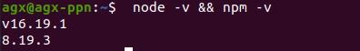

## 前言

在使用docusaurus搭建自己的网站时，docusaurus要求nodejs的版本在16.0以上，在终端使用二进制方式安装（`sudo apt-get install nodejs
`）时默认安装的是8.0的版本，所以在这需要对nodejs进行升级。

本文的手动安装部分在本人笔记本上的ubuntu18.04系统进行过验证；脚本安装部分在ubuntu20.04系统进行过验证。

## 手动安装

### 安装npm以及nodejs16.x版本

如需将nodejs替换成其它版本，只需将`16.x`替换成你想要的版本号即可。

```shell
curl -sL https://deb.nodesource.com/setup_16.x | sudo -E bash -
sudo apt-get install -y nodejs      #添加软件源
```

上面的命令行包括npm的安装。

**npm若报错**，则执行下面操作：

（1）关闭命令窗口再打开

（2）不可行时再执行以下命令后，重新启动bash

```shell
sudo apt install note

sudo apt-get install -y build-essential
```

#### 查看npm源

```shell
sudo npm config get registry
```

#### 设置npm包为淘宝镜像源

**为什么要将npm换源？**

npm全称Node Package Manager，是node.js的模块依赖管理工具。由于npm的源在国外，所以国内用户使用起来各种不方便，可能会出现无法访问，发生异常，或者下载缓慢等问题。为此，淘宝搭建了 cnpm（中国 npm 镜像的客户端），它是一个完整的 npmjs.org 镜像，你可以用此代替官方版本。

```shell
sudo npm config set registry https://registry.npm.taobao.org
```

#### npm升级至指定版本

```bash
sudo npm install -g npm@9.6.2
```

### 卸载nodejs

```shell
sudo apt-get remove nodejs
```

## 脚本安装nodejs

该方法安装效率高，推荐使用。

### nodejs & npm 安装
>
> 脚本名字：install_nodejs.sh

运行该脚本

```shell
#!/bin/bash
# 安装更新Node.js和Npm所需要的软件
echo "update apt packge ..."
sudo apt update
# 添加NodeSource APT存储库和用于验证软件包的PGP密钥
echo "add NodeSource APT is PGP"
sudo apt install apt-transport-https curl ca-certificates software-properties-common
echo "add apt-get nodejs16.x and PGP" # 该行命令完成了apt-get存储库的添加并添加了PGP密钥
curl -sL https://deb.nodesource.com/setup_16.x | sudo -E bash -
echo "install nodejs and npm...." # 安装Node
sudo apt-get install -y nodejs
```

终端执行命令：

```shell
 sh install_nodejs.sh
```

查看是否安装成功：

```shell
 node -v && npm -v
```

安装成功



### 安装yarn

```shell
curl -sS https://dl.yarnpkg.com/debian/pubkey.gpg | sudo apt-key add -
echo "deb https://dl.yarnpkg.com/debian/ stable main" | sudo tee /etc/apt/sources.list.d/yarn.list  #添加软件源

sudo apt update #更新

sudo apt install yarn   #二进制安装yarn

yarn --version    #查看yarn版本
```

## 参考致谢

- [Ubuntu安装nodejs，指定版本nodejs](https://www.programminghunter.com/article/64352096437/)
- [Ubuntu20.04一键安装nodejs16（mysql，redis，yarn，typescript）的稳定版本的shell脚本](https://blog.csdn.net/fengjinghong/article/details/122923587)
